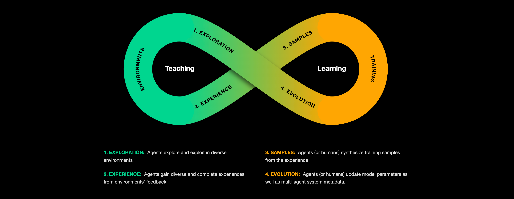
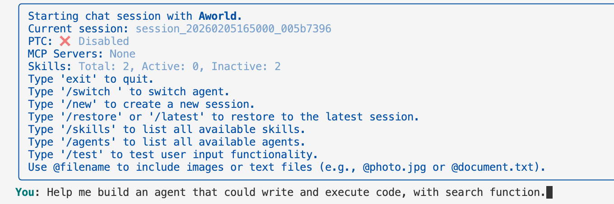
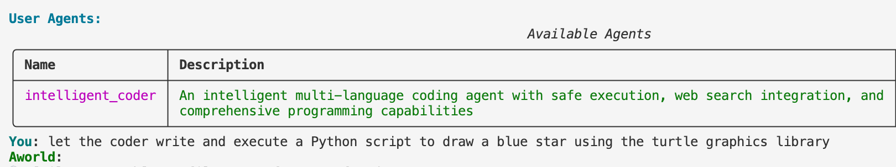
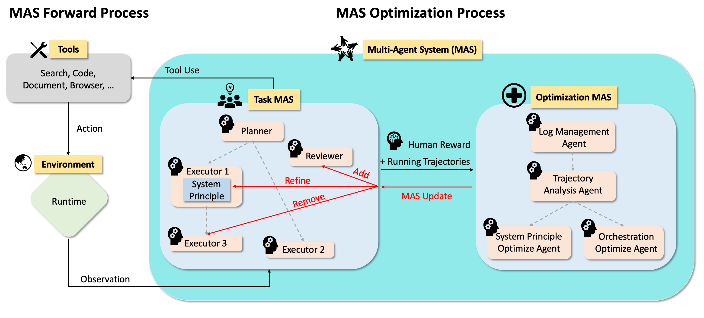
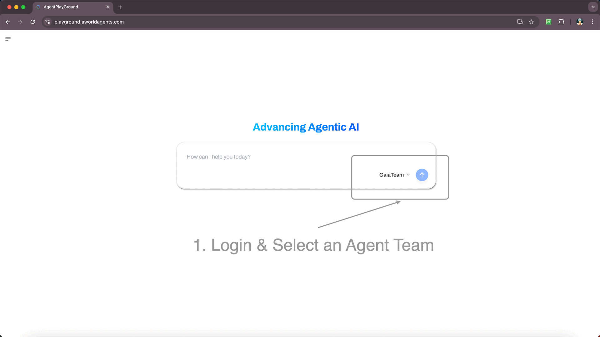

<div align="center">

# AWorld: Agentic Craft for Your World

</div>

<h4 align="center">

*"The Next Frontier for AI is Your Expertise"*

[![Twitter Follow][twitter-image]][twitter-url]
[![WeChat QR Code][wechat-image]][wechat-url]
[![Discord][discord-image]][discord-url]
[![License: MIT][license-image]][license-url]
[![DeepWiki][deepwiki-image]][deepwiki-url]
[![Tutorial][tutorial-image]][tutorial-url]
<!-- [![arXiv][arxiv-image]][arxiv-url] -->
<!-- [![Playground][playground-image]][playground-url] -->

</h4>

<h4 align="center">

[中文版](./README_zh.md) |
[Automation](#your-journey-with-aworld-cli) |
[Manual](#total-control-manually-crafting-agent-systems) |
[Evolution](#evolution) |
[Contributing](#contributing) |
<!-- [Experience](#experience-to-samples) |
[Training](#training) | -->

</h4>

---

<p align="justify">
For all its power, general AI hits a wall of context. It's a wall built from the nuanced workflows, domain-specific data, and hard-won intuition that define your world. From scientific research, financial analysis, to complex engineering, generic models can't climb this wall. They can't speak your language. 

The AWorld Thesis is that the true scaling of AI is achieved by enabling experts like you to build a gate in that wall.

AWorld with its CLI mode is the platform designed for this. We provide the fundamental recipe for you, the expert, to infuse your knowledge and craft unique insights into fleets of autonomous agents. This is how we move beyond generic promise to specific, robust applications that navigate your world with precision.
</p>




> 💡 Visit our [homepage](https://www.aworldagents.com/) for more details, or try our online [environments](https://www.aworldagents.com/environments) and [agents](https://playground.aworldagents.com/). 


# Your Journey with AWorld-CLI
The journey from an idea to an evolved, autonomous agent begins at your fingertips.


## Install and Activate

Create a .env file in the AWorld/aworld-cli to configure the base model for both the AWorld Agent and any agents it creates. Add the following content:
```bash
LLM_MODEL_NAME="your_model_name, Claude-Sonnet-4 or above suggested"
LLM_PROVIDER="openai"
LLM_API_KEY="your_model_api_key"
LLM_BASE_URL="your_base_url"
```

**Install and Enter AWorld-CLI**
```bash
git clone https://github.com/inclusionAI/AWorld && cd AWorld

conda create -n aworld_env python=3.11 -y && conda activate aworld_env 

pip install -e . && cd aworld-cli && pip install -e .

aworld-cli
```


## Create Your Agent
<p align="justify">
Instantly scaffold an agent from a natural language description of your task. AWorld-CLI handles the boilerplate, so you can focus on the logic.
</p>


<!--  -->
***Let AWorld Agent make an agent for you***


<p align="justify">
This command generates a fully operational agent file referencing our carefully curated Verified Skills as the solid foundation and a global configuration, ready for immediate execution.

Once it's generated, your agent is a permanent, reusable tool in your ~/.agents folder.
</p>


### Verified Skills: The DNA for Automated Agent Creation
<div align="justify">
Our library of Verified Skills is more than a collection of blueprints; it's a gene pool of expert capabilities.
</div>

<br>

<p align="justify">
When you automate the creation of a new agent, AWorld-CLI doesn't start from scratch. It intelligently references these battle-tested Skills for robutsness, and simultaneously learns from your custom skills in the ~/agents folder. This dual inheritance ensures every agent is not only reliable from the start, adapted to your requirements.
</p>

<table style="width: 100%; border-collapse: collapse; table-layout: fixed;">
  <colgroup>
    <col style="width: 40%;">
    <col style="width: 60%;">
  </colgroup>
  <thead>
    <tr>
      <th style="text-align: left; border-bottom: 2px solid #ddd; padding: 8px;">Skills</th>
      <th style="text-align: left; border-bottom: 2px solid #ddd; padding: 8px;">Description</th>
    </tr>
  </thead>
  <tbody>
    <tr>
      <td style="padding: 8px; vertical-align: top;">🧠 DeepSearch Agent</td>
      <td style="padding: 8px; vertical-align: top;">Conducts comprehensive, multi-source research on a topic and synthesizes a structured report.</td>
    </tr>
    <tr>
      <td style="padding: 8px; vertical-align: top;">🚀 PPT Agent</td>
      <td style="padding: 8px; vertical-align: top;">Creates polished presentations from documents, outlines, or data.</td>
    </tr>
  </tbody>
</table>


## Run Your Agent
<p align="justify">
Prompt the AWorld Agent to execute your newly created agent on a task and watch it work. Every call, action, and observation is captured in a detailed trajectory log, saved right to your local directory.
</p>


***Let the created agent do your job***


<!--  -->

## Evolve Your Agent
<p align="justify">
If the agent's performance isn't perfect in your opinion, you have a spectrum of powerful options for refinement.

**Manual Evolution**
<p align="justify">
You are the expert. Open the generated Python file and fine-tune the prompts, logic, or tool usage directly. You have full control.
</p>

**Exciting: AI-Assisted Evolution**
<p align="justify">
This is where AWorld truly shines! Prompt with your desired changes, so the AWorld Agent can transfer this complex task to our pre-built Optimizer Agent as your AI pair programmer to tune your agent.
</p>


***Schematic***
 


***Optimize your agent***


***Let the optimized agent do the more challenging job***


**Our Vista: Self-Evolution**
<p align="justify">
This is the future. Instead of you providing explicit prompts, the system automatically detects sub-optimal performance based on a reward signal (e.g., failed validation, deviation from a verified Skill). It then triggers an autonomous optimization loop, evolving the agent on its own. This is evaluation-driven evolution, where the agent gains true self-awareness and improves without constant human intervention.
</p>

Once you're satisfied with your optimized agent, it is permanent and reusable in your ~/agents folder.
</p>


# Total Control: Manually Crafting Agent Systems
<p align="justify">
In AWorld, an agent is a model enhanced with tools. But real-world problems often demand more than a single agent. To solve this, AWorld gives you full control with flexible build paths, allowing you to manually craft complex, multi-agent systems for collaboration.
</p>

1. design automated workflows end to end  [Docs](https://inclusionai.github.io/AWorld/Quickstart/workflow_construction/)

2. spin up MCP-enabled agents [Docs](https://inclusionai.github.io/AWorld/Quickstart/agent_construction/)

3. orchestrate multi-agent systems (MAS) [Docs](https://inclusionai.github.io/AWorld/Quickstart/multi-agent_system_construction/)


# Playground: See a Multi-Agent System in Action
Launch our official DeepResearch team in the AWorld [Playground](https://playground.aworldagents.com/) to see AI collaboration live. Inspect its source, run it end-to-end, and get inspired.



**From User to Creator: Get Your Agent Featured!**
Ready to build your own? Use the aworld-cli to forge an agent with your unique expertise, captured in its skill.md file.

To get your creation featured, simply submit a Pull Request with your skill.md to:
AWorld/examples/Custom_Skills/

<p align="justify">
We'll showcase the best community agents here in the Playground. Let your expertise evolve into a professional agent, gain recognition, and empower the entire community to experience the amazing tools you've built.
</p>

<!-- # Experience to Samples
Iterate with confidence. Our runtime records a complete history for every task, capturing each LLM call, action, and reward. Use this data to audit performance and generate high-quality training samples.
[Docs](https://inclusionai.github.io/AWorld/Training/Trajectory/)


# Model Training
Once agents can roam across environments, AWorld closes the loop with two complementary training modes that drive continuous improvement. Plug any mainstream LLM trainer—AReal, Swift, Verl, Slime, etc.—into the runtime to update model parameters directly. Adapters are lightweight, so you can reuse the same environment and agent code across trainers.
[Docs](https://inclusionai.github.io/AWorld/Training/Trainer/)

> 💡 Check the [real case](./train/examples/train_gaia_with_aworld_verl/main.py) which includes the full training config to run agentic training.
 -->

# Evolution
<p align="justify">
AWorld's mission is to handle the complexity so you can focus on innovation. This section showcases cutting-edge multi-agent systems built with AWorld, advancing toward AGI.


#### Agent Benchmarking

<table style="width: 100%; border-collapse: collapse; table-layout: fixed;">
  <thead>
    <tr>
      <th style="width: 30%; text-align: left; border-bottom: 2px solid #ddd; padding: 8px;">Category</th>
      <th style="width: 20%; text-align: left; border-bottom: 2px solid #ddd; padding: 8px;">Achievement</th>
      <th style="width: 20%; text-align: left; border-bottom: 2px solid #ddd; padding: 8px;">Performance</th>
      <th style="width: 25%; text-align: left; border-bottom: 2px solid #ddd; padding: 8px;">Key Innovation</th>
      <th style="width: 5%; text-align: left; border-bottom: 2px solid #ddd; padding: 8px;">Date</th>
    </tr>
  </thead>
  <tbody>
    <tr>
      <td style="padding: 8px; vertical-align: top;">🤖 Agent
        <br>
        <a href="https://playground.aworldagents.com/" target="_blank" style="text-decoration: none;">
          
        </a>
      </td>
      <td style="padding: 8px; vertical-align: top;">
        <strong>GAIA Benchmark <br>Excellence</strong>
        <br>
        <a href="https://huggingface.co/spaces/gaia-benchmark/leaderboard" target="_blank" style="text-decoration: none;">
          
        </a>
      </td>
      <td style="padding: 8px; vertical-align: top;">
        Pass@1: <strong>67.89</strong> <br>
        Pass@3: <strong>83.49</strong>
        <br> (109 tasks)
        <a href="./examples/gaia/README_GUARD.md" target="_blank" style="text-decoration: none;">
          
        </a>
      </td>
      <td style="padding: 8px; vertical-align: top;">
        Multi-agent system <br>stability & orchestration
        <br>
        <a href="https://arxiv.org/abs/2508.09889" target="_blank" style="text-decoration: none;">
          
        </a>
      </td>
      <td style="padding: 8px; vertical-align: top;">2025/08/06</td>
    </tr>
    <tr>
      <td style="padding: 8px; vertical-align: top;">🧠 Reasoning</td>
      <td style="padding: 8px; vertical-align: top;">
        <strong>IMO 2025 <br>Problem Solving</strong>
        <br>
        <a href="https://www.imo-official.org/year_info.aspx?year=2025" target="_blank" style="text-decoration: none;">
          
        </a>
      </td>
      <td style="padding: 8px; vertical-align: top;">
        <strong>5/6</strong> problems <br>solved in 6 hours
        <br>
        <a href="examples/imo/README.md" target="_blank" style="text-decoration: none;">
          
        </a>
      </td>
      <td style="padding: 8px; vertical-align: top;">Multi-agent collaboration <br>beats solo models</td>
      <td style="padding: 8px; vertical-align: top;">2025/07/25</td>
    </tr>
    <tr>
      <td style="padding: 8px; vertical-align: top;">🖼️ Multi-Modal</td>
      <td style="padding: 8px; vertical-align: top;">
        <strong>OSWorld <br>Rank 1st</strong>
        <br>
        <a href="https://os-world.github.io/" target="_blank" style="text-decoration: none;">
          
        </a>
      </td>
      <td style="padding: 8px; vertical-align: top;">
        <strong>58.0%</strong> <br> Success Rate
        <br>
        <a href="examples/osworld/README.md" target="_blank" style="text-decoration: none;">
          
        </a>
      </td>
      <td style="padding: 8px; vertical-align: top;">The more tools the better?</td>
      <td style="padding: 8px; vertical-align: top;">2025/09/18</td>
    </tr>
    <tr>
      <td style="padding: 8px; vertical-align: top;">🖼️ Multi-Modal</td>
      <td style="padding: 8px; vertical-align: top;">
        <strong>VisualWebArena Rank 1st in September</strong>
        <br>
        <a href="https://docs.google.com/spreadsheets/d/1M801lEpBbKSNwP-vDBkC_pF7LdyGU1f_ufZb_NWNBZQ/edit?gid=2044883967#gid=2044883967" target="_blank" style="text-decoration: none;">
          
        </a>
      </td>
      <td style="padding: 8px; vertical-align: top;">
        <strong>36.5%</strong> <br> Success Rate
        <br>
        <a href="examples/visualwebarena/README.md" target="_blank" style="text-decoration: none;">
          
        </a>
      </td>
      <td style="padding: 8px; vertical-align: top;">Automated tool generation <br>
        <a href="https://arxiv.org/pdf/2509.21072" target="_blank" style="text-decoration: none;">
          </td>
      <td style="padding: 8px; vertical-align: top;">2025/09/25</td>
    </tr>
    <tr>
      <td style="padding: 8px; vertical-align: top;">🔍 Deep-Search</td>
      <td style="padding: 8px; vertical-align: top;">
        <strong>Xbench Excellence</strong>
        <br>
        <a href="https://xbench.org/" target="_blank" style="text-decoration: none;">
          
        </a>
      </td>
      <td style="padding: 8px; vertical-align: top;">
        Pass@1: 51 <br> Pass@3: 61
        <br>
        <a href="examples/xbench/README.md" target="_blank" style="text-decoration: none;">
          
        </a>
      </td>
      <td style="padding: 8px; vertical-align: top;">
          AWorld has its own context engine: Amni.
      </td>
      <td style="padding: 8px; vertical-align: top;">2025/10/23</td>
    </tr>
  </tbody>
</table>

#### Data Synthesis

1. **FunReason-MT Technical Report: Overcoming the Complexity Barrier in Multi-Turn Function Calling** arxiv, 2025. [paper](https://arxiv.org/abs/2510.24645), [code](https://github.com/inclusionAI/AWorld-RL), [model](https://huggingface.co/Bingguang/FunReason-MT), [dataset](https://huggingface.co/datasets/Bingguang/FunReason-MT)

    *Zengzhuang Xu, Bingguang Hao, Zechuan Wang, Yuntao Wen, Maolin Wang, etc.*
   
2. **From Failure to Mastery: Generating Hard Samples for Tool-use Agents** arxiv, 2026. [paper](https://arxiv.org/abs/2601.01498), [code](https://github.com/inclusionAI/AWorld-RL), [model](https://huggingface.co/Bingguang/FunReason-MT), [dataset](https://huggingface.co/datasets/Bingguang/FunReason-MT)

    *Bingguang Hao, Zengzhuang Xu, Yuntao Wen, Xinyi Xu, Yang Liu, etc.*


#### Model Training

1. **AWorld: Orchestrating the Training Recipe for Agentic AI.** arxiv, 2025. [paper](https://arxiv.org/abs/2508.20404), [code](https://github.com/inclusionAI/AWorld/tree/main/train), [model](https://huggingface.co/inclusionAI/Qwen3-32B-AWorld)

    *Chengyue Yu, Siyuan Lu, Chenyi Zhuang, Dong Wang, Qintong Wu, etc.*

2. **FunReason: Enhancing Large Language Models' Function Calling via Self-Refinement Multiscale Loss and Automated Data Refinement.** arxiv, 2025. [paper](https://arxiv.org/abs/2505.20192), [model](https://huggingface.co/Bingguang/FunReason)

    *Bingguang Hao, Maolin Wang, Zengzhuang Xu, Cunyin Peng, etc.*

3. **Exploring Superior Function Calls via Reinforcement Learning.** arxiv, 2025. [paper](https://arxiv.org/abs/2508.05118), [code](https://github.com/BingguangHao/RLFC)

    *Bingguang Hao, Maolin Wang, Zengzhuang Xu, Yicheng Chen, etc.*

4. **RAG-R1 : Incentivize the Search and Reasoning Capabilities of LLMs through Multi-query Parallelism.** arxiv, 2025. [paper](https://arxiv.org/abs/2507.02962), [code](https://github.com/inclusionAI/AgenticLearning), [model](https://huggingface.co/collections/endertzw/rag-r1-68481d7694b3fca8b809aa29)

    *Zhiwen Tan, Jiaming Huang, Qintong Wu, Hongxuan Zhang, Chenyi Zhuang, Jinjie Gu*

5. **V2P: From Background Suppression to Center Peaking for Robust GUI Grounding Task.** arxiv, 2025. [paper](https://arxiv.org/abs/2508.13634), [code](https://github.com/inclusionAI/AgenticLearning/tree/main/V2P)

    *Jikai Chen, Long Chen, Dong Wang, Leilei Gan, Chenyi Zhuang, Jinjie Gu*

6. **Don’t Just Fine-tune the Agent, Tune the Environment** arxiv, 2025. [paper](https://arxiv.org/abs/2510.10197)

    *Siyuan Lu, Zechuan Wang, Hongxuan Zhang, Qintong Wu, Leilei Gan, Chenyi Zhuang, etc.*


#### Meta Learning

1. **Profile-Aware Maneuvering: A Dynamic Multi-Agent System for Robust GAIA Problem Solving by AWorld.** arxiv, 2025. [paper](https://arxiv.org/abs/2508.09889), [code](https://github.com/inclusionAI/AWorld/blob/main/examples/gaia/README_GUARD.md)

    *Zhitian Xie, Qintong Wu, Chengyue Yu, Chenyi Zhuang, Jinjie Gu*

2. **Recon-Act: A Self-Evolving Multi-Agent Browser-Use System via Web Reconnaissance, Tool Generation, and Task Execution.** arxiv, 2025. [paper](https://arxiv.org/pdf/2509.21072), [code](https://github.com/inclusionAI/AWorld/tree/main/examples/visualwebarena)

    *Kaiwen He, Zhiwei Wang, Chenyi Zhuang, Jinjie Gu*

</p>


# Contributing
<p align="justify">
Our roadmap includes expanding our AI for Science & Business initiative, deepening our self-evolution capabilities, and growing our library of community-contributed Skills.

We warmly welcome developers, researchers, and domain experts to join us. Whether you're enhancing the framework or contributing a Skill from your field of expertise, your work is valuable.

For academic citations or wish to contact us, please use the following BibTeX entry:
</p>

```bibtex
@misc{yu2025aworldorchestratingtrainingrecipe,
      title={AWorld: Orchestrating the Training Recipe for Agentic AI}, 
      author={Chengyue Yu and Siyuan Lu and Chenyi Zhuang and Dong Wang and Qintong Wu and Zongyue Li and Runsheng Gan and Chunfeng Wang and Siqi Hou and Gaochi Huang and Wenlong Yan and Lifeng Hong and Aohui Xue and Yanfeng Wang and Jinjie Gu and David Tsai and Tao Lin},
      year={2025},
      eprint={2508.20404},
      archivePrefix={arXiv},
      primaryClass={cs.AI},
      url={https://arxiv.org/abs/2508.20404}, 
}
```

<!-- # Star History
 -->


<!-- resource section start -->
<!-- image links -->
[arxiv-image]: https://img.shields.io/badge/Paper-arXiv-B31B1B?style=for-the-badge&logo=arxiv&logoColor=white
[blog-image]: https://img.shields.io/badge/Blog-Coming%20Soon-FF5722?style=for-the-badge&logo=blogger&logoColor=white
[deepwiki-image]: https://img.shields.io/badge/DeepWiki-Explore-blueviolet?style=for-the-badge&logo=wikipedia&logoColor=white
[discord-image]: https://img.shields.io/badge/Discord-Join%20us-blue?style=for-the-badge&logo=discord&logoColor=white
[github-code-image]: https://img.shields.io/badge/Code-GitHub-181717?style=for-the-badge&logo=github&logoColor=white
[huggingface-dataset-image]: https://img.shields.io/badge/Dataset-Coming%20Soon-007ACC?style=for-the-badge&logo=dataset&logoColor=white
[huggingface-model-image]: https://img.shields.io/badge/Model-Hugging%20Face-FF6B6B?style=for-the-badge&logo=huggingface&logoColor=white
[license-image]: https://img.shields.io/badge/License-MIT-yellow?style=for-the-badge
[twitter-image]: https://img.shields.io/badge/Twitter-Follow%20us-1DA1F2?style=for-the-badge&logo=twitter&logoColor=white
[wechat-image]: https://img.shields.io/badge/WeChat-Add%20us-green?style=for-the-badge&logo=wechat&logoColor=white
[tutorial-image]: https://img.shields.io/badge/Tutorial-Get%20Started-FF6B35?style=for-the-badge&logo=book&logoColor=white
[playground-image]: https://img.shields.io/badge/Playground-Try%20Online-9B59B6?style=for-the-badge&logo=book&logoColor=white

<!-- aworld links -->
[deepwiki-url]: https://deepwiki.com/inclusionAI/AWorld
[discord-url]: https://discord.gg/b4Asj2ynMw
[license-url]: https://opensource.org/licenses/MIT
[twitter-url]: https://x.com/AWorldAgents
[wechat-url]: https://raw.githubusercontent.com/inclusionAI/AWorld/main/readme_assets/aworld_wechat.png
[arxiv-url]: https://arxiv.org/abs/2508.20404
[tutorial-url]: https://inclusionai.github.io/AWorld/
[playground-url]: https://playground.aworldagents.com/

<!-- funreason links -->
[funreason-code-url]: https://github.com/BingguangHao/FunReason
[funreason-model-url]: https://huggingface.co/Bingguang/FunReason
[funreason-paper-url]: https://arxiv.org/pdf/2505.20192
<!-- [funreason-dataset-url]: https://github.com/BingguangHao/FunReason -->
<!-- [funreason-blog-url]: https://github.com/BingguangHao/FunReason -->

<!-- deepsearch links -->
[deepsearch-code-url]: https://github.com/inclusionAI/AgenticLearning
[deepsearch-dataset-url]: https://github.com/inclusionAI/AgenticLearning
[deepsearch-model-url]: https://huggingface.co/collections/endertzw/rag-r1-68481d7694b3fca8b809aa29
[deepsearch-paper-url]: https://arxiv.org/abs/2507.02962

<!-- badge -->
[MAS]: https://img.shields.io/badge/Mutli--Agent-System-EEE1CE
[IMO]: https://img.shields.io/badge/IMO-299D8F
[BFCL]: https://img.shields.io/badge/BFCL-8AB07D
[GAIA]: https://img.shields.io/badge/GAIA-E66F51
[Runtime]: https://img.shields.io/badge/AWorld-Runtime-287271
[Leaderboard]: https://img.shields.io/badge/Leaderboard-FFE6B7
[Benchmark]: https://img.shields.io/badge/Benchmark-FFE6B7
[Cloud-Native]: https://img.shields.io/badge/Cloud--Native-B19CD7
[Forward]: https://img.shields.io/badge/Forward-4A90E2
[Backward]: https://img.shields.io/badge/Backward-7B68EE
[Code]: https://img.shields.io/badge/Code-FF6B6B
[Paper]: https://img.shields.io/badge/Paper-4ECDC4


<!-- resource section end -->
