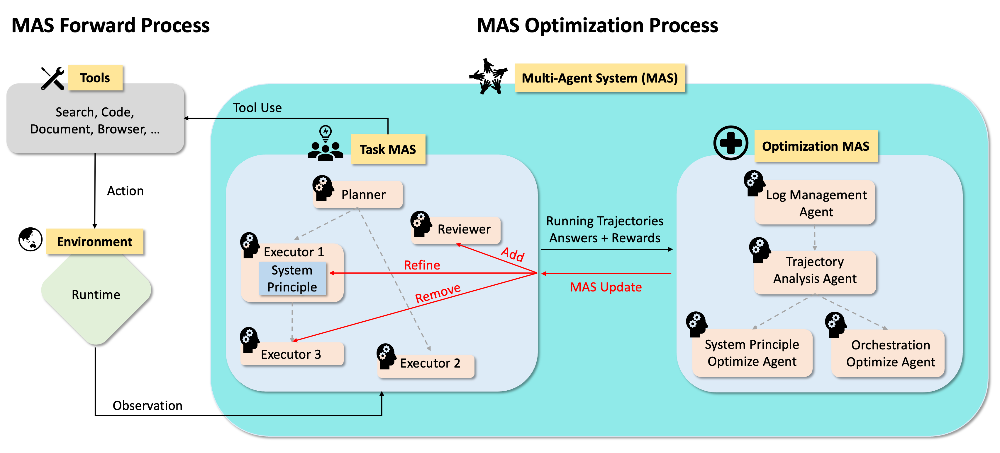

<div align="center">

# AWorld: Rich Environments, Intelligent Agents, Continuous Evolution

</div>

<h4 align="center">

*"Self-awareness: the hardest problem isn't solving within limits, it's discovering one's own limitations"*

[![Twitter Follow][twitter-image]][twitter-url]
[![WeChat QR Code][wechat-image]][wechat-url]
[![Discord][discord-image]][discord-url]
[![License: MIT][license-image]][license-url]
[![DeepWiki][deepwiki-image]][deepwiki-url]
[![arXiv][arxiv-image]][arxiv-url]
[![Tutorial][tutorial-image]][tutorial-url]
[![Playground][playground-image]][playground-url]

</h4>

<h4 align="center">

[中文版](./README_zh.md) |
[Installation](#installation) |
[Environments](#online-access-to-complex-environments) |
[Agent](#efficient-agent-construction) |
[Experience](#experience-to-samples) |
[Training](#training) |
[Architecture](#architecture-design-principles) |
[Evolution](#evolution) |
[Contributing](#contributing) |

</h4>

---

**AWorld (Agent World)** builds intelligent agents and rich environments where they operate, pushing the frontiers of AI capabilities and enabling continuous evolution. This project provides the fundamental recipe for agentic learning: [Environment Access](#online-access-to-complex-environments), [Agent Construction](#efficient-agent-construction), [Experience Retrieval](#experience-to-samples), and [Model Training](#training). What makes AWorld powerful is that agents can use these same components to automatically improve themselves.


> 💡 Visit our [homepage](https://www.aworldagents.com/) for more details, or try our online [environments](https://www.aworldagents.com/environments) and [agents](https://playground.aworldagents.com/). 


# Installation
> [!TIP]
> Python>=3.11
```bash
git clone https://github.com/inclusionAI/AWorld && cd AWorld

pip install -e .
```

# Online Access to Complex Environments
Provisioning rich environments is hard—packages conflict, APIs need keys, concurrency must scale. We make it painless with three access modes:
1. Use our default hosted setup (tooling with usage costs includes a limited free tier).
2. Bring your own API keys for unrestricted access (coming soon).
3. Pull our Docker images and run everything on your own infrastructure (coming soon).

```python
import os
import asyncio
from aworld.sandbox import Sandbox

INVITATION_CODE = os.environ.get("INVITATION_CODE", "")

mcp_config = {
    "mcpServers": {
        "gaia_server": {
            "type": "streamable-http",
            "url": "https://playground.aworldagents.com/environments/mcp",
            "timeout": 600,
            "sse_read_timeout": 600,
            "headers": {
                "ENV_CODE": "gaia",
                "Authorization": f"Bearer {INVITATION_CODE}",
            }
        }
    }
}

async def _list_tools():
    sand_box = Sandbox(mcp_config=mcp_config, mcp_servers=["gaia_server"])
    return await sand_box.mcpservers.list_tools()

if __name__ == "__main__":
    tools = asyncio.run(_list_tools())
    print(tools)
```


# Efficient Agent Construction
In Aworld, an agent is simply a model enhanced with tools. To spin one up, you only need:
1. a model endpoint (for training, a vLLM service works great)
2. an online environment to call (use our hosted options or plug in your own MCP toolchain)
That’s it—no heavyweight scaffolding required.

```python
from aworld.agents.llm_agent import Agent
from aworld.runner import Runners

# refer the section above for details
mcp_config = {...}

searcher = Agent(
    name="Search Agent",
    system_prompt="You specialize at searching.",
    mcp_config=mcp_config
)

if __name__ == "__main__":
    result = Runners.sync_run(
        input="Use google search tool to answer the question: the news about AI today.",
        agent=searcher
    )
    print(f"answer: {result.answer}")
```

Remember to plug in your LLM credentials first.
```bash
# Set LLM credentials
export LLM_MODEL_NAME="gpt-4"
export LLM_API_KEY="your-api-key-here"
export LLM_BASE_URL="https://api.openai.com/v1"
```

## Complex Agent System Construction

Real-world problems often need more than a single agent. AWorld gives you flexible build paths:
1. design automated workflows end to end  [Docs](https://inclusionai.github.io/AWorld/Quickstart/workflow_construction/)
2. spin up MCP-enabled agents [Docs](https://inclusionai.github.io/AWorld/Quickstart/agent_construction/)
3. orchestrate multi-agent systems (MAS) [Docs](https://inclusionai.github.io/AWorld/Quickstart/multi-agent_system_construction/)

Want to see it live? Load a pre-built DeepResearch team in the AWorld [Playground](https://playground.aworldagents.com/), inspect the source, and run it end to end.


# Experience to samples
Our runtime captures every step across offline and online runs. Each task yields a complete trajectory—every LLM call, action, and reward—so you can synthesize training samples, audit performance, and iterate with confidence.

## Complete Task Trajectories
Tasks unfold over many LLM calls. The framework captures every step, giving you a full trajectory.

```python
import asyncio
from aworld.runner import Runners
from aworld.core.task import Task
from aworld.logs.util import logger
import json

# refer the section above for agent constrution 
searcher = Agent(...)

if __name__ == "__main__":
    async def test_complete_trajectory():
        task = Task(
            input="Use google search tool to answer the question: the news about AI today.",
            agent=searcher
        )

        responses = await Runners.run_task(task)
        resp = responses[task.id]
        logger.info(f"task answer: {resp.answer}")
        logger.info(f"task trajectory: {json.dumps(resp.trajectory, ensure_ascii=False)}")
    asyncio.run(test_complete_trajectory())
```

## Single-Step Introspection
Need finer control? Call `step()` to inspect one action/response pair at a time. This lets you inject intermediate rewards during training, enabling richer, more flexible learning signals.

```python
import os
import asyncio
from aworld.runner import Runners
from aworld.core.task import Task
from aworld.logs.util import logger
import json
from aworld.config import TaskConfig, TaskRunMode

# refer the section above for agent constrution 
searcher = Agent(...)

if __name__ == "__main__":
    async def test_single_step_introspection():
        task = Task(
            input="Use google search tool to answer the question: the news about AI today.",
            agent=searcher,
            conf=TaskConfig(
                resp_carry_context=True,
                run_mode=TaskRunMode.INTERACTIVE
            )
        )

        trajectory_log = os.path.join(os.path.dirname(__file__), "trajectory_log.txt")
        is_finished = False
        step = 1
        while not is_finished:
            with open(trajectory_log, "a", encoding="utf-8") as traj_file:
                is_finished, observation, response = await Runners.step(task)
                traj_file.write(f"Step {step}\n")
                traj_file.write(json.dumps(response.trajectory, ensure_ascii=False, indent=2))
                traj_file.write("\n\n")
                step += 1
    asyncio.run(test_single_step_introspection())
```

# Training
Once agents can roam across environments, AWorld closes the loop with two complementary training modes that drive continuous improvement.

## Model Training
Plug any mainstream LLM trainer—AReal, Swift, Verl, Slime, etc.—into the runtime to update model parameters directly. Adapters are lightweight, so you can reuse the same environment and agent code across trainers.

```python
from datasets import load_dataset
from aworld.agents.llm_agent import Agent
from aworld.config import AgentConfig

from train.trainer.agent_trainer import AgentTrainer
from train.examples.train_gaia_with_aworld_verl.metrics.gaia_reward_function import gaia_reward_func


# refer the section above for details
mcp_config = {...}

# Configure agent to use Verl as the model service (adapts inference format automatically)
agent_config = AgentConfig(
    llm_provider="verl"
)
searcher = Agent(
    name="Search Agent",
    system_prompt="You specialize at searching.",
    mcp_config=mcp_config,
    conf=agent_config
)

train_dataset = load_dataset("", split="train")
test_dataset = load_dataset("", split="test")

trainer = AgentTrainer(
    agent=agent,
    config=custom_train_config,
    reward_func=gaia_reward_func,
    train_dataset=train_dataset,
    test_dataset=test_dataset
)

trainer.train()
```
> 💡 Check the [real case](./train/examples/train_gaia_with_aworld_verl/main.py) which includes the full training config to run agentic training.

## Meta-Learning
Beyond weights, you can meta-learn whole agent systems. Spin up role-specific agents that critique, rewrite prompts, refine workflow, or adjust strategies for a target agent, then iterate the team (e.g., our Gaia demo).



# Architecture Design Principles
This framework is engineered to be highly adaptable, enabling researchers and developers to explore and innovate across multiple domains, thereby advancing the capabilities and applications of multi-agent systems.

## Concepts & Framework
| Concepts | Description |
| :-------------------------------------- | ------------ |
| [`agent`](./aworld/core/agent/base.py)  | Define the foundational classes, descriptions, output parsing, and multi-agent collaboration (swarm) logic for defining, managing, and orchestrating agents in the AWorld system. |
| [`runner`](./aworld/runners)            | Contains runner classes that manage the execution loop for agents in environments, handling episode rollouts and parallel training/evaluation workflows.   |
| [`task`](./aworld/core/task.py)         | Define the base Task class that encapsulates environment objectives, necessary tools, and termination conditions for agent interactions.  |
| [`swarm`](./aworld/core/agent/swarm.py) | Implement the SwarmAgent class managing multi-agent coordination and emergent group behaviors through decentralized policies. |
| [`sandbox`](./aworld/sandbox)           | Provide a controlled runtime with configurable scenarios for rapid prototyping and validation of agent behaviors. |
| [`tools`](./aworld/tools)               | Offer a flexible framework for defining, adapting, and executing tools for agent-environment interaction in the AWorld system. |
| [`context`](./aworld/core/context)      | Feature a comprehensive context management system for AWorld agents, enabling complete state tracking, configuration management, prompt optimization, multi-task state handling, and dynamic prompt templating throughout the agent lifecycle.  |
| [`memory`](./aworld/memory)             | Implement an extensible memory system for agents, supporting short-term and long-term memory, summarization, retrieval, embeddings, and integration.|
| [`trace`](./aworld/trace)               | Feature an observable tracing framework for AWorld, enabling distributed tracing, context propagation, span management, and integration with popular frameworks and protocols to monitor and analyze agent, tool, and task execution.|


## Characteristics
| Agent Construction            | Topology Orchestration                                                                            | Environment                    |
|:------------------------------|:--------------------------------------------------------------------------------------------------|:-------------------------------|
| ✅ Integrated MCP services     | ✅ Encapsulated runtime                                                                            | ✅ Runtime state management  |
| ✅ Multi-model providers       | ✅ Flexible MAS patterns                                                                           | ✅ High-concurrency support  |
| ✅ Customization options       | ✅ Clear state tracing                                                                             | ✅ Distributed training      |
| ✅ [Support Agent Skills](https://github.com/inclusionAI/AWorld/tree/main/examples/skill_agent)  | [Support Aworld-Cli](https://github.com/inclusionAI/AWorld/tree/main/examples/aworld_cli_demo) 🚀 |       |


# Evolution
Our mission: AWorld handles the complexity, you focus on innovation. This section showcases cutting-edge multi-agent systems built with AWorld, advancing toward AGI.

#### Agent Benchmarking

<table style="width: 100%; border-collapse: collapse; table-layout: fixed;">
  <thead>
    <tr>
      <th style="width: 30%; text-align: left; border-bottom: 2px solid #ddd; padding: 8px;">Category</th>
      <th style="width: 20%; text-align: left; border-bottom: 2px solid #ddd; padding: 8px;">Achievement</th>
      <th style="width: 20%; text-align: left; border-bottom: 2px solid #ddd; padding: 8px;">Performance</th>
      <th style="width: 25%; text-align: left; border-bottom: 2px solid #ddd; padding: 8px;">Key Innovation</th>
      <th style="width: 5%; text-align: left; border-bottom: 2px solid #ddd; padding: 8px;">Date</th>
    </tr>
  </thead>
  <tbody>
    <tr>
      <td style="padding: 8px; vertical-align: top;">🤖 Agent
        <br>
        <a href="https://playground.aworldagents.com/" target="_blank" style="text-decoration: none;">
          
        </a>
      </td>
      <td style="padding: 8px; vertical-align: top;">
        <strong>GAIA Benchmark <br>Excellence</strong>
        <br>
        <a href="https://huggingface.co/spaces/gaia-benchmark/leaderboard" target="_blank" style="text-decoration: none;">
          
        </a>
      </td>
      <td style="padding: 8px; vertical-align: top;">
        Pass@1: <strong>67.89</strong> <br>
        Pass@3: <strong>83.49</strong>
        <br> (109 tasks)
        <a href="./examples/gaia/README_GUARD.md" target="_blank" style="text-decoration: none;">
          
        </a>
      </td>
      <td style="padding: 8px; vertical-align: top;">
        Multi-agent system <br>stability & orchestration
        <br>
        <a href="https://arxiv.org/abs/2508.09889" target="_blank" style="text-decoration: none;">
          
        </a>
      </td>
      <td style="padding: 8px; vertical-align: top;">2025/08/06</td>
    </tr>
    <tr>
      <td style="padding: 8px; vertical-align: top;">🧠 Reasoning</td>
      <td style="padding: 8px; vertical-align: top;">
        <strong>IMO 2025 <br>Problem Solving</strong>
        <br>
        <a href="https://www.imo-official.org/year_info.aspx?year=2025" target="_blank" style="text-decoration: none;">
          
        </a>
      </td>
      <td style="padding: 8px; vertical-align: top;">
        <strong>5/6</strong> problems <br>solved in 6 hours
        <br>
        <a href="examples/imo/README.md" target="_blank" style="text-decoration: none;">
          
        </a>
      </td>
      <td style="padding: 8px; vertical-align: top;">Multi-agent collaboration <br>beats solo models</td>
      <td style="padding: 8px; vertical-align: top;">2025/07/25</td>
    </tr>
    <tr>
      <td style="padding: 8px; vertical-align: top;">🖼️ Multi-Modal</td>
      <td style="padding: 8px; vertical-align: top;">
        <strong>OSWorld <br>Rank 1st</strong>
        <br>
        <a href="https://os-world.github.io/" target="_blank" style="text-decoration: none;">
          
        </a>
      </td>
      <td style="padding: 8px; vertical-align: top;">
        <strong>58.0%</strong> <br> Success Rate
        <br>
        <a href="examples/osworld/README.md" target="_blank" style="text-decoration: none;">
          
        </a>
      </td>
      <td style="padding: 8px; vertical-align: top;">The more tools the better?</td>
      <td style="padding: 8px; vertical-align: top;">2025/09/18</td>
    </tr>
    <tr>
      <td style="padding: 8px; vertical-align: top;">🖼️ Multi-Modal</td>
      <td style="padding: 8px; vertical-align: top;">
        <strong>VisualWebArena Rank 1st in September</strong>
        <br>
        <a href="https://docs.google.com/spreadsheets/d/1M801lEpBbKSNwP-vDBkC_pF7LdyGU1f_ufZb_NWNBZQ/edit?gid=2044883967#gid=2044883967" target="_blank" style="text-decoration: none;">
          
        </a>
      </td>
      <td style="padding: 8px; vertical-align: top;">
        <strong>36.5%</strong> <br> Success Rate
        <br>
        <a href="examples/visualwebarena/README.md" target="_blank" style="text-decoration: none;">
          
        </a>
      </td>
      <td style="padding: 8px; vertical-align: top;">Automated tool generation <br>
        <a href="https://arxiv.org/pdf/2509.21072" target="_blank" style="text-decoration: none;">
          </td>
      <td style="padding: 8px; vertical-align: top;">2025/09/25</td>
    </tr>
    <tr>
      <td style="padding: 8px; vertical-align: top;">🔍 Deep-Search</td>
      <td style="padding: 8px; vertical-align: top;">
        <strong>Xbench Excellence</strong>
        <br>
        <a href="https://xbench.org/" target="_blank" style="text-decoration: none;">
          
        </a>
      </td>
      <td style="padding: 8px; vertical-align: top;">
        Pass@1: 51 <br> Pass@3: 61
        <br>
        <a href="examples/xbench/README.md" target="_blank" style="text-decoration: none;">
          
        </a>
      </td>
      <td style="padding: 8px; vertical-align: top;">
          AWorld has its own context engine: Amni.
      </td>
      <td style="padding: 8px; vertical-align: top;">2025/10/23</td>
    </tr>
  </tbody>
</table>

#### Data Synthesis

1. **FunReason-MT Technical Report: Overcoming the Complexity Barrier in Multi-Turn Function Calling** arxiv, 2025. [paper](https://arxiv.org/abs/2510.24645), [code](https://github.com/inclusionAI/AWorld-RL), [model](https://huggingface.co/Bingguang/FunReason-MT), [dataset](https://huggingface.co/datasets/Bingguang/FunReason-MT)

    *Zengzhuang Xu, Bingguang Hao, Zechuan Wang, Yuntao Wen, Maolin Wang, etc.*


#### Model Training

1. **AWorld: Orchestrating the Training Recipe for Agentic AI.** arxiv, 2025. [paper](https://arxiv.org/abs/2508.20404), [code](https://github.com/inclusionAI/AWorld/tree/main/train), [model](https://huggingface.co/inclusionAI/Qwen3-32B-AWorld)

    *Chengyue Yu, Siyuan Lu, Chenyi Zhuang, Dong Wang, Qintong Wu, etc.*

2. **FunReason: Enhancing Large Language Models' Function Calling via Self-Refinement Multiscale Loss and Automated Data Refinement.** arxiv, 2025. [paper](https://arxiv.org/abs/2505.20192), [model](https://huggingface.co/Bingguang/FunReason)

    *Bingguang Hao, Maolin Wang, Zengzhuang Xu, Cunyin Peng, etc.*

3. **Exploring Superior Function Calls via Reinforcement Learning.** arxiv, 2025. [paper](https://arxiv.org/abs/2508.05118), [code](https://github.com/BingguangHao/RLFC)

    *Bingguang Hao, Maolin Wang, Zengzhuang Xu, Yicheng Chen, etc.*

4. **RAG-R1 : Incentivize the Search and Reasoning Capabilities of LLMs through Multi-query Parallelism.** arxiv, 2025. [paper](https://arxiv.org/abs/2507.02962), [code](https://github.com/inclusionAI/AgenticLearning), [model](https://huggingface.co/collections/endertzw/rag-r1-68481d7694b3fca8b809aa29)

    *Zhiwen Tan, Jiaming Huang, Qintong Wu, Hongxuan Zhang, Chenyi Zhuang, Jinjie Gu*

5. **V2P: From Background Suppression to Center Peaking for Robust GUI Grounding Task.** arxiv, 2025. [paper](https://arxiv.org/abs/2508.13634), [code](https://github.com/inclusionAI/AgenticLearning/tree/main/V2P)

    *Jikai Chen, Long Chen, Dong Wang, Leilei Gan, Chenyi Zhuang, Jinjie Gu*

6. **Don’t Just Fine-tune the Agent, Tune the Environment** arxiv, 2025. [paper](https://arxiv.org/abs/2510.10197)

    *Siyuan Lu, Zechuan Wang, Hongxuan Zhang, Qintong Wu, Leilei Gan, Chenyi Zhuang, etc.*


#### Meta Learning

1. **Profile-Aware Maneuvering: A Dynamic Multi-Agent System for Robust GAIA Problem Solving by AWorld.** arxiv, 2025. [paper](https://arxiv.org/abs/2508.09889), [code](https://github.com/inclusionAI/AWorld/blob/main/examples/gaia/README_GUARD.md)

    *Zhitian Xie, Qintong Wu, Chengyue Yu, Chenyi Zhuang, Jinjie Gu*

2. **Recon-Act: A Self-Evolving Multi-Agent Browser-Use System via Web Reconnaissance, Tool Generation, and Task Execution.** arxiv, 2025. [paper](https://arxiv.org/pdf/2509.21072), [code](https://github.com/inclusionAI/AWorld/tree/main/examples/visualwebarena)

    *Kaiwen He, Zhiwei Wang, Chenyi Zhuang, Jinjie Gu*


# Contributing
We warmly welcome developers to join us in building and improving AWorld! Whether you're interested in enhancing the framework, fixing bugs, or adding new features, your contributions are valuable to us.

For academic citations or wish to contact us, please use the following BibTeX entry:

```bibtex
@misc{yu2025aworldorchestratingtrainingrecipe,
      title={AWorld: Orchestrating the Training Recipe for Agentic AI}, 
      author={Chengyue Yu and Siyuan Lu and Chenyi Zhuang and Dong Wang and Qintong Wu and Zongyue Li and Runsheng Gan and Chunfeng Wang and Siqi Hou and Gaochi Huang and Wenlong Yan and Lifeng Hong and Aohui Xue and Yanfeng Wang and Jinjie Gu and David Tsai and Tao Lin},
      year={2025},
      eprint={2508.20404},
      archivePrefix={arXiv},
      primaryClass={cs.AI},
      url={https://arxiv.org/abs/2508.20404}, 
}
```

# Star History


<!-- resource section start -->
<!-- image links -->
[arxiv-image]: https://img.shields.io/badge/Paper-arXiv-B31B1B?style=for-the-badge&logo=arxiv&logoColor=white
[blog-image]: https://img.shields.io/badge/Blog-Coming%20Soon-FF5722?style=for-the-badge&logo=blogger&logoColor=white
[deepwiki-image]: https://img.shields.io/badge/DeepWiki-Explore-blueviolet?style=for-the-badge&logo=wikipedia&logoColor=white
[discord-image]: https://img.shields.io/badge/Discord-Join%20us-blue?style=for-the-badge&logo=discord&logoColor=white
[github-code-image]: https://img.shields.io/badge/Code-GitHub-181717?style=for-the-badge&logo=github&logoColor=white
[huggingface-dataset-image]: https://img.shields.io/badge/Dataset-Coming%20Soon-007ACC?style=for-the-badge&logo=dataset&logoColor=white
[huggingface-model-image]: https://img.shields.io/badge/Model-Hugging%20Face-FF6B6B?style=for-the-badge&logo=huggingface&logoColor=white
[license-image]: https://img.shields.io/badge/License-MIT-yellow?style=for-the-badge
[twitter-image]: https://img.shields.io/badge/Twitter-Follow%20us-1DA1F2?style=for-the-badge&logo=twitter&logoColor=white
[wechat-image]: https://img.shields.io/badge/WeChat-Add%20us-green?style=for-the-badge&logo=wechat&logoColor=white
[tutorial-image]: https://img.shields.io/badge/Tutorial-Get%20Started-FF6B35?style=for-the-badge&logo=book&logoColor=white
[playground-image]: https://img.shields.io/badge/Playground-Try%20Online-9B59B6?style=for-the-badge&logo=book&logoColor=white

<!-- aworld links -->
[deepwiki-url]: https://deepwiki.com/inclusionAI/AWorld
[discord-url]: https://discord.gg/b4Asj2ynMw
[license-url]: https://opensource.org/licenses/MIT
[twitter-url]: https://x.com/AWorldAgents
[wechat-url]: https://raw.githubusercontent.com/inclusionAI/AWorld/main/readme_assets/aworld_wechat.png
[arxiv-url]: https://arxiv.org/abs/2508.
[tutorial-url]: https://inclusionai.github.io/AWorld/
[playground-url]: https://playground.aworldagents.com/

<!-- funreason links -->
[funreason-code-url]: https://github.com/BingguangHao/FunReason
[funreason-model-url]: https://huggingface.co/Bingguang/FunReason
[funreason-paper-url]: https://arxiv.org/pdf/2505.20192
<!-- [funreason-dataset-url]: https://github.com/BingguangHao/FunReason -->
<!-- [funreason-blog-url]: https://github.com/BingguangHao/FunReason -->

<!-- deepsearch links -->
[deepsearch-code-url]: https://github.com/inclusionAI/AgenticLearning
[deepsearch-dataset-url]: https://github.com/inclusionAI/AgenticLearning
[deepsearch-model-url]: https://huggingface.co/collections/endertzw/rag-r1-68481d7694b3fca8b809aa29
[deepsearch-paper-url]: https://arxiv.org/abs/2507.02962

<!-- badge -->
[MAS]: https://img.shields.io/badge/Mutli--Agent-System-EEE1CE
[IMO]: https://img.shields.io/badge/IMO-299D8F
[BFCL]: https://img.shields.io/badge/BFCL-8AB07D
[GAIA]: https://img.shields.io/badge/GAIA-E66F51
[Runtime]: https://img.shields.io/badge/AWorld-Runtime-287271
[Leaderboard]: https://img.shields.io/badge/Leaderboard-FFE6B7
[Benchmark]: https://img.shields.io/badge/Benchmark-FFE6B7
[Cloud-Native]: https://img.shields.io/badge/Cloud--Native-B19CD7
[Forward]: https://img.shields.io/badge/Forward-4A90E2
[Backward]: https://img.shields.io/badge/Backward-7B68EE
[Code]: https://img.shields.io/badge/Code-FF6B6B
[Paper]: https://img.shields.io/badge/Paper-4ECDC4


<!-- resource section end -->
