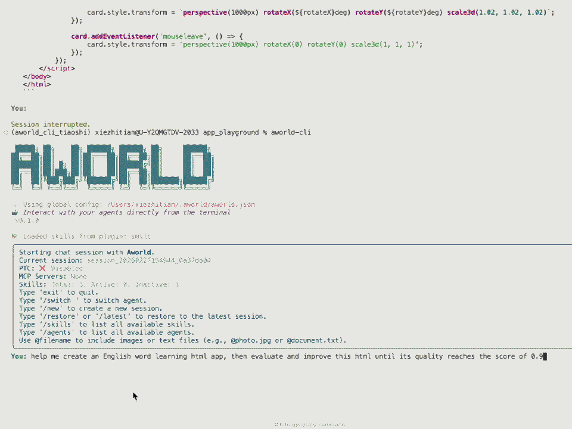

<div align="center">

# AWorld: The Agent Harness for Your World

</div>

<h4 align="center">

*"The Next Frontier for AI is Your Expertise"*

[![Twitter Follow][twitter-image]][twitter-url]
[![WeChat QR Code][wechat-image]][wechat-url]
[![Discord][discord-image]][discord-url]
[![License: MIT][license-image]][license-url]
[![DeepWiki][deepwiki-image]][deepwiki-url]
[![Tutorial][tutorial-image]][tutorial-url]
<!-- [![arXiv][arxiv-image]][arxiv-url] -->
<!-- [![Playground][playground-image]][playground-url] -->

</h4>

<h4 align="center">

[中文版](./README_zh.md) |
[Automation](#your-journey-with-aworld-cli) |
[Manual](#total-control-manually-crafting-agent-systems) |
[Evolution](#evolution) |
[Contributing](#contributing) |


</h4>

---

<p align="justify">
General AI often hits a "wall of context"—the nuanced data, workflows, and intuition that define <em>your</em> world. An agent's true power lies not in the model alone, but in its <b>Agent Harness</b>: the framework orchestrating its tools, memory, context, and execution.

This is the <b>AWorld Thesis</b>: A powerful harness is not enough. True AI scaling is unlocked only when experts like you embed the invaluable knowledge, effectively building the gate in that wall. 

AWorld is the platform designed for this singular purpose. We provide a complete, battle-tested Harness as the recipe for you, the expert, to forge your knowledge into a fleet of autonomous agents. Together, we move beyond AI's generic promise to create robust, precise applications that master <em>your</em> specific domain.
</p>

# From Prompt to Product: Instant Creations

Before diving deep into the framework, see what AWorld-CLI can build for you right now. Turn a single prompt into a polished, functional product—all orchestrated by the AWorld Agent and its team. Here are what's possible with just one command.

<table>
<colgroup>
  <col style="width:15%">
  <col style="width:36%">
  <col style="width:26%">
  <col style="width:23%">
</colgroup>
<thead>
<tr>
  <th>Capability</th>
  <th>Features</th>
  <th>See it in Action</th>
  <th>Recipe</th>
</tr>
</thead>
<tbody>
<tr>
  <td>Create App</td>
  <td>• Auto-creation by <a href="aworld-skills/frontend_design">AWorld Skill</a><br>• Auto-evaluation by <a href="aworld-skills/app_evaluator">AWorld Skill</a></td>
  <td style="width:26%"></td>
  <td><a href="docs/Recipe/miniapp_build_recipe.md">View Recipe</a></td>
</tr>
<tr>
  <td>Create Video</td>
  <td>• Auto-creation by <a href="https://www.skillhub.club/skills/remotion-dev-remotion-remotion">Remotion Skill</a><br>• Human evaluation</td>
  <td style="width:26%"></td>
  <td><a href="docs/Recipe/video_create_recipe.md">View Recipe</a></td>
</tr>
</tbody>
</table>


# Your Journey with AWorld-CLI
The journey from an idea to an evolved, autonomous agent begins at your fingertips.


## Install and Activate

Install once, configure globally, and run anywhere.

**Install AWorld-CLI**
```bash
git clone https://github.com/inclusionAI/AWorld && cd AWorld

conda create -n aworld_env python=3.11 -y && conda activate aworld_env 

pip install -e . && cd aworld-cli && pip install -e .
```


**Config & Launch**

```bash
cd your working directory

aworld-cli --config
```

Once configured, simply type aworld-cli in your terminal to start your journey.

Alternatively, you can configure by creating a `.env` file in your working directory with your model and API settings. See [Environment configuration](./README_env_config.md) for details.


## Automate Creation with AWorld-CLI
<p align="justify">
AWorld-CLI goes beyond simple scaffolding. It acts as a central brain, the AWorld Agent, which orchestrates a team of specialized sub-agents to build, evaluate, and even evolve other agents autonomously.

This multi-agent system works in concert to turn your ideas into reality:
</p>

<table>
<colgroup>
  <col style="width:17%">
  <col style="width:83%">
</colgroup>
<thead>
<tr><th>Agent Name</th><th>Role & Core Function</th></tr>
</thead>
<tbody>
<tr><td>👑 AWorld Agent</td><td><strong>The Orchestrator</strong>: The central brain that interprets user goals, creates a plan, and delegates tasks to the appropriate sub-agents. It manages the entire workflow from start to finish.</td></tr>
<tr><td>🧑‍💻 Developer</td><td><strong>The Builder</strong>: The master craftsman responsible for writing, debugging, and refactoring code, such as applicable html.</td></tr>
<tr><td>🧐 Evaluator</td><td><strong>The Judge</strong>: The quality assurance expert. It assesses the Developer's output against objective criteria defined by Skills (e.g., UI score), providing the critical feedback required for the evolution loop.</td></tr>
</tbody>
</table>

### The Evolution Loop: Build -> Evaluate -> Evolve

Imagine you ask: *"Help me create an English word learning mini-app with a UI quality score above 0.9."*

*   **The Developer Builds**: The `Developer` agent analyzes requirements and writes code (e.g., HTML/JS) using **CAST**, our specialized code analysis and compression toolset that allows agents to read and modify complex repositories with surgical precision.
*   **The Evaluator Judges**: The `Evaluator` agent inspects the output using verified Skills (e.g., a professional UI Assessment Skill).
*   **The Loop Refines**: If the score is below target (e.g., 0.7), AWorld instructs the Developer to fix specific issues identified by the Evaluator. This loop continues until your criteria are met.

***📹  See the Self-Evolution Loop in Action***


https://github.com/user-attachments/assets/ff56195e-e117-4d33-b709-9a2144680abd


### No Evaluation, No Evolution

<p align="justify">
For an agent to improve, it must first understand what "good" looks like. This is the core of AWorld's autonomous evolution loop. However, real-world evolution is hard: codebases are massive, context windows are limited, and tasks require precise, long-term iteration.
</p>
<p align="justify">
AWorld provides the complete infrastructure for this loop, turning your expertise into the driving force of evolution.
</p>

#### CAST: Conquering Code Complexity
<p align="justify">
Agents often fail because they are overwhelmed by code complexity. We built <b>CAST</b> (Code Abstract Syntax Tree) to solve this. Instead of seeing a flat text file, CAST gives the agent an architectural blueprint of the code. This enables:
</p>

*   **Hierarchical Navigation**: Instantly understand code structure and purpose without getting lost in implementation details.
*   **Nearly Infinite Context**: Intelligently compresses code to feed the agent only relevant information, breaking the context window limitation.
*   **Surgical Code Modification**: Perform precise changes with full dependency awareness, avoiding the clumsy errors of "blind" text replacement.

#### Your Expertise as the Evaluator
<p align="justify">
CAST provides the technical capability for change, but your knowledge provides the direction. AWorld's <b>Shared Skill System</b> makes your expertise the ultimate measure of quality.
</p>

<ul>
    <li><b>Automated Evaluation</b>: A Skill (e.g., <i>UI Aesthetics Score</i>) teaches the <code>Evaluator</code> agent how to judge performance and identify flaws, setting a clear, objective target for the <code>Developer</code> agent. This creates a powerful synergy: the <code>Evaluator</code> sets the target, and the <code>Developer</code> uses the same knowledge to hit it.</li>
    <br>
    <li><b>Human Evaluation</b>: Your intuition is the ceiling. You are the ultimate evaluator. Provide natural language feedback at any stage, and the AWorld agent will interpret it as a high-priority instruction for the next evolutionary cycle.</li>
</ul>

<p align="justify">
Whether it's an automated score from a Skill you contributed or your direct manual guidance, in AWorld, precise feedback drives precise evolution.
</p>


# Total Control: Manually Crafting Agent Systems

<p align="justify">
In AWorld, an agent is a model enhanced with tools. But real-world problems often demand more than a single agent. To solve this, AWorld gives you full control with flexible build paths, allowing you to manually craft complex, multi-agent systems for collaboration.
</p>

1. Flexible Multi-Agent Orchestration, Rich Environment Sandbox, Comprehensive Observability Tracing [Docs](https://inclusionai.github.io/AWorld/Get%20Start/Core%20Capabilities/)

2. Parallel Tasks Runtime, Streaming Response [Docs](https://inclusionai.github.io/AWorld/Get%20Start/Parallel%20Tasks/)

3. Human in the Loop (HITL) [Docs](https://inclusionai.github.io/AWorld/Get%20Start/HITL/)


# Evolution
<p align="justify">
AWorld's mission is to handle the complexity so you can focus on innovation. This section showcases cutting-edge multi-agent systems built with AWorld, advancing toward AGI.


#### Agent Benchmarking

<table style="width: 100%; border-collapse: collapse; table-layout: fixed;">
  <thead>
    <tr>
      <th style="width: 30%; text-align: left; border-bottom: 2px solid #ddd; padding: 8px;">Category</th>
      <th style="width: 20%; text-align: left; border-bottom: 2px solid #ddd; padding: 8px;">Achievement</th>
      <th style="width: 20%; text-align: left; border-bottom: 2px solid #ddd; padding: 8px;">Performance</th>
      <th style="width: 25%; text-align: left; border-bottom: 2px solid #ddd; padding: 8px;">Key Innovation</th>
      <th style="width: 5%; text-align: left; border-bottom: 2px solid #ddd; padding: 8px;">Date</th>
    </tr>
  </thead>
  <tbody>
    <tr>
      <td style="padding: 8px; vertical-align: top;">🤖 Agent
        <br>
        <a href="https://playground.aworldagents.com/" target="_blank" style="text-decoration: none;">
          
        </a>
      </td>
      <td style="padding: 8px; vertical-align: top;">
        <strong>GAIA Benchmark <br>Excellence</strong>
        <br>
        <a href="https://huggingface.co/spaces/gaia-benchmark/leaderboard" target="_blank" style="text-decoration: none;">
          
        </a>
      </td>
      <td style="padding: 8px; vertical-align: top;">
        Pass@1: <strong>67.89</strong> <br>
        Pass@3: <strong>83.49</strong>
        <br> (109 tasks)
        <a href="./examples/gaia/README_GUARD.md" target="_blank" style="text-decoration: none;">
          
        </a>
      </td>
      <td style="padding: 8px; vertical-align: top;">
        Multi-agent system <br>stability & orchestration
        <br>
        <a href="https://arxiv.org/abs/2508.09889" target="_blank" style="text-decoration: none;">
          
        </a>
      </td>
      <td style="padding: 8px; vertical-align: top;">2025/08/06</td>
    </tr>
    <tr>
      <td style="padding: 8px; vertical-align: top;">🧠 Reasoning</td>
      <td style="padding: 8px; vertical-align: top;">
        <strong>IMO 2025 <br>Problem Solving</strong>
        <br>
        <a href="https://www.imo-official.org/year_info.aspx?year=2025" target="_blank" style="text-decoration: none;">
          
        </a>
      </td>
      <td style="padding: 8px; vertical-align: top;">
        <strong>5/6</strong> problems <br>solved in 6 hours
        <br>
        <a href="examples/imo/README.md" target="_blank" style="text-decoration: none;">
          
        </a>
      </td>
      <td style="padding: 8px; vertical-align: top;">Multi-agent collaboration <br>beats solo models</td>
      <td style="padding: 8px; vertical-align: top;">2025/07/25</td>
    </tr>
    <tr>
      <td style="padding: 8px; vertical-align: top;">🖼️ Multi-Modal</td>
      <td style="padding: 8px; vertical-align: top;">
        <strong>OSWorld <br>Rank 1st</strong>
        <br>
        <a href="https://os-world.github.io/" target="_blank" style="text-decoration: none;">
          
        </a>
      </td>
      <td style="padding: 8px; vertical-align: top;">
        <strong>58.0%</strong> <br> Success Rate
        <br>
        <a href="examples/osworld/README.md" target="_blank" style="text-decoration: none;">
          
        </a>
      </td>
      <td style="padding: 8px; vertical-align: top;">The more tools the better?</td>
      <td style="padding: 8px; vertical-align: top;">2025/09/18</td>
    </tr>
    <tr>
      <td style="padding: 8px; vertical-align: top;">🖼️ Multi-Modal</td>
      <td style="padding: 8px; vertical-align: top;">
        <strong>VisualWebArena Rank 1st in September</strong>
        <br>
        <a href="https://docs.google.com/spreadsheets/d/1M801lEpBbKSNwP-vDBkC_pF7LdyGU1f_ufZb_NWNBZQ/edit?gid=2044883967#gid=2044883967" target="_blank" style="text-decoration: none;">
          
        </a>
      </td>
      <td style="padding: 8px; vertical-align: top;">
        <strong>36.5%</strong> <br> Success Rate
        <br>
        <a href="examples/visualwebarena/README.md" target="_blank" style="text-decoration: none;">
          
        </a>
      </td>
      <td style="padding: 8px; vertical-align: top;">Automated tool generation <br>
        <a href="https://arxiv.org/pdf/2509.21072" target="_blank" style="text-decoration: none;">
          </td>
      <td style="padding: 8px; vertical-align: top;">2025/09/25</td>
    </tr>
    <tr>
      <td style="padding: 8px; vertical-align: top;">🔍 Deep-Search</td>
      <td style="padding: 8px; vertical-align: top;">
        <strong>Xbench Excellence</strong>
        <br>
        <a href="https://xbench.org/" target="_blank" style="text-decoration: none;">
          
        </a>
      </td>
      <td style="padding: 8px; vertical-align: top;">
        Pass@1: 51 <br> Pass@3: 61
        <br>
        <a href="examples/xbench/README.md" target="_blank" style="text-decoration: none;">
          
        </a>
      </td>
      <td style="padding: 8px; vertical-align: top;">
          AWorld has its own context engine: Amni.
      </td>
      <td style="padding: 8px; vertical-align: top;">2025/10/23</td>
    </tr>
  </tbody>
</table>

#### Data Synthesis

1. **FunReason-MT Technical Report: Overcoming the Complexity Barrier in Multi-Turn Function Calling** arxiv, 2025. [paper](https://arxiv.org/abs/2510.24645), [code](https://github.com/inclusionAI/AWorld-RL), [model](https://huggingface.co/Bingguang/FunReason-MT), [dataset](https://huggingface.co/datasets/Bingguang/FunReason-MT)

    *Zengzhuang Xu, Bingguang Hao, Zechuan Wang, Yuntao Wen, Maolin Wang, etc.*
   
2. **From Failure to Mastery: Generating Hard Samples for Tool-use Agents** arxiv, 2026. [paper](https://arxiv.org/abs/2601.01498), [code](https://github.com/inclusionAI/AWorld-RL), [model](https://huggingface.co/Bingguang/FunReason-MT), [dataset](https://huggingface.co/datasets/Bingguang/FunReason-MT)

    *Bingguang Hao, Zengzhuang Xu, Yuntao Wen, Xinyi Xu, Yang Liu, etc.*


#### Model Training

1. **AWorld: Orchestrating the Training Recipe for Agentic AI.** arxiv, 2025. [paper](https://arxiv.org/abs/2508.20404), [code](https://github.com/inclusionAI/AWorld/tree/main/train), [model](https://huggingface.co/inclusionAI/Qwen3-32B-AWorld)

    *Chengyue Yu, Siyuan Lu, Chenyi Zhuang, Dong Wang, Qintong Wu, etc.*

2. **FunReason: Enhancing Large Language Models' Function Calling via Self-Refinement Multiscale Loss and Automated Data Refinement.** arxiv, 2025. [paper](https://arxiv.org/abs/2505.20192), [model](https://huggingface.co/Bingguang/FunReason)

    *Bingguang Hao, Maolin Wang, Zengzhuang Xu, Cunyin Peng, etc.*

3. **Exploring Superior Function Calls via Reinforcement Learning.** arxiv, 2025. [paper](https://arxiv.org/abs/2508.05118), [code](https://github.com/BingguangHao/RLFC)

    *Bingguang Hao, Maolin Wang, Zengzhuang Xu, Yicheng Chen, etc.*

4. **RAG-R1 : Incentivize the Search and Reasoning Capabilities of LLMs through Multi-query Parallelism.** arxiv, 2025. [paper](https://arxiv.org/abs/2507.02962), [code](https://github.com/inclusionAI/AgenticLearning), [model](https://huggingface.co/collections/endertzw/rag-r1-68481d7694b3fca8b809aa29)

    *Zhiwen Tan, Jiaming Huang, Qintong Wu, Hongxuan Zhang, Chenyi Zhuang, Jinjie Gu*

5. **V2P: From Background Suppression to Center Peaking for Robust GUI Grounding Task.** arxiv, 2025. [paper](https://arxiv.org/abs/2508.13634), [code](https://github.com/inclusionAI/AgenticLearning/tree/main/V2P)

    *Jikai Chen, Long Chen, Dong Wang, Leilei Gan, Chenyi Zhuang, Jinjie Gu*

6. **Don’t Just Fine-tune the Agent, Tune the Environment** arxiv, 2025. [paper](https://arxiv.org/abs/2510.10197)

    *Siyuan Lu, Zechuan Wang, Hongxuan Zhang, Qintong Wu, Leilei Gan, Chenyi Zhuang, etc.*


#### Meta Learning

1. **Profile-Aware Maneuvering: A Dynamic Multi-Agent System for Robust GAIA Problem Solving by AWorld.** arxiv, 2025. [paper](https://arxiv.org/abs/2508.09889), [code](https://github.com/inclusionAI/AWorld/blob/main/examples/gaia/README_GUARD.md)

    *Zhitian Xie, Qintong Wu, Chengyue Yu, Chenyi Zhuang, Jinjie Gu*

2. **Recon-Act: A Self-Evolving Multi-Agent Browser-Use System via Web Reconnaissance, Tool Generation, and Task Execution.** arxiv, 2025. [paper](https://arxiv.org/pdf/2509.21072), [code](https://github.com/inclusionAI/AWorld/tree/main/examples/visualwebarena)

    *Kaiwen He, Zhiwei Wang, Chenyi Zhuang, Jinjie Gu*

</p>


# Contributing
<p align="justify">
Our roadmap includes expanding our AI for Science & Business initiative, deepening our self-evolution capabilities, and growing our library of community-contributed Skills.

We warmly welcome developers, researchers, and domain experts to join us. Whether you're enhancing the framework or contributing a Skill from your field of expertise, your work is valuable.

For academic citations or wish to contact us, please use the following BibTeX entry:
</p>

```bibtex
@misc{yu2025aworldorchestratingtrainingrecipe,
      title={AWorld: Orchestrating the Training Recipe for Agentic AI}, 
      author={Chengyue Yu and Siyuan Lu and Chenyi Zhuang and Dong Wang and Qintong Wu and Zongyue Li and Runsheng Gan and Chunfeng Wang and Siqi Hou and Gaochi Huang and Wenlong Yan and Lifeng Hong and Aohui Xue and Yanfeng Wang and Jinjie Gu and David Tsai and Tao Lin},
      year={2025},
      eprint={2508.20404},
      archivePrefix={arXiv},
      primaryClass={cs.AI},
      url={https://arxiv.org/abs/2508.20404}, 
}
```

<!-- # Star History
 -->


<!-- resource section start -->
<!-- image links -->
[arxiv-image]: https://img.shields.io/badge/Paper-arXiv-B31B1B?style=for-the-badge&logo=arxiv&logoColor=white
[blog-image]: https://img.shields.io/badge/Blog-Coming%20Soon-FF5722?style=for-the-badge&logo=blogger&logoColor=white
[deepwiki-image]: https://img.shields.io/badge/DeepWiki-Explore-blueviolet?style=for-the-badge&logo=wikipedia&logoColor=white
[discord-image]: https://img.shields.io/badge/Discord-Join%20us-blue?style=for-the-badge&logo=discord&logoColor=white
[github-code-image]: https://img.shields.io/badge/Code-GitHub-181717?style=for-the-badge&logo=github&logoColor=white
[huggingface-dataset-image]: https://img.shields.io/badge/Dataset-Coming%20Soon-007ACC?style=for-the-badge&logo=dataset&logoColor=white
[huggingface-model-image]: https://img.shields.io/badge/Model-Hugging%20Face-FF6B6B?style=for-the-badge&logo=huggingface&logoColor=white
[license-image]: https://img.shields.io/badge/License-MIT-yellow?style=for-the-badge
[twitter-image]: https://img.shields.io/badge/Twitter-Follow%20us-1DA1F2?style=for-the-badge&logo=twitter&logoColor=white
[wechat-image]: https://img.shields.io/badge/WeChat-Add%20us-green?style=for-the-badge&logo=wechat&logoColor=white
[tutorial-image]: https://img.shields.io/badge/Tutorial-Get%20Started-FF6B35?style=for-the-badge&logo=book&logoColor=white
[playground-image]: https://img.shields.io/badge/Playground-Try%20Online-9B59B6?style=for-the-badge&logo=book&logoColor=white

<!-- aworld links -->
[deepwiki-url]: https://deepwiki.com/inclusionAI/AWorld
[discord-url]: https://discord.gg/b4Asj2ynMw
[license-url]: https://opensource.org/licenses/MIT
[twitter-url]: https://x.com/AWorldAgents
[wechat-url]: https://raw.githubusercontent.com/inclusionAI/AWorld/main/readme_assets/aworld_wechat.png
[arxiv-url]: https://arxiv.org/abs/2508.20404
[tutorial-url]: https://inclusionai.github.io/AWorld/
[playground-url]: https://playground.aworldagents.com/

<!-- funreason links -->
[funreason-code-url]: https://github.com/BingguangHao/FunReason
[funreason-model-url]: https://huggingface.co/Bingguang/FunReason
[funreason-paper-url]: https://arxiv.org/pdf/2505.20192
<!-- [funreason-dataset-url]: https://github.com/BingguangHao/FunReason -->
<!-- [funreason-blog-url]: https://github.com/BingguangHao/FunReason -->

<!-- deepsearch links -->
[deepsearch-code-url]: https://github.com/inclusionAI/AgenticLearning
[deepsearch-dataset-url]: https://github.com/inclusionAI/AgenticLearning
[deepsearch-model-url]: https://huggingface.co/collections/endertzw/rag-r1-68481d7694b3fca8b809aa29
[deepsearch-paper-url]: https://arxiv.org/abs/2507.02962

<!-- badge -->
[MAS]: https://img.shields.io/badge/Mutli--Agent-System-EEE1CE
[IMO]: https://img.shields.io/badge/IMO-299D8F
[BFCL]: https://img.shields.io/badge/BFCL-8AB07D
[GAIA]: https://img.shields.io/badge/GAIA-E66F51
[Runtime]: https://img.shields.io/badge/AWorld-Runtime-287271
[Leaderboard]: https://img.shields.io/badge/Leaderboard-FFE6B7
[Benchmark]: https://img.shields.io/badge/Benchmark-FFE6B7
[Cloud-Native]: https://img.shields.io/badge/Cloud--Native-B19CD7
[Forward]: https://img.shields.io/badge/Forward-4A90E2
[Backward]: https://img.shields.io/badge/Backward-7B68EE
[Code]: https://img.shields.io/badge/Code-FF6B6B
[Paper]: https://img.shields.io/badge/Paper-4ECDC4


<!-- resource section end -->
