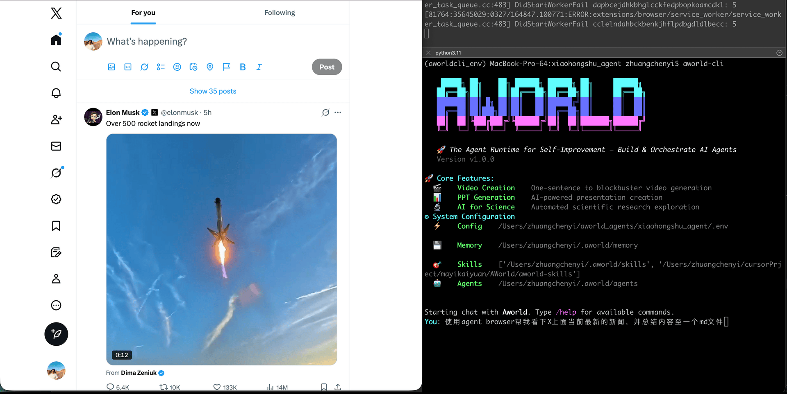
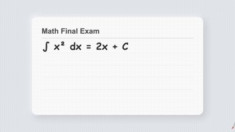

<div align="center">

# AWorld：为你的世界打造的智能体驾驭框架

</div>

<h4 align="center">

*"AI 的下一个前沿，是你的专业能力"*

[![Twitter Follow][twitter-image]][twitter-url]
[![WeChat QR Code][wechat-image]][wechat-url]
[![Discord][discord-image]][discord-url]
[![License: MIT][license-image]][license-url]
[![DeepWiki][deepwiki-image]][deepwiki-url]
[![Tutorial][tutorial-image]][tutorial-url]
<!-- [![arXiv][arxiv-image]][arxiv-url] -->
<!-- [![Playground][playground-image]][playground-url] -->

</h4>

<h4 align="center">

[English](./README.md) |
[自动化](#你的-aworld-cli-之旅) |
[手动](#完全掌控手动打造智能体系统) |
[演进](#演进) |
[参与贡献](#参与贡献) |


</h4>

---

<p align="justify">
通用 AI 常常会撞上“上下文之墙”——那些定义<em>你</em>所在世界的细微数据、工作流与专业直觉。智能体的真正力量不仅来自模型本身，更来自其<b>Agent Harness（智能体驾驭框架）</b>：用于编排工具、记忆、上下文与执行过程的整体框架。

这就是<b>AWorld 理念</b>：仅有强大的 Harness 还不够。只有当像你这样的专家把宝贵知识嵌入其中，真正打通这堵墙，AI 的规模化价值才会被释放。

AWorld 正是为此而生的平台。我们提供一套完整、久经实战验证的 Harness 作为“配方”，帮助你（领域专家）把专业知识锻造成一支自主智能体舰队。我们一起超越 AI 的泛化承诺，构建稳健、精准、真正掌握<em>你</em>所在领域的应用。
</p>

# 从专业能力到产品

看看当专家知识被编码成可复用的 **Skill（技能）** 会发生什么。下面这些成果都由 AWorld Agent 编排完成，体现了我们的核心规模化定律：社区贡献的专业能力越多，整个生态就越强。

这些只是今天已经做到的。想象一下，加入*你的*专业能力后我们还能创造什么。

<table>
<colgroup>
  <col style="width:15%">
  <col style="width:40%">
  <col style="width:22%">
  <col style="width:23%">
</colgroup>
<thead>
<tr>
  <th>能力</th>
  <th>专业能力</th>
  <th>效果演示</th>
  <th>配方</th>
</tr>
</thead>
<tbody>
<tr>
  <td>创建应用</td>
  <td>• 由基座模型自动创建<br>• 由 <a href="aworld-skills/app_evaluator/SKILL.md">UI Evaluation Skill</a> 自动评估</td>
  <td style="width:22%"></td>
  <td><a href="docs/Recipe/miniapp_build_recipe.md">查看配方</a></td>
</tr>

<tr>
  <td>深度搜索</td>
  <td>• 由 <a href="./aworld-skills/agent-browser/SKILL.md">Agent Browser Skill</a> 自动搜索</td>
  <td style="width:22%"></td>
  <td><a href="docs/Recipe/deep_search_recipe.md">查看配方</a></td>
</tr>
<!-- 
<tr>
  <td>创建视频：自我介绍</td>
  <td>• 由 <a href="https://www.skillhub.club/skills/remotion-dev-remotion-remotion">Remotion Skill</a> 自动创建<br>• 人工评估</td>
  <td style="width:22%"></td>
  <td><a href="docs/Recipe/video_create_recipe.md">查看配方</a></td>
</tr> -->

<!-- <tr>
  <td>创建视频：微积分</td>
  <td>• 由 <a href="https://www.skillhub.club/skills/remotion-dev-remotion-remotion">Remotion Skill</a> 自动创建<br>• 完整视频见 <a href="https://youtu.be/98rrFKJBr-w">Youtube </td>
  <td style="width:22%"></td>
  <td><a href="docs/Recipe/video_create_recipe.md">查看配方</a></td>
</tr> -->

<tr>
  <td>创建视频：三角恒等式</td>
  <td>• 由 <a href="https://www.skillhub.club/skills/remotion-dev-remotion-remotion">Remotion Skill</a> 自动创建<br>• 完整视频见 <a href="https://www.youtube.com/watch?v=qmPruOMsAKU">Youtube </td>
  <td style="width:22%"></td>
  <td><a href="docs/Recipe/video_create_recipe.md">查看配方</a></td>
</tr>

<tr>
  <td>创建视频：企业培训</td>
  <td>• 由 <a href="https://www.skillhub.club/skills/remotion-dev-remotion-remotion">Remotion Skill</a> 自动创建<br>• 完整视频见 <a href="https://youtu.be/-QuzXw4MrHQ">Youtube </td>
  <td style="width:22%"></td>
  <td><a href="docs/Recipe/video_create_recipe.md">查看配方</a></td>
</tr>

<tr>
  <td>创建视频：品牌营销</td>
  <td>• 由 Video Diffusion 与 <a href="aworld-skills/video_subtitles_audios_insert/SKILL.md">Audios Insert Skill</a> 自动创建<br>• 完整视频见 <a href="https://youtu.be/dIDjABTFppg">Youtube</td>
  <td style="width:22%"></td>
  <td><a href="docs/Recipe/video_create_recipe.md">查看配方</a></td>
</tr>

<tr>
  <td>创建视频：社交媒体</td>
  <td>• 由 Video Diffusion 与 <a href="aworld-skills/video_subtitles_audios_insert/SKILL.md">Audios Insert Skill</a> 自动创建<br>• 完整视频见 <a href="https://youtu.be/L6hIwpqLy5w">Youtube</td>
  <td style="width:22%"></td>
  <td><a href="docs/Recipe/video_create_recipe.md">查看配方</a></td>
</tr>

<tr>
  <td>创建视频：Vtuber</td>
  <td>• 由 Video Diffusion + Audio Generator + <a href="aworld-skills/embedded_video/SKILL.md">Video Embedded Skill</a> 自动创建<br>• 完整视频见 <a href="https://youtu.be/THKfbjYolqs">Youtube</td>
  <td style="width:22%"></td>
  <td><a href="docs/Recipe/video_create_recipe.md">查看配方</a></td>
</tr>

</tbody>
</table>


# 你的 AWorld-CLI 之旅
从一个想法到一个可演进的自主智能体，旅程从你的指尖开始。


## 安装与激活

一次安装，全局配置，随处运行。

**安装 AWorld-CLI**
```bash
git clone https://github.com/inclusionAI/AWorld && cd AWorld

conda create -n aworld_env python=3.11 -y && conda activate aworld_env 

pip install -e . && cd aworld-cli && pip install -e .
```


**配置并启动**

```bash
cd 你的工作目录

aworld-cli --config
```

配置完成后，只需在终端输入 `aworld-cli`，即可开始你的旅程。

或者，你也可以在`工作目录`中创建 `.env` 文件来配置模型与 API。详见 [环境配置](./README_env_config.md)。


## 用 AWorld-CLI 自动化创建
<p align="justify">
AWorld-CLI 不只是脚手架工具。它像一个中枢大脑（AWorld Agent），会编排多个专业子智能体，自主完成构建、评估，甚至持续演进其他智能体。

这套多智能体系统协同运作，把你的想法真正变成可运行成果：
</p>

<table>
<thead>
<tr><th style="white-space:nowrap">智能体名称</th><th>角色与核心功能</th></tr>
</thead>
<tbody>
<tr><td style="white-space:nowrap">👑 AWorld Agent</td><td><strong>总编排者</strong>：中心大脑，负责理解用户目标、制定计划、分派任务给对应子智能体，并管理端到端工作流。</td></tr>
<tr><td style="white-space:nowrap">🧑‍💻 Developer</td><td><strong>构建者</strong>：负责编写、调试、重构代码的核心执行者。</td></tr>
<tr><td style="white-space:nowrap">🧐 Evaluator</td><td><strong>评判者</strong>：质量保障专家。按客观标准评估 Developer 产出，提供演进循环所需关键反馈。</td></tr>
<tr><td style="white-space:nowrap">🎬 Video Diffusion</td><td><strong>视频生成者</strong>：基于扩散模型（如 Kling-V3）的子智能体，可根据文本或“文本+图片”输入生成视频。</td></tr>
<tr><td style="white-space:nowrap">🎤 Audio Generator</td><td><strong>语音生成者</strong>：基于 TTS 模型的子智能体，可将文本转换为语音音频。</td></tr>
<tr><td style="white-space:nowrap">🖼️ Image Generator</td><td><strong>图像生成者</strong>：可根据文本或“文本+图片”输入生成图像的子智能体。</td></tr>
</tbody>
</table>

### 演进循环：Build -> Evaluate -> Evolve

假设你提出：*“帮我做一个英语单词学习小程序，UI 质量评分要高于 0.9。”*

*   **Developer 先构建**：`Developer` 分析需求，借助 [CAST](#cast征服代码复杂度) 编写代码（如 HTML）。
*   **Evaluator 再评判**：`Evaluator` 使用 [已验证的 Skill](aworld-skills/app_evaluator/SKILL.md) 检查输出质量。
*   **循环持续精炼**：如果分数低于目标（例如 0.9），AWorld 会指示 Developer 针对 Evaluator 指出的具体问题修复。循环反复直到满足你的标准。

***📹 观看自演进循环实战***

<p align="center">
  <video src="https://github.com/user-attachments/assets/ff56195e-e117-4d33-b709-9a2144680abd" 
         poster="readme_assets/evolution_loop_poster.png" 
         width="80%" controls style="max-width: 80%;">
  </video>
</p>


### 没有评估，就没有演进

<p align="justify">
智能体要想进步，必须先知道“什么是好”。评估是我们自主演进循环的核心，但这本身是复杂挑战：从有明确指标的<b>客观</b>任务（例如数学题）到依赖人类偏好的<b>主观</b>任务。真实世界中的演进还会受到超大代码库、上下文窗口有限、以及精细迭代需求的共同制约。
</p>
<p align="justify">
AWorld 提供了同时驾驭这两类评估场景的完整基础设施，把你的专业能力转化为驱动智能体完成整个演进循环的核心力量。
</p>

#### CAST：征服代码复杂度
<p align="justify">
智能体常常因代码复杂度过高而失败。为此我们打造了 <b>CAST</b>（Code Abstract Syntax Tree）。它不再让智能体面对扁平文本，而是给出代码的架构蓝图，从而实现：
</p>

*   **层级导航**：快速理解代码结构和目标，不被实现细节淹没。
*   **近乎无限上下文**：智能压缩代码，只提供相关信息，突破上下文窗口限制。
*   **外科手术式修改**：在完整依赖感知下精确改动，避免“盲改文本”带来的粗糙错误。

#### 你的专业能力就是评判者
<p align="justify">
CAST 提供“修改能力”，而你的知识提供“方向”。AWorld 的 <b>共享 Skill 系统</b> 让你的专业能力成为质量的最终衡量标准。
</p>

<p align="justify">
<b>自动评估</b>：<code>Evaluator</code> 负责判断表现并识别问题，为 <code>Developer</code> 设定清晰、客观的目标。二者形成强协同：<code>Evaluator</code> 定义目标，<code>Developer</code> 用同一套知识实现目标。
</p>

<p align="justify">
<b>人工评估</b>：当任务需要主观判断时，你的直觉就是上限。你是最终评判者。你在任意阶段给出的自然语言反馈，AWorld 都会将其视为下一轮演进的高优先级指令。
</p>

<p align="justify">
无论是来自你贡献 Skill 的自动打分，还是你亲自提供的人工反馈，在 AWorld 中，精确反馈都会驱动精确演进。
</p>


# 久经验证的 Harness：基准成绩说明一切
<p align="justify">
下面这些在竞争性基准上的领先排名，不只是单一智能体的表现，更是对 AWorld **Harness** 的直接验证。它们证明：我们稳健、经受实战考验的基础设施，正是构建 SOTA 级 AI 系统所需的底座。


#### 智能体基准评测

<table style="width: 100%; border-collapse: collapse; table-layout: fixed;">
  <thead>
    <tr>
      <th style="width: 30%; text-align: left; border-bottom: 2px solid #ddd; padding: 8px;">类别</th>
      <th style="width: 20%; text-align: left; border-bottom: 2px solid #ddd; padding: 8px;">成就</th>
      <th style="width: 20%; text-align: left; border-bottom: 2px solid #ddd; padding: 8px;">成绩</th>
      <th style="width: 25%; text-align: left; border-bottom: 2px solid #ddd; padding: 8px;">关键创新</th>
      <th style="width: 5%; text-align: left; border-bottom: 2px solid #ddd; padding: 8px;">日期</th>
    </tr>
  </thead>
  <tbody>
    <tr>
      <td style="padding: 8px; vertical-align: top;">🤖 Agent
        <br>
        <a href="https://playground.aworldagents.com/" target="_blank" style="text-decoration: none;">
          
        </a>
      </td>
      <td style="padding: 8px; vertical-align: top;">
        <strong>GAIA Benchmark <br>Excellence</strong>
        <br>
        <a href="https://huggingface.co/spaces/gaia-benchmark/leaderboard" target="_blank" style="text-decoration: none;">
          
        </a>
      </td>
      <td style="padding: 8px; vertical-align: top;">
        Pass@1: <strong>67.89</strong> <br>
        Pass@3: <strong>83.49</strong>
        <br> (109 tasks)
        <a href="./examples/gaia/README_GUARD.md" target="_blank" style="text-decoration: none;">
          
        </a>
      </td>
      <td style="padding: 8px; vertical-align: top;">
        Multi-agent system <br>stability & orchestration
        <br>
        <a href="https://arxiv.org/abs/2508.09889" target="_blank" style="text-decoration: none;">
          
        </a>
      </td>
      <td style="padding: 8px; vertical-align: top;">2025/08/06</td>
    </tr>
    <tr>
      <td style="padding: 8px; vertical-align: top;">🧠 Reasoning</td>
      <td style="padding: 8px; vertical-align: top;">
        <strong>IMO 2025 <br>Problem Solving</strong>
        <br>
        <a href="https://www.imo-official.org/year_info.aspx?year=2025" target="_blank" style="text-decoration: none;">
          
        </a>
      </td>
      <td style="padding: 8px; vertical-align: top;">
        <strong>5/6</strong> problems <br>solved in 6 hours
        <br>
        <a href="examples/imo/README.md" target="_blank" style="text-decoration: none;">
          
        </a>
      </td>
      <td style="padding: 8px; vertical-align: top;">Multi-agent collaboration <br>beats solo models</td>
      <td style="padding: 8px; vertical-align: top;">2025/07/25</td>
    </tr>
    <tr>
      <td style="padding: 8px; vertical-align: top;">🖼️ Multi-Modal</td>
      <td style="padding: 8px; vertical-align: top;">
        <strong>OSWorld <br>Rank 1st</strong>
        <br>
        <a href="https://os-world.github.io/" target="_blank" style="text-decoration: none;">
          
        </a>
      </td>
      <td style="padding: 8px; vertical-align: top;">
        <strong>58.0%</strong> <br> Success Rate
        <br>
        <a href="examples/osworld/README.md" target="_blank" style="text-decoration: none;">
          
        </a>
      </td>
      <td style="padding: 8px; vertical-align: top;">The more tools the better?</td>
      <td style="padding: 8px; vertical-align: top;">2025/09/18</td>
    </tr>
    <tr>
      <td style="padding: 8px; vertical-align: top;">🖼️ Multi-Modal</td>
      <td style="padding: 8px; vertical-align: top;">
        <strong>VisualWebArena Rank 1st in September</strong>
        <br>
        <a href="https://docs.google.com/spreadsheets/d/1M801lEpBbKSNwP-vDBkC_pF7LdyGU1f_ufZb_NWNBZQ/edit?gid=2044883967#gid=2044883967" target="_blank" style="text-decoration: none;">
          
        </a>
      </td>
      <td style="padding: 8px; vertical-align: top;">
        <strong>36.5%</strong> <br> Success Rate
        <br>
        <a href="examples/visualwebarena/README.md" target="_blank" style="text-decoration: none;">
          
        </a>
      </td>
      <td style="padding: 8px; vertical-align: top;">Automated tool generation <br>
        <a href="https://arxiv.org/pdf/2509.21072" target="_blank" style="text-decoration: none;">
          </td>
      <td style="padding: 8px; vertical-align: top;">2025/09/25</td>
    </tr>
    <tr>
      <td style="padding: 8px; vertical-align: top;">🔍 Deep-Search</td>
      <td style="padding: 8px; vertical-align: top;">
        <strong>Xbench Excellence</strong>
        <br>
        <a href="https://xbench.org/" target="_blank" style="text-decoration: none;">
          
        </a>
      </td>
      <td style="padding: 8px; vertical-align: top;">
        Pass@1: 51 <br> Pass@3: 61
        <br>
        <a href="examples/xbench/README.md" target="_blank" style="text-decoration: none;">
          
        </a>
      </td>
      <td style="padding: 8px; vertical-align: top;">
          AWorld has its own context engine: Amni.
      </td>
      <td style="padding: 8px; vertical-align: top;">2025/10/23</td>
    </tr>
  </tbody>
</table>

#### 数据合成

1. **FunReason-MT Technical Report: Overcoming the Complexity Barrier in Multi-Turn Function Calling** arxiv, 2025. [paper](https://arxiv.org/abs/2510.24645), [code](https://github.com/inclusionAI/AWorld-RL), [model](https://huggingface.co/Bingguang/FunReason-MT), [dataset](https://huggingface.co/datasets/Bingguang/FunReason-MT)

    *Zengzhuang Xu, Bingguang Hao, Zechuan Wang, Yuntao Wen, Maolin Wang, etc.*
   
2. **From Failure to Mastery: Generating Hard Samples for Tool-use Agents** arxiv, 2026. [paper](https://arxiv.org/abs/2601.01498), [code](https://github.com/inclusionAI/AWorld-RL), [model](https://huggingface.co/Bingguang/FunReason-MT), [dataset](https://huggingface.co/datasets/Bingguang/FunReason-MT)

    *Bingguang Hao, Zengzhuang Xu, Yuntao Wen, Xinyi Xu, Yang Liu, etc.*


#### 模型训练

1. **AWorld: Orchestrating the Training Recipe for Agentic AI.** arxiv, 2025. [paper](https://arxiv.org/abs/2508.20404), [code](https://github.com/inclusionAI/AWorld/tree/main/train), [model](https://huggingface.co/inclusionAI/Qwen3-32B-AWorld)

    *Chengyue Yu, Siyuan Lu, Chenyi Zhuang, Dong Wang, Qintong Wu, etc.*

2. **FunReason: Enhancing Large Language Models' Function Calling via Self-Refinement Multiscale Loss and Automated Data Refinement.** arxiv, 2025. [paper](https://arxiv.org/abs/2505.20192), [model](https://huggingface.co/Bingguang/FunReason)

    *Bingguang Hao, Maolin Wang, Zengzhuang Xu, Cunyin Peng, etc.*

3. **Exploring Superior Function Calls via Reinforcement Learning.** arxiv, 2025. [paper](https://arxiv.org/abs/2508.05118), [code](https://github.com/BingguangHao/RLFC)

    *Bingguang Hao, Maolin Wang, Zengzhuang Xu, Yicheng Chen, etc.*

4. **RAG-R1 : Incentivize the Search and Reasoning Capabilities of LLMs through Multi-query Parallelism.** arxiv, 2025. [paper](https://arxiv.org/abs/2507.02962), [code](https://github.com/inclusionAI/AgenticLearning), [model](https://huggingface.co/collections/endertzw/rag-r1-68481d7694b3fca8b809aa29)

    *Zhiwen Tan, Jiaming Huang, Qintong Wu, Hongxuan Zhang, Chenyi Zhuang, Jinjie Gu*

5. **V2P: From Background Suppression to Center Peaking for Robust GUI Grounding Task.** arxiv, 2025. [paper](https://arxiv.org/abs/2508.13634), [code](https://github.com/inclusionAI/AgenticLearning/tree/main/V2P)

    *Jikai Chen, Long Chen, Dong Wang, Leilei Gan, Chenyi Zhuang, Jinjie Gu*

6. **Don’t Just Fine-tune the Agent, Tune the Environment** arxiv, 2025. [paper](https://arxiv.org/abs/2510.10197)

    *Siyuan Lu, Zechuan Wang, Hongxuan Zhang, Qintong Wu, Leilei Gan, Chenyi Zhuang, etc.*


#### 元学习

1. **Profile-Aware Maneuvering: A Dynamic Multi-Agent System for Robust GAIA Problem Solving by AWorld.** arxiv, 2025. [paper](https://arxiv.org/abs/2508.09889), [code](https://github.com/inclusionAI/AWorld/blob/main/examples/gaia/README_GUARD.md)

    *Zhitian Xie, Qintong Wu, Chengyue Yu, Chenyi Zhuang, Jinjie Gu*

2. **Recon-Act: A Self-Evolving Multi-Agent Browser-Use System via Web Reconnaissance, Tool Generation, and Task Execution.** arxiv, 2025. [paper](https://arxiv.org/pdf/2509.21072), [code](https://github.com/inclusionAI/AWorld/tree/main/examples/visualwebarena)

    *Kaiwen He, Zhiwei Wang, Chenyi Zhuang, Jinjie Gu*

</p>


# 高级特性

## 后台子智能体执行（v2.0）

**非阻塞式编排**：启动子智能体后立即返回，主编排器可继续工作，子任务在后台执行。

```python
from aworld.core.common import ActionModel
from aworld.core.tool.builtin.spawn_subagent_tool import SpawnSubagentTool

# 初始化工具
spawn_tool = SpawnSubagentTool(subagent_manager=your_manager, conf=config)

# 1. 启动后台任务（立即返回）
action = ActionModel(
    action_name='spawn_background',
    params={
        'name': 'deep_researcher',
        'directive': 'Comprehensive research on quantum computing',
        'task_id': 'research_quantum'
    }
)
obs, reward, _, _, info = await spawn_tool.do_step([action])
task_id = info['task_id']

# 2. 编排器继续处理其他工作（并行执行）
# ... 分析已有数据、规划下一步、继续派发更多任务 ...

# 3. 检查任务状态（非阻塞）
check_action = ActionModel(
    action_name='check_task',
    params={'task_id': task_id, 'include_result': False}
)
obs, reward, _, _, info = await spawn_tool.do_step([check_action])
print(f"Status: {info['status']}, Elapsed: {info['elapsed']:.2f}s")

# 4. 在需要时等待任务完成
wait_action = ActionModel(
    action_name='wait_task',
    params={'task_ids': task_id, 'timeout': 300}
)
await spawn_tool.do_step([wait_action])

# 5. 获取结果
check_action = ActionModel(
    action_name='check_task',
    params={'task_id': task_id, 'include_result': True}
)
obs, reward, _, _, info = await spawn_tool.do_step([check_action])
result = info['result']
```

**性能收益**：编排器工作与子智能体执行可重叠，整体耗时从 `T_orchestrator + T_subagent` 降为 `max(T_orchestrator, T_subagent)`。基准测试显示在典型负载下可实现约 3 倍加速。

**文档**：详见 [docs/features/parallel-subagent-spawning.md](docs/features/parallel-subagent-spawning.md) 与 [docs/design/subagent-architecture.md](docs/design/subagent-architecture.md)

---

# 参与贡献
<p align="justify">
我们的路线图包括：扩展 AI for Science & Business 方向、深化自演进能力、并持续丰富社区共建 Skill 库。

我们诚挚欢迎开发者、研究者与领域专家加入。无论你是增强框架本身，还是贡献你所在领域的 Skill，你的工作都非常有价值。

如果你需要学术引用或希望联系我们，请使用以下 BibTeX：
</p>

```bibtex
@misc{yu2025aworldorchestratingtrainingrecipe,
      title={AWorld: Orchestrating the Training Recipe for Agentic AI}, 
      author={Chengyue Yu and Siyuan Lu and Chenyi Zhuang and Dong Wang and Qintong Wu and Zongyue Li and Runsheng Gan and Chunfeng Wang and Siqi Hou and Gaochi Huang and Wenlong Yan and Lifeng Hong and Aohui Xue and Yanfeng Wang and Jinjie Gu and David Tsai and Tao Lin},
      year={2025},
      eprint={2508.20404},
      archivePrefix={arXiv},
      primaryClass={cs.AI},
      url={https://arxiv.org/abs/2508.20404}, 
}
```

<!-- # Star History
 -->


<!-- resource section start -->
<!-- image links -->
[arxiv-image]: https://img.shields.io/badge/Paper-arXiv-B31B1B?style=for-the-badge&logo=arxiv&logoColor=white
[blog-image]: https://img.shields.io/badge/Blog-Coming%20Soon-FF5722?style=for-the-badge&logo=blogger&logoColor=white
[deepwiki-image]: https://img.shields.io/badge/DeepWiki-Explore-blueviolet?style=for-the-badge&logo=wikipedia&logoColor=white
[discord-image]: https://img.shields.io/badge/Discord-Join%20us-blue?style=for-the-badge&logo=discord&logoColor=white
[github-code-image]: https://img.shields.io/badge/Code-GitHub-181717?style=for-the-badge&logo=github&logoColor=white
[huggingface-dataset-image]: https://img.shields.io/badge/Dataset-Coming%20Soon-007ACC?style=for-the-badge&logo=dataset&logoColor=white
[huggingface-model-image]: https://img.shields.io/badge/Model-Hugging%20Face-FF6B6B?style=for-the-badge&logo=huggingface&logoColor=white
[license-image]: https://img.shields.io/badge/License-MIT-yellow?style=for-the-badge
[twitter-image]: https://img.shields.io/badge/Twitter-Follow%20us-1DA1F2?style=for-the-badge&logo=twitter&logoColor=white
[wechat-image]: https://img.shields.io/badge/WeChat-Add%20us-green?style=for-the-badge&logo=wechat&logoColor=white
[tutorial-image]: https://img.shields.io/badge/Tutorial-Get%20Started-FF6B35?style=for-the-badge&logo=book&logoColor=white
[playground-image]: https://img.shields.io/badge/Playground-Try%20Online-9B59B6?style=for-the-badge&logo=book&logoColor=white

<!-- aworld links -->
[deepwiki-url]: https://deepwiki.com/inclusionAI/AWorld
[discord-url]: https://discord.gg/b4Asj2ynMw
[license-url]: https://opensource.org/licenses/MIT
[twitter-url]: https://x.com/AWorldAgents
[wechat-url]: https://raw.githubusercontent.com/inclusionAI/AWorld/main/readme_assets/aworld_wechat.png
[arxiv-url]: https://arxiv.org/abs/2508.20404
[tutorial-url]: https://inclusionai.github.io/AWorld/
[playground-url]: https://playground.aworldagents.com/

<!-- funreason links -->
[funreason-code-url]: https://github.com/BingguangHao/FunReason
[funreason-model-url]: https://huggingface.co/Bingguang/FunReason
[funreason-paper-url]: https://arxiv.org/pdf/2505.20192
<!-- [funreason-dataset-url]: https://github.com/BingguangHao/FunReason -->
<!-- [funreason-blog-url]: https://github.com/BingguangHao/FunReason -->

<!-- deepsearch links -->
[deepsearch-code-url]: https://github.com/inclusionAI/AgenticLearning
[deepsearch-dataset-url]: https://github.com/inclusionAI/AgenticLearning
[deepsearch-model-url]: https://huggingface.co/collections/endertzw/rag-r1-68481d7694b3fca8b809aa29
[deepsearch-paper-url]: https://arxiv.org/abs/2507.02962

<!-- badge -->
[MAS]: https://img.shields.io/badge/Mutli--Agent-System-EEE1CE
[IMO]: https://img.shields.io/badge/IMO-299D8F
[BFCL]: https://img.shields.io/badge/BFCL-8AB07D
[GAIA]: https://img.shields.io/badge/GAIA-E66F51
[Runtime]: https://img.shields.io/badge/AWorld-Runtime-287271
[Leaderboard]: https://img.shields.io/badge/Leaderboard-FFE6B7
[Benchmark]: https://img.shields.io/badge/Benchmark-FFE6B7
[Cloud-Native]: https://img.shields.io/badge/Cloud--Native-B19CD7
[Forward]: https://img.shields.io/badge/Forward-4A90E2
[Backward]: https://img.shields.io/badge/Backward-7B68EE
[Code]: https://img.shields.io/badge/Code-FF6B6B
[Paper]: https://img.shields.io/badge/Paper-4ECDC4


<!-- resource section end -->
