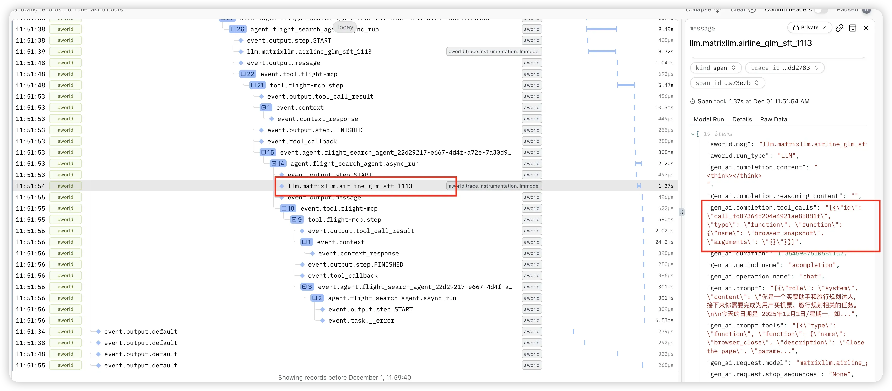

## Overview
The **AWorld Trace** module is a full-featured distributed tracing system built on **OpenTelemetry**, providing comprehensive observability capabilities for the AWorld framework. It offers flexible tracing configuration, automatic instrumentation, and manual tracing support, with compatibility for multiple backend storage and export options.

### Core Features
+ Built on the **OpenTelemetry standard**, ensuring compatibility with mainstream observability platforms
+ **Automatic instrumentation**: Tracks key components (Agent, Tool, LLM, etc.) without code modification
+ **Manual span creation and management** for fine-grained tracing control
+ Built-in **in-memory storage** and **Trace UI Server** for quick inspection of trace data
+ Seamless integration with third-party observability platforms (e.g., **Logfire**, **Jaeger**)
+ Highly **configurable** to meet diverse use-case requirements

### Main Components
+ `**TraceManager**`: Core tracing manager responsible for creating and managing spans
+ `**ContextManager**`: Handles propagation of tracing context across components and threads
+ `**Instrumentation**`: Automatically instruments core framework components
+ `**OpenTelemetryAdapter**`: Bridges AWorld’s tracing API with OpenTelemetry’s native APIs
+ `**TraceServer**`: Built-in UI server for visualizing trace data

## Quick Start
### Enabling Tracing in AWorld
To enable tracing, configure `ObservabilityConfig` at application startup:

```python
from aworld.trace.config import configure, ObservabilityConfig

# Configure tracing
config = ObservabilityConfig(
    trace_provider="otlp",
    trace_backends=["memory"],        # Use in-memory storage
    trace_server_enabled=True,        # Enable built-in Trace UI Server
    trace_server_port=7079            # UI server port
)

# Apply configuration
configure(config)
```

### Viewing Traces via Built-in UI
Once the Trace UI Server is enabled, access traces at:  
[http://localhost:7079](http://localhost:7079/)

The UI provides:

+ List of all recorded traces
+ Full call chain visualization for individual traces
+ Detailed span information (attributes, status, duration)
+ Time-based sorting and filtering

### Interpreting Trace UI Data


During execution, AWorld automatically creates several core span types to track component behavior:

+ **Event Span**
    - **Name format**: `event.<event_type>`
    - **Description**: AWorld is event-driven; each event execution is traced as a span prefixed with `event.` (e.g., `event.output`).
    - **Key attributes**:
        * `event.topic`: Event topic
        * `event.payload`: Event payload
        * `event.sender` / `event.receiver`: Source and destination
+ **Task Span**
    - **Name format**: `task.<session_id>`
    - **Description**: Represents a complete task execution.
    - **Key attributes**:
        * `task.id`, `task.input`, `task.is_sub_task`
+ **Agent Span**
    - **Name format**: `agent.<agent_name>`
    - **Description**: Traces an agent’s execution lifecycle.
    - **Key attributes**:
        * `agent.name`, `agent.id`, `session.id`, `user.id`
+ **Tool Span**
    - **Name format**: `tool.<tool_name>` (for MCP tools, `<tool_name>` = MCP service name)
    - **Description**: Captures tool execution.
    - **Key attributes**:
        * `tool.name`, `agent.name`, `agent.id`, `session.id`, `user.id`
    - **Viewing results**: Check child span `event.output.tool_call_result`
+ **LLM Span**
    - **Name format**: `llm.<model_name>`
    - **Description**: Records a single LLM invocation.
    - **Key attributes**:
        * `gen_ai.prompt`, `gen_ai.prompt.tools`
        * `gen_ai.request.*` (e.g., `top_k`)
        * `gen_ai.completion.content`, `.reasoning_content`, `.tool_calls`
        * `gen_ai.duration`, `gen_ai.first_token_duration`
        * Token usage: `input_tokens`, `output_tokens`, `total_tokens`

## Core Concepts
### **Trace**
A complete call chain composed of multiple spans, representing an end-to-end operation (e.g., one user task). Identified by a unique **Trace ID**.

### **Span**
A single operation unit within a trace, representing a specific execution step. Contains:

+ Name, start/end time, duration
+ Key-value **attributes**
+ **Status** (success/failure)
+ **Parent Span ID** and list of **child spans**

### **TraceContext**
Carries tracing metadata (Trace ID, Span ID, etc.) across services in distributed environments to link related spans.

### **TraceProvider**
Factory for creating `Tracer` instances. AWorld abstracts tracing implementation, allowing pluggable providers (default: OpenTelemetry).

### **Tracer**
Component that creates and manages spans in application code.

### **SpanConsumer**
Processes span data for custom logic—e.g., exporting to backends or generating real-time agent trajectories.

#### Usage Example
```python
from aworld.trace.span_consumer import SpanConsumer, register_span_consumer
from typing import Sequence

@register_span_consumer
class MySpanConsumer(SpanConsumer):
    def consume(self, spans: Sequence[Span]) -> None:
        for span in spans:
            print(f"Span processed: {span.get_name()}")
```

### **Instrumentation**
Automatic tracing of core components via bytecode enhancement or decorators—no code changes needed. AWorld includes built-in instrumentors (all enabled by default):

+ `**EventBusInstrumentor**`: Traces event execution and parent-child relationships
+ `**AgentInstrumentor**`: Auto-traces agent runs
+ `**ToolInstrumentor**`: Auto-traces tool executions
+ `**LLMModelInstrumentor**`: Auto-traces LLM calls
+ `**ThreadingInstrumentor**`: Propagates trace context across threads
+ **Web Framework Instrumentors**:
    - `FastAPIInstrumentor`
    - `FlaskInstrumentor`
+ `**RequestsInstrumentor**`: Traces outbound HTTP calls

#### Enabling Example (FastAPI)
```python
from aworld.trace.instrumentation.fastapi import FastAPIInstrumentor

FastAPIInstrumentor().instrument()
```

## Integration with Third-Party Observability Platforms
Built on OpenTelemetry and using the **OTLP** protocol (the de facto standard for trace data), AWorld integrates seamlessly with a wide range of observability platforms.

### Commercial Platforms
#### **Logfire** ([https://logfire.pydantic.dev](https://logfire.pydantic.dev/))
1. Create a project on Logfire and obtain a **Write Token**
2. Configure AWorld:

```plain
python


from aworld.trace.config import configure, ObservabilityConfig

config = ObservabilityConfig(
    trace_provider="otlp",
    trace_backends=["logfire"],
    trace_base_url="https://logfire-us.pydantic.dev",
    trace_write_token="your-logfire-write-token"
)

configure(config)
```

### Open-Source Platforms
#### **Jaeger** ([https://www.jaegertracing.io/](https://www.jaegertracing.io/))
Deploy Jaeger per [official docs](https://www.jaegertracing.io/docs/2.13/deployment/), then configure AWorld:

```python
config = ObservabilityConfig(
    trace_provider="otlp",
    trace_backends=["other_otlp"],
    trace_base_url="http://localhost:4317",  # Jaeger OTLP endpoint
    trace_write_token=None
)

configure(config)
```

## Custom Tracing
### Using Context Manager
```python
import aworld.trace as trace

with trace.span("custom_operation", attributes={"custom_attr": "value"}):
    result = perform_custom_operation()
```

### Decorator Approach
```python
@trace.func_span("custom_function", attributes={"function_type": "business"}, extract_args=True)
def custom_function(param1, param2):
    return result
# `extract_args=True` logs function arguments as span attributes (default: False)
```

### Adding Attributes to Current Span
```python
current_span = trace.get_current_span()
current_span.set_attribute("custom_key", "custom_value")
```

### Manual Span Lifecycle
```python
span = trace.span("manual_operation")
try:
    result = perform_operation()
    span.set_status("OK")
finally:
    span.end()
```

## Advanced Features
### Auto-Tracing Configuration
Automatically trace all function calls in specified modules:

```python
trace.auto_tracing(
    modules=["my_module", "another_module"],
    min_duration=0.1  # Only trace functions taking >100ms
)
```

### Trace Namespace Isolation
Isolate traces from different applications using environment variables:

```python
os.environ["MONITOR_SERVICE_NAME"] = "otlp_example"
```

### Integration with Other Trace Propagation Protocols
By default, AWorld uses OpenTelemetry’s **W3C TraceContext** propagation. To interoperate with systems using other protocols (e.g., Zipkin B3, SOFATracer), implement custom propagators.


#### Core Concepts
+ `**Propagator**`: Interface for injecting/extracting trace context
+ `**TraceContext**`: Holds `trace_id`, `span_id`, flags, etc.
+ `**Carrier**`: Transport medium (e.g., HTTP headers, message headers)

#### Architecture
AWorld uses a `**CompositePropagator**` to support multiple protocols simultaneously.


#### Implementing a Custom Propagator
1. **Subclass**** **`**Propagator**`:

```python
from aworld.trace.base import Propagator, TraceContext, Carrier
from typing import Optional

class CustomTracePropagator(Propagator):
    _CUSTOM_TRACE_ID_HEADER = "X-Custom-Trace-ID"
    _CUSTOM_SPAN_ID_HEADER = "X-Custom-Span-ID"
    _CUSTOM_FLAGS_HEADER = "X-Custom-Flags"

    def extract(self, carrier: Carrier) -> Optional[TraceContext]:
        trace_id = self._get_value(carrier, self._CUSTOM_TRACE_ID_HEADER)
        span_id = self._get_value(carrier, self._CUSTOM_SPAN_ID_HEADER)
        flags = self._get_value(carrier, self._CUSTOM_FLAGS_HEADER) or "01"

        if not trace_id or not span_id:
            return None

        return TraceContext(
            trace_id=trace_id,
            span_id=span_id,
            trace_flags=flags,
            version="00",
            attributes={"custom_protocol": "v1"}
        )

    def inject(self, trace_context: TraceContext, carrier: Carrier) -> None:
        if not trace_context:
            return
        carrier.set(self._CUSTOM_TRACE_ID_HEADER, trace_context.trace_id)
        carrier.set(self._CUSTOM_SPAN_ID_HEADER, trace_context.span_id)
        carrier.set(self._CUSTOM_FLAGS_HEADER, trace_context.trace_flags)
        if "custom_protocol" in trace_context.attributes:
            carrier.set("X-Custom-Protocol-Version", trace_context.attributes["custom_protocol"])
```

2. **Register the Propagator**:

```python
from aworld.trace.propagator import get_global_trace_propagator, CompositePropagator

global_propagator = get_global_trace_propagator()
propagators = list(global_propagator._propagators) if isinstance(global_propagator, CompositePropagator) else [global_propagator]

propagators.append(CustomTracePropagator())
new_propagator = CompositePropagator(propagators)

# Replace global propagator
from aworld.trace.propagator import _GLOBAL_TRACE_PROPAGATOR
_GLOBAL_TRACE_PROPAGATOR = new_propagator
```

This enables seamless trace context propagation between AWorld and external systems using non-OpenTelemetry protocols.
