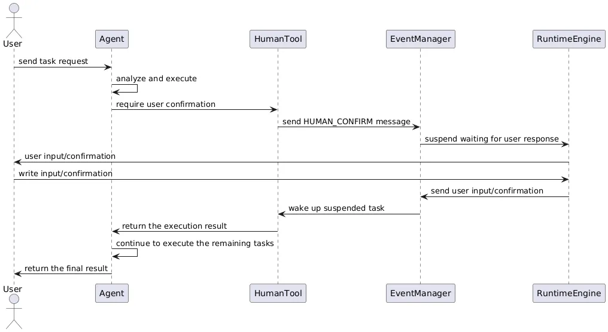

作为一个先进的多智能体进化框架，AWorld在设计上充分考虑了用户参与的重要性。

人机协同（Human in the Loop）功能使得用户可以在关键节点介入AI决策过程，确保系统的安全性和准确性，特别是在面对敏感操作或需要用户专业知识的情况。

+ 提升安全性。通过在关键操作点引入用户确认，可以有效防止恶意操作或误操作带来的风险，特别是在涉及资金交易、敏感数据访问等场景中。
+ 增强可信度。对于一些需要专业判断的场景，用户的介入可以提升系统决策的可信度，确保重要决策得到适当审查。
+ 法规合规。在金融、医疗等受监管行业，人机协同机制可以帮助满足法规对人工审核的要求。

人机协同的设计一般遵循几个核心原则：

+ 最小干预：用户只在必要时介入，通常是遇到特定授权障碍时，而不是常规操作过程中。
+ 明确边界：严格区分哪些操作必须由用户确认。
+ 安全保障：涉及敏感操作（如登录、支付、管理员权限等）时触发用户介入。

## AWorld的人机协作
AWorld基于工具和事件实现人机协作，[示例](https://github.com/inclusionAI/AWorld/blob/main/examples/aworld_quick_start/HITL/run.py)。

##### 人机交互流程


##### HumanTool
HumanTool是专用于人机协作的内置工具，当交互需要用户介入时，会使用该工具，然后发送一个HumanMessage的事件，然后等待用户发出响应，过程中任务会挂起等待。收到用户响应后，系统会将其作为工具执行结果处理，并继续后续的流程。

##### 事件消息
AWorld使用HumanMessage来处理人机交互，消息承载需要用户确认的信息。

这种设计使系统能够在任何需要用户介入的地方发送相应消息，并等待用户响应后再继续执行。

##### Agent集成
开发人员可以通过在Agent中注册human工具来启用人机协同功能。Agent**自主判断**需要用户介入时，会构造相应的工具调用请求。

```python
from aworld.tools.human.human import HUMAN
agent = Agent(
    conf=agent_config,
    name='human_test',
    tool_names=[HUMAN]
)
```

##### 定义规则介入
还可以预设规则，**命中规则**后，直接触发用户介入。例如：

当终端命令需要管理员权限时，发送"当前操作需要管理员权限，请确认是否授权执行此命令"的提示

```python
from aworld.tools.human.human import HUMAN
from aworld.utils.run_util import exec_tool

# 命中后触发
context = your_context or Context()
exec_tool(tool_name=HUMAN, action_name="HUMAN_CONFIRM", 
          params={"confirm_content": "当前操作需要管理员权限，请确认是否授权执行此命令"}, 
          agent_name="human", context=context)
```

##### 触发条件
人机协同可以在以下情况下触发：

+ 浏览器操作工具遇到登录/认证/支付页面
+ 终端工具需要sudo/管理员权限
+ 文件系统工具访问受保护目录
+ 信息收集和分析任务，需要补充用户的专业知识
+ 内容检索，需要补充额外的检索条件
+ 数据处理和报告生成，需要“签字”生效
+ 决策制定或任务完成后，需要做合规确认
+ 寻求操作批准

##### 小结
AWorld的人机协同能力通过精心设计的工具系统、消息传递机制和使用规范，实现了在必要时刻引入用户判断的机制。提升了系统的安全性和可靠性，也体现了AI系统应该是可控设计的理念。通过这种方式，AWorld框架在保持AI自主性的同时，确保了用户在关键时刻的控制权，为构建可信赖的AI系统提供了坚实基础。

