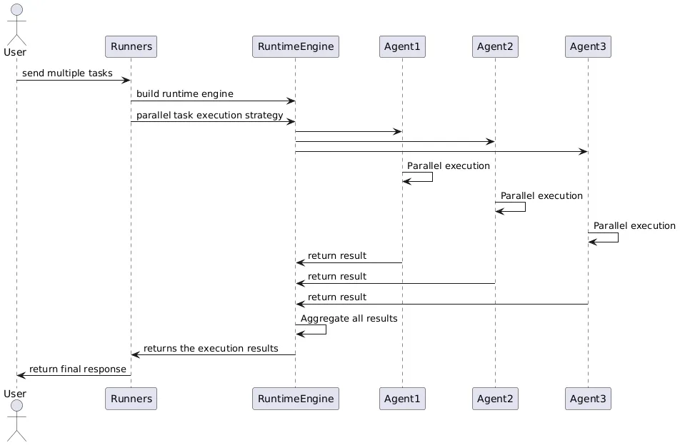

AWorld支持多种任务并行执行，而且不仅能在本地多进程并行，还能无缝集成分布式计算引擎如Ray和Spark，使得大规模任务并行处理变得简单而高效。主要基于以下几个核心理念：

+ 统一抽象：无论底层使用何种计算引擎（本地、Ray还是Spark），对用户提供的API接口是一致的。
+ 透明切换：用户可以根据需要在不同计算引擎之间轻松切换，无需修改业务逻辑。
+ 高可扩展：框架设计支持从小规模本地测试到大规模分布式生产环境的平滑过渡。

AWorld通过精巧的设计和高度的抽象，实现了在多种计算引擎上的统一并行处理，通过一致的API轻松实现任务并行化，提高开发效率和系统性能，使多任务的执行有很大的优势：

+ 提高执行效率。通过并行执行多个任务，显著缩短整体执行时间，特别是在处理大量独立任务时效果更为明显。
+ 灵活的部署选项。用户可以根据实际需求选择合适的执行引擎，从本地开发测试到大规模生产部署都可以平滑过渡。
+ 简化分布式。隐藏了分布式计算的复杂性，让开发者可以专注于业务逻辑而不是底层的分布式系统细节。
+ 强大的扩展性。模块化插件化设计，可以方便地添加新的计算引擎支持，满足不断变化的需求。

### 任务执行流程


### 运行时引擎
AWorld目前支持三种引擎：

+ LocalRuntime：本地多进程执行引擎，无需额外依赖，适用于开发和小规模部署
+ RayRuntime：基于Ray的分布式执行引擎，适用于大规模并行处理
+ SparkRuntime：基于Apache Spark的执行引擎，适用于大数据处理场景

### 运行时配置
RunConfig是切换运行时计算的关键。设置相关属性，以实现更高效的计算。如选择使用哪种计算引擎`engine_name`，任务是否有依赖`sequence_dependent`，对于分布式引擎是否使用本地模式`in_local`，同时支持自定义的RuntimeEngine实现`cls`。

### 统一入口
Runners提供了统一的工具化入口，内部也提供了exec_tasks的工具化方法，便捷的支持任务随时提交和随时运行。

```python
from aworld.core.task import Task
from aworld.runner import Runners
from aworld.config import RunConfig, EngineName

# 创建任务列表
tasks = [
    Task(input="什么是机器学习?", agent=my_agent, id="task1"),
    Task(input="解释神经网络", agent=my_agent, id="task2"),
    Task(input="什么是深度学习?", agent=my_agent, id="task3")
]
# 使用Ray引擎并行执行
run_conf=RunConfig(
    engine_name=EngineName.RAY,
    worker_num=len(tasks)
)

# 工具化入口
results = Runners.sync_run_task(
    task=tasks,
    run_conf=run_conf
)

from aworld.utils.run_util import exec_tasks

# 内部工具化方法
exec_tasks(tasks=tasks, run_conf=run_conf)
```

### Agent并行
任务的粒度比Agent粗，如果希望在Agent维度指定并行，可以使用`ParallelizableAgent`：

```python
sub_agents = [google_search, bing_search, wiki, ...]
parallel_agent = ParallelizableAgent(name=f"parallel_search",
                                     agents=sub_agents)
```

用户还可以自定义结果聚合函数来处理并行任务的结果：

```python
def custom_aggregate_func(agent: ParallelizableAgent, results: Dict[str, Any]) -> ActionModel:
    # 自定义聚合逻辑
    aggregated_result = "...处理所有并行结果..."
    return ActionModel(policy_info=aggregated_result)

parallel_agent = ParallelizableAgent(
    agents=sub_agents,
    aggregate_func=custom_aggregate_func
)
```

