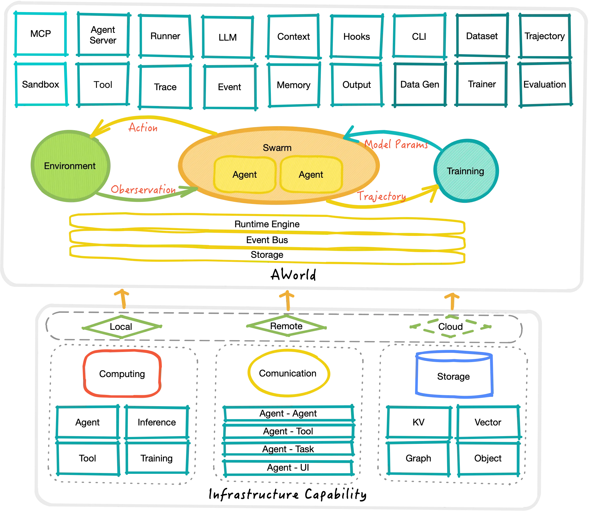

欢迎来到AWorld——一个友好便捷的构建，编排，评估和进化AI Agent的基础框架。AWorld为自我进化的AI Agent提供了系列的基础和高级组件，以处理各种类型的任务。

## AWorld是什么
致力于端到端的Multi-Agent框架，核心愿景是打通从“智能体构建”到“环境交互”再到“自进化”的完整闭环，使您能够轻松：

- 🤖 **构建智能代理**——声明式创建基于LLM的AI代理

- 🔄 **编排多代理协作**——使用交接和工作流构建复杂的多代理系统

- 📚 **获取完整追踪**——记录token级别的详细执行轨迹

- 🌍 **使用多元环境**——提供可扩展的工具环境，连接三方环境

- 🧠 **自我改进**——使代理能够从经验中学习并优化自己

与传统的 Agent 框架（如 LangChain、AutoGPT， ADK）不同，AWorld 相比侧重于 **Agentic Learning（智能体学习）**，即如何让智能体在动态环境中通过反馈（RL）不断提升能力，而不仅仅是执行任务。

## 核心概念
1. **Agent**：基于规则或模型的实体，可以进行推理、使用工具并与其它智能体协作。
2. **Swarm**：多个智能体(Multi-Agent)协作及范式定义和构建的统一拓扑模型。
3. **Tool**：为智能体提供超出LLM能力的实体，使Agent能够完成更多更复杂的任务。
4. **Sandbox**：智能体可以安全地执行代码或操作外部软件的沙箱环境。
5. **Runner**：AWorld 的调度执行引擎，负责任务的分发、状态的轮转、串并行执行以及交互轨迹的记录。
6. **Context**：任务执行的上下文管理，以支持状态跟踪和恢复。
7. **Memory**：用于存储和检索智能体在任务执行过程中的信息，支持短期和长期记忆管理。
8. **Environment**：提供智能体可以与之交互的工具和资源API的环境。
9. **Trainer**：用于训练和优化代理行为的模块，通常包括强化学习或其他机器学习方法。
10. **Evaluation**：评测智能体相关能力指标的评估框架。
11. **Tracer**：用于追踪代理执行过程中的详细步骤和状态变化，以便调试和分析。
12. **Output**：管理系统输出结果，包括日志、报告和可视化数据。

在一些核心概念下，还会有一些子概念，比如

+ Agent会使用模型(Models)和MCP工具完成任务，
+ Tool有多个执行动作(Action)，
+ Runner基于事件(Event)机制提供了任务(Task)的编排执行(Handler)和回调(Callback)，在链路中可以注入钩子(Hook)。

## 架构
AWorld 的典型运行架构是一个反馈控制回路：

+ **感知**：将 Environment 的当前状态（Observation）传递给 Agent。 
+ **决策**：构建的 Agent 结合模型，规则和上下文，生成下一步动作（Action）。
+ **执行**：Environment 执行指定的 Action，产生新的 Observation 和 反馈（Reward）。
+ **经验**：通过 Agent 与环境交互，收集成功或失败的轨迹数据（Trajectory）。
+ **学习**：记录轨迹数据（Trajectory），用于后续的 RL 训练或 In-context Learning 优化，实现自我进化。

## 关键特性
AWorld 在功能设计上兼顾了灵活性与生产级的高性能需求，提供了一系列特性用以更好地支持 Agent 应用程序和产品：

1. **简单灵活且强大的多智能体协作**

以统一的图语法构建中心化和去中心化的多智能体协作和协作范式，允许 Multi-agent 的组合、嵌套。支持 Workflow、Handoff、Team 等模式，用以构建复杂的协作系统。

2. **丰富的工具使用模式**

支持多种工具集成方式：

+ 本地工具
+ MCP 工具
+ Agent 作为工具 (Agent as a Tool)
+ 编程式工具调用 (Programmatic Tool Calling, PTC)
3. **多样化的运行时**

支持多种运行时后端，包括本地、Spark、Ray等，通过统一接口实现无缝切换，无需更改任务定义即可在不同环境中运行。

4. **多类LLM支持**

支持各种主流的大语言模型提供商，如 OpenAI、Anthropic、Qwen 等，可以通过统一接口轻松切换和配置不同的模型。

5. **事件驱动架构**

采用事件驱动的执行模型，通过专门的处理器基于类别处理事件，支持模块化、可扩展性和执行步骤的并发处理。

6. **上下文管理**

统一管理任务、事件、多轮会话的上下文，并提供压缩、过滤等功能，确保高效的状态跟踪和恢复。

7. **轨迹构建**

运行时捕获每个任务的完整轨迹，包括每个 LLM 调用、动作和奖励，可用于合成训练样本、评估性能和迭代改进。

8. **环境支持**

提供 Agent 可感知、交互并从中学习或执行任务的外部世界或模拟系统，支持复杂的在线环境访问。

9. **数据生成**

内置数据生成功能，支持从 Agent 执行轨迹中生成高质量的训练数据，用于模型训练和优化。

10. **自进化能力**

支持基于元学习的自我进化机制，可以优化整个 Agent 系统，而不仅仅是模型权重。

11. **评估能力**

提供完整的评估框架，用于评测 Agent 的各种能力，支持多种基准测试和自定义评估指标。

12. **服务化能力**

支持将 Agent 和相关组件部署为服务，提供 API 接口供其他系统调用。

13. **可视化支持**

框架提供了任务执行过程中交互关键信息的记录和持久化，用于 UI 展示和分析。

14. **可观测性**

内置 Trace 框架，可追踪智能体、工具调用、多智能体交互等信息，便于调试和监控。

15. **高度可扩展**

模块化设计，支持在各个层面进行扩展，包括 Agent、工具、内存、执行器等组件。

16. **多样化使用模式**

AWorld 提供 SDK、CLI、Web UI 三种使用模式，满足不同类型用户的需求。

这些特性使得 AWorld 成为一个功能强大且灵活的 Agent 自进化框架，适用于从简单的单 Agent 应用到复杂多 Agent 协作系统的各种场景。

