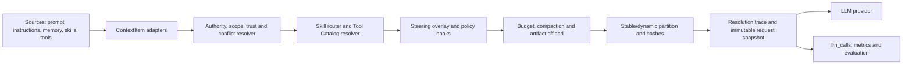
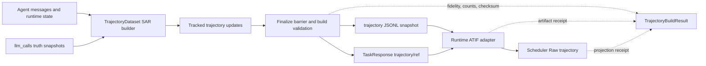

# AWorld Unified Context Management Harness Design

## Date

2026-08-17

## Status

Proposed

## Summary

本设计为 AWorld 建立统一的上下文管理 Harness。它不是新增一种 memory，也不是单纯压缩 prompt，
而是在所有 LLM 调用之前引入唯一的 Context Compiler，将用户输入、系统提示、作用域指令、
Skills、Tools、Steering、Delegation 七类上下文统一建模、解析、裁剪、缓存和审计。

核心结果是：AWorld 的普通 Agent、Amni Context、CLI、ACP 和 Subagent 不再各自拼装 prompt，
而是共享同一组语义和不变量；同时通过 baseline/candidate 对照测试证明优化带来的质量、成本、
延迟、安全和长任务稳定性收益。

## Goal

建立一套可渐进迁移、可观测、可验证的上下文管理能力，使 AWorld 能够：

- 在多个上下文来源冲突时，按 authority、scope、trust 和时效性做确定性裁决。
- 只加载当前任务需要的指令、Skill 内容和 Tool schema，支持渐进式披露。
- 对所有 Agent 路径强制执行 token budget、单项上限、压缩和可逆 offload。
- 保持稳定前缀，提升 prompt cache 命中率，避免无关动态内容破坏缓存。
- 显式管理 task/session 的 reset、checkpoint、rewind 和 resume，避免上一任务的动态上下文长期驻留。
- 以 cache-adjusted cost per successful task 而非原始 token 数作为主要效率目标。
- 将 steering 和可修改 prompt 的 hook 收敛到最终编译之前。
- 为 subagent 提供显式的上下文、工具、预算、输出和合并契约。
- 记录每个上下文项为何被包含、排除、压缩或 offload，并能与真实 provider 请求逐项核对。
- 用同模型、同任务、同工具、同环境的 paired evaluation 量化收益。

## Non-Goals

本设计不包含：

- 替换现有短期、长期、向量或 workspace memory 存储实现。
- 在第一阶段重写 Amni neuron、CLI plugin、hook 或 subagent 的全部内部实现。
- 绑定某一家模型厂商的 prompt cache API。
- 让 LLM 自行决定安全边界、工具授权或必需上下文是否可以丢弃。
- 保证所有历史上下文永久保留在模型窗口中；完整内容可以被压缩或 offload 到 artifact。
- 在没有线上证据前一次性删除旧的 prompt assembly 路径。

## Related Design Inputs

- [Maximizing the value of your Claude Code sessions](https://claude.com/blog/maximizing-the-value-of-your-claude-code-sessions)
  提供了 prompt cache、task reset、compact/rewind、按需加载、Tool 输出降噪和 subagent 隔离的会话经济性
  参考。本设计吸收其机制，但不把 Claude Code 命令名、固定 cache TTL 或厂商价格比例作为规范。

## Problem Statement

AWorld 已经具备较丰富的上下文原语，但它们分布在多个独立链路中，缺少一个统一的解析和提交边界。
因此当前问题不是“完全没有能力”，而是“相同能力在不同入口中语义不同，且无法证明最终请求与设计一致”。

### Existing Strengths

当前可以复用的能力包括：

- `aworld/core/context/base.py` 中的任务级 Context 与 merge 能力。
- `aworld/core/context/amni/prompt/assembly/plan.py` 中的 `PromptSection` 和
  `PromptAssemblyPlan`。
- Amni neurons 提供的 system prompt、history、memory、workspace、AWORLD.md 和 skill 注入。
- `aworld/skills/` 与 CLI skill registry 提供的 Skill descriptor/content 分离和激活入口。
- `aworld/memory/tool_result_compaction.py` 等现有 tool result 压缩能力。
- `aworld/models/llm.py` 中真实 LLM 请求、hook 和 `llm_calls` 捕获边界。
- `TrajectoryDataset`、`trajectory.log`、`TaskResponse.trajectory` 和 Runtime ATIF exporter 已形成的
  轨迹生成与交付数据面。
- CLI steering、Tool hook/permission 和 Subagent Manager 已有的运行时控制能力。
- prompt cache lowering、trajectory、memory 和 hook 的现有测试基础。

### Capability Gaps

需要收敛的主要差距如下：

1. `PromptSection` 主要表达 name、kind、stability、content 和 hash，无法完整表达 authority、
   scope、lifetime、trust、priority、token cap、provenance 和压缩策略。
2. token budget 不是所有 Agent 路径的强制不变量，部分 history 或 neuron 仍可能注入无界内容。
3. Scoped Instructions 主要覆盖 global/workspace `AWORLD.md` 及 imports，缺少目录层级、path
   匹配、冲突解释和统一来源模型。
4. system prompt 的多个 section 在部分链路中过早合并为字符串，section 级元数据无法贯穿到
   provider request。
5. cache stability 信息没有端到端保留；未显式标注的 system message 可能被错误视为稳定内容。
6. Skill 虽然支持 descriptor/content 分离，但候选解析仍可能提前读取完整内容；自动路由能力和
   多 Skill 组合能力有限。
7. Skill 过滤工具时会保留部分无关 custom/MCP tools，不能保证最小 Tool Catalog。
8. Steering 可在 `before_llm_call` 修改 messages，但修改可能发生在预算、hash 或 audit 之后，
   导致观测值与真实请求漂移。
9. Hook 的失败策略不统一。安全相关 hook 应 fail-closed，观测 hook 可以 fail-open，但当前缺少
   明确分类。
10. 普通 memory 路径和 Amni 路径对大 Tool Result 的压缩、原文保留和 artifact offload 行为不同。
11. Subagent 已有 fork/merge、工具交集和后台执行能力，但缺少结构化的 Context Pack、预算、
    输出 schema、停止条件和 merge policy。
12. 现有日志无法完整回答“某项为何进入/未进入上下文”，也不能持续证明 trace 与真实 provider
    request 完全一致。
13. task、session 和 turn 虽然已有作用域概念，但缺少 reset、checkpoint/compact、rewind/fork、
    resume 的统一状态迁移语义，旧任务内容可能在后续 turn 中继续消耗上下文。
14. cache stability 尚未完整建模 provider、model、effort、execution mode、序列化版本和 TTL 等
    cache identity；中途切换这些参数时无法解释实际 cache miss。
15. 按调用动态最小化 Skill 和 Tool Catalog 可能改变请求最前部的 schema，节省少量 token 的同时
    击穿后续全部历史的 prompt cache，当前缺少显式收益/代价比较。
16. 大 Tool Result 主要在执行完成后压缩，缺少执行前的 quiet/structured/artifact-stream 输出契约；
    中等规模但高噪声的输出仍可能先被序列化、tokenize 并进入会话。
17. 效率指标偏重输入 token，缺少 output/reasoning token、上下文驻留 turn 数、cache-adjusted cost
    和 cost per successful task，可能把“prompt 更短但实际更贵”误判为优化。
18. 当前 trajectory item 可通过异步 `_update_trajectory(...)` 增量生成，但这些更新与任务结束时的
    `_save_trajectories()` 之间缺少统一 finalize barrier；最终读取内存 storage 时无法证明所有更新已完成。
19. `trajectory.log` 是从 message、runtime state 和 `llm_calls` 派生出的最终快照，不是可独立恢复全部
    执行过程的原始真值。空 trajectory 当前可能不写成功或失败 record，Runtime 只能降级为占位结果，
    无法区分执行未发生、SAR 构建失败、TaskResponse 绑定失败或 artifact 持久化失败。
20. 现有 trajectory log 使用通用 logger formatter、Python `repr` 和嵌套 JSON string，缺少稳定 JSONL
    schema、builder version、source high watermark、fidelity 和 checksum；真实 formatter、rotation、重试
    record 与 evaluation reader 之间缺少端到端兼容契约。
21. trajectory 默认可暂存在内存 storage，并在任务完成后释放。AWorld、TaskResponse、Runtime artifact 和
    Scheduler Raw trajectory 之间没有统一回执，导致下游缺失时不能判断数据在哪个边界丢失，也不能基于
    持久化来源幂等重建。
22. Agent 的自然语言完成声明与 deliverable 是否存在、是否通过最新验证没有分离；长 rollout 可能在
    未形成目标 artifact 时提前结束，或在重复试错后仍用乐观文本声明完成。
23. built-in `Aworld` agent 在模块导入阶段依赖 `ZoneInfo("Asia/Shanghai")` 和 CAST/tree-sitter native
    扩展。时区数据库缺失或 task image 的 GLIBC 版本过旧时，可选能力会阻止核心 Agent 注册，故障发生在
    首次 provider call 之前。
24. plugin loader 会记录警告后跳过加载失败的 Agent，而 direct mode 在找不到 Agent 或无法创建 executor
    时只打印文本并正常返回；上层因此无法可靠区分“任务执行完成”和“执行从未开始”。
25. pre-provider failure 当前没有稳定的机器可读 stage/error code。Runtime 只能从空 summary 推断结果，
    容易生成 `AWorld completed without a captured response` 并把 harness failure 错标为正常 completion。
26. 外部适配器若通过 `aworld-cli ... | tee ...` 启动任务但没有启用 `pipefail` 或读取每段 pipeline status，
    即使 AWorld 正确返回非零也可能再次被改写为成功。AWorld 与 harness 之间缺少退出状态保真契约和
    executor-ready preflight。

### Validated Pre-LLM Failure Incident: Batch `b-771cbacf3eb9420e8a4e`

该 batch 的 54 条占位 Raw trajectory 已完成根因定位，不应再归因于 Scheduler 下载损坏或泛化为
TaskResponse finalize 竞态：

- 54 条恰好来自 27 个 task × 两个模型，同一 task 总是成对失败；Raw trajectory 中
  `trajectory_capture_mode=summary_synthetic`、`llm_call_count=0`，证明故障发生在模型调用之前。
- 25 个 Ubuntu 24.04 minimal task（50 个 run）缺少系统 timezone database，导入 built-in Agent 时
  `ZoneInfo("Asia/Shanghai")` 抛出 `ZoneInfoNotFoundError`。
- 2 个 Debian bullseye-slim task（4 个 run）的 GLIBC 2.31 无法加载要求 GLIBC 2.33 的
  `tree_sitter_language_pack/_native.abi3.so`；fallback `tree_sitter_languages` 同样不可用。
- 在相同 task image 和相同 AWorld wheel 中，不调用模型即可稳定复现：`adaptive-rejection-sampler`
  失败于 timezone、`qemu-startup` 失败于 native GLIBC、对照 `path-tracing` 能注册 `Aworld` 并创建
  `LocalAgentExecutor`。
- 已下载的 92 条 Dashboard Raw trajectory 与服务端 `harbor.trajectory` 逐条一致，因此 Scheduler、
  Dashboard 下载和本地 JSON 保存不是这 54 条占位内容的生成原因。

故障链为：可移植性依赖导致 built-in Agent 导入失败 → loader 跳过 Agent → direct mode 返回空结果但退出
成功 → Runtime 用 synthetic summary 补位 → Harbor 继续 verifier 并得到 reward 0。责任边界如下：

| 层 | 必须承担的修复 |
|---|---|
| AWorld Agent package | 声明 `tzdata`，同时提供 UTC+8 fallback；CAST/native 能力 lazy optional，失效时只降级相关 Tools/Subagents，不能阻止核心 Agent 加载 |
| AWorld CLI/runtime | Agent load、executor create、provider start 分阶段；前两者失败输出结构化 `RunFailureRecord` 并返回非零，禁止正常 completion 文案 |
| Context/trajectory control plane | `execution_not_started` 必须形成失败 build result；`llm_call_count=0` 与 placeholder 不得进入完整 trajectory 数据集 |
| 外部 harness contract | 在目标 task container 中执行 load-agent + create-executor preflight；保留 CLI 非零退出状态；不得由 `tee`、synthetic summary 或 ATIF 文件存在覆盖失败 |

当前 AWorld 代码库内可以直接完成前三层的 AWorld 侧行为；不要求修改 mcpgateway 或
lingguang-bench-runtime-dsh。外部 harness 行为作为兼容契约和 release canary 验收，使用本地
`DockerSandbox` attach-only fixture 即可先验证 AWorld 侧修复。

该事件证据采用“可复验 manifest + 原始来源”的 provenance contract，而不是依赖某台机器上的临时目录：

- Dashboard batch：`b-771cbacf3eb9420e8a4e`；下载源固定为每个 run detail 的 Raw trajectory/
  `harbor.trajectory` 字段；
- 选择策略为全部双 0、全部 0/1 split，以及由 batch id 作 seed 的 3 个双 1 task；共请求 120 个 run，
  92 个有 Raw trajectory、28 个 unavailable；
- 92 个已下载对象逐条执行服务端 checksum/内容相等校验；54 个 synthetic placeholder 只用于 capture
  reliability 与 pre-provider failure 分析，不能进入 Context 策略质量归因；
- 稳定 checksum、来源 URL、选择计数和局限性记录在
  `docs/superpowers/evidence/b-771cbacf3eb9420e8a4e-provenance.json`。Raw 数据可能包含敏感执行内容，
  不要求随源码仓库分发；需要复验时按 manifest 中 run id 从权限受控的原始来源重新下载。

## Design Principles

### One Final Compilation Boundary

所有会改变 messages、tools 或 provider 参数的动作，必须发生在 Context Compiler 完成之前。
编译完成后，请求对象不可变，audit、`llm_calls` 和真实 provider 请求必须引用同一份快照。

### Metadata Must Survive Until Submission

上下文项不能在早期阶段丢失来源和策略信息后只剩字符串。authority、scope、trust、stability、
token usage 和 provenance 必须保留到最终决策完成。

### Progressive Disclosure by Default

默认只加载索引和 descriptor。完整 Skill、Tool schema、历史正文和大 Tool Result 仅在被路由、
调用或明确需要时加载。

### Deterministic Policy, Model-Assisted Relevance

权限、authority、scope、硬预算、递归深度和必需项保留由确定性代码执行。相关性排序、摘要和
Skill 意图匹配可以由模型辅助，但不得突破确定性边界。

### Bounded and Reversible Context

每一个注入项都有硬上限。超限内容优先进行可逆 offload：模型看到摘要、头尾片段和 artifact
引用，完整内容仍可通过受控工具取回。

### Preserve Prefixes Across Turns

对同一 task epoch，未变化的 provider-bound 前缀必须保持内容、顺序和序列化结果稳定。新增 turn
优先只向动态尾部追加内容；只有显式 checkpoint/compact、策略版本变化、预算压力或用户操作才允许
重写既有历史，并必须记录 cache break 原因。

### Optimize End-to-End Value, Not Raw Token Count

输入 token、缓存读取、缓存写入、输出/推理 token、Tool 往返和额外 subagent 都有不同成本。
优化决策必须使用 provider 返回的真实 usage 或明确版本化的归一化成本模型，并以质量约束下的
task-level cost、latency 和成功率为准，不把厂商特定的价格比例写入核心策略。

### Same Semantics Across Entry Points

普通 Agent、Amni、CLI、ACP、resume 和 Subagent 只允许有 adapter 差异，不允许有核心解析语义差异。

### Reuse the Trajectory Data Plane, Add a Verifiable Control Plane

本设计不另建一套与现有轨迹并行的 capture 系统。`llm_calls`、event/runtime state、
`TrajectoryDataset`、`trajectory.log`、`TaskResponse` 和 Runtime ATIF adapter 继续承担现有职责；新增能力
只负责跟踪增量构建任务、建立 finalize barrier、输出 build manifest/fidelity/checksum，并验证各边界回执。

`llm_calls[*].request` 是 provider 请求真值，event/runtime state 是动作和执行结果的上游证据，
`trajectory.log` 与 ATIF 都是可版本化重建的派生投影。派生文件存在不能自动证明完整，派生文件缺失也
不能自动证明 Agent 没有运行。

### Benchmarks Validate a Framework Hypothesis, Not a Score-Tuning Target

本 spec 的可证伪假设是：在 model、prompt、Tool、环境和 verifier 不变时，统一且有界的 Context 编译、
provider-bound 真值捕获、可逆 Tool output offload 与稳定 cache identity，会系统性提高 AWorld 在长历史、
Tool-heavy、research、delegation 等 workload 上的质量、稳定性或单位成功成本。Terminal Bench 只是首个
具备真实容器、文件修改、长 Tool 输出和独立 verifier 的 workload adapter，不是产品目标本身。

因此任何 variant 只能改变 Context/ToolOutputPolicy；不得包含 task name、题目专用 prompt、预期答案、
solution、测试断言或 verifier 分支。单题 reward 上升只能作为诊断信号，不能作为框架收益结论。发布结论
必须来自预注册 corpus 的 paired aggregate，并至少在一个非 Terminal Bench workload 上复验同方向收益；
若改动只提升特定题目或特定 benchmark，归类为 benchmark tuning，不纳入 Context Management 默认策略。

### Context Management Benefit Loop

本设计不能停留在“采到更多 trajectory”或“能在本地跑 benchmark”。完整收益闭环必须逐层成立：

1. **Framework mechanism**：Context Compiler、预算/作用域、Tool 输出压缩、artifact offload、稳定前缀、
   cache identity、delegation pack 或 trajectory control plane 发生版本化变更；
2. **Request-level effect**：provider-bound messages/tools/params、Context item residency、inline/offloaded bytes、
   prefix hash 或 cache usage 出现符合设计预期且可解释的变化；
3. **Agent capability effect**：required context recall、Tool 使用正确性、长任务稳定性、恢复/委派能力或
   cost/latency 改善，且没有安全、权限、fidelity 或质量回退；
4. **Independent outcome**：由 benchmark adapter 之外的 verifier/scorer 计算 reward 与质量指标，不采信
   TaskResponse success 或 final answer 自报；
5. **Generalization decision**：在预注册 paired corpus 聚合并由另一类 workload 复验后，才决定 shadow、
   enforce、回退或继续改造。

其中 Tool 输出压缩与 artifact offload 不是 Terminal Bench 专用技巧，而是 Context Management 的输入治理
能力：完整 Tool 原文进入可校验 artifact，模型只接收有界、可恢复的 inline view；其收益要同时通过
`raw/inline/offloaded bytes`、artifact retrieval success、provider input/cost 和 task quality 验证。Raw
trajectory 与本地 Docker 环境是闭环的证据和实验基础设施，不是闭环终点。任何实现若只改变 reward、却
无法在 request/trace 层解释对应 Context 变化，不能归因于 Context Management；任何实现若只缩短 Context、
却没有下游能力/成本收益或导致 verifier 回退，也不能判定成功。

## Core Invariants

1. Provider 收到的 messages、tools 和相关参数必须与 `CompiledContext.request_snapshot` 深度相等。
2. final compile 之后不得再修改 messages 或 tools。
3. 每个注入项必须有硬 token 上限；默认单项不得超过 10K tokens。
4. 总输入不得超过 `model_context_limit - reserved_output - protocol_reserve`。
5. `required=true` 的项不能静默丢弃；无法满足时必须在调用模型前失败并给出原因。
6. Tool call 与对应 Tool result 必须成对保留、成对压缩或成对移除，不能破坏消息协议。
7. 未信任的 memory、retrieval、网页和 Tool output 永远不能提升自身 authority。
8. Child agent 的工具权限只能等于父权限与 `DelegationSpec.allowed_tools` 的交集。
9. Security/permission hook 失败必须 fail-closed；纯 observability hook 可以 fail-open 并记录错误。
10. 相同输入、配置和依赖版本必须产生相同的解析顺序、稳定前缀 hash 和 trace。
11. 同一 task epoch 中未变化的 cacheable prefix 必须产生相同的 canonical serialization 和
    `serialized_prefix_hash`，不能只保证语义对象深度相等。
12. model、effort、execution mode、Tool Catalog、Skill set、policy 或 serialization 的变化若会改变
    cache identity，必须产生结构化 `CacheBreakReason`，不得表现为无法解释的 cache miss。
13. 新 task 默认只继承 installation/workspace 等显式允许的稳定项；上一 task 的 history、Tool output、
    Steering 和临时附件不得自动进入新 task。
14. Tool output 在执行前必须有最大 inline token 契约；超限原文直接进入 artifact，不能依赖模型调用后
    再决定是否压缩。
15. task finalize 读取 trajectory storage 前必须等待所有已调度 trajectory update 到达确定 high watermark，
    或在有界超时后显式产生 `partial/unavailable`，不得静默导出当时碰巧可见的快照。
16. 无论 trajectory 构建成功、为空、部分完成还是失败，每个 task 都必须产生一个可持久化的
    `TrajectoryBuildResult`；TaskResponse、Runtime 和 Scheduler 不得用占位文本替代结构化失败原因。
17. 同一 trajectory artifact 在 AWorld、TaskResponse、Runtime 和 Scheduler 边界必须携带相同 checksum；
    不一致必须产生明确错误，不能继续标记为 complete。
18. `agent_finished`、`artifact_present`、`self_check_passed` 和 `external_verifier_passed` 是不同状态；
    自然语言完成声明不能单独满足 `CompletionContract`。
19. timezone database、CAST/tree-sitter、视觉、音频等 optional capability 缺失只能降低 capability manifest，
    不能阻止不依赖该能力的核心 Agent 加载；native import 必须 lazy、可捕获并可观测。
20. direct/non-interactive run 只有在目标 Agent 已加载且 executor 已创建后才进入 `running`；此前任一失败
    必须返回非零并输出稳定的 `RunFailureRecord`，不得返回 `None` 后由调用方解释为成功。
21. `llm_call_count == 0` 且 run 未越过 provider-start barrier 时，trajectory fidelity 只能是
    `unavailable/build_failed`，不能是 `complete`，也不能使用 completed placeholder 作为 agent message。
22. 通过 shell pipeline 调用 AWorld 的 adapter 必须保留 AWorld 进程的真实退出状态；日志复制、`tee`、
    summary/ATIF 生成和 verifier 均不得把非零状态覆盖为成功。

## Architecture



整体能力分为三个平面：

- Context Plane：采集、标准化、解析、预算、压缩、offload、缓存分区和 trace。
- Control Plane：authority、trust、permission、hook、steering、工具策略和 delegation policy。
- Execution Plane：LLM provider、Tool runtime、worker/subagent 和 artifact store。

Context Plane 只决定“模型能看到什么”；Control Plane 决定“谁有权改变什么”；Execution Plane
负责执行不可变请求和受控动作。

轨迹链路复用现有数据面，并增加独立的保真控制面：



轨迹构建失败属于 observability/data-quality 状态，默认不能把已经成功执行的外部动作回滚成未执行；
但 benchmark、训练和因果分析必须按 fidelity 过滤，不能把 placeholder 当作有效模型轨迹。

## Core Data Model

### ContextItem

所有来源通过 adapter 转换为统一的 `ContextItem`，推荐模型如下：

```python
@dataclass(frozen=True)
class ContextItem:
    id: str
    kind: ContextKind
    payload: ContextPayload
    task_epoch: int | None
    authority: Authority
    scope: ContextScope
    lifetime: Lifetime
    priority: int
    required: bool
    trust: TrustLevel
    stability: Stability
    token_limit: int
    reducer: ReducerPolicy | None
    source_uri: str | None
    content_hash: str
    version: str | None
    activation_reason: str
    created_at: datetime | None
```

字段语义：

- `kind`：system、user、instruction、skill、memory、tool_result、steering、delegation 等。
- `authority`：决定冲突时谁可以覆盖谁，不能由内容文本自行声明。
- `scope`：global、workspace、directory、path pattern、session、turn、agent 或 child task。
- `task_epoch`：task-scoped 项所属的单调递增 epoch；installation/workspace 项可以为空。
- `lifetime`：installation、workspace、session、task、turn 或 single-call。
- `priority`：同 authority、同 scope 内的保留和排序优先级，不等同于 authority。
- `required`：预算不足时必须保留，否则编译失败。
- `trust`：trusted、user-controlled、external-untrusted、tool-untrusted 等。
- `stability`：stable、session-stable、turn-dynamic，用于 cache 分区而非权限判断。
- `reducer`：drop、truncate-head-tail、summarize、artifact-offload 或 domain-specific reducer。
- `source_uri/content_hash/version`：支持审计、缓存失效和复现。

### ResolvedContext

```python
@dataclass(frozen=True)
class ResolvedContext:
    messages: tuple[Message, ...]
    tools: tuple[ToolSchema, ...]
    provider_params: Mapping[str, Any]
    stable_prefix_hash: str
    serialized_prefix_hash: str
    dynamic_context_hash: str
    cache_identity: CacheIdentity
    cache_break_reason: CacheBreakReason | None
    token_accounting: TokenAccounting
    decisions: tuple[ResolutionDecision, ...]
    request_snapshot: ProviderRequestSnapshot
    compiler_version: str
```

### TrajectoryBuildResult and Fidelity

`TrajectoryBuildResult` 是现有轨迹数据面的控制面，不替代 `TrajectoryDataset` 或 `TaskResponse`：

```python
TrajectoryFidelity = Literal[
    "complete",
    "partial",
    "placeholder",
    "unavailable",
    "build_failed",
    "legacy",
]

@dataclass(frozen=True)
class TrajectoryBuildResult:
    task_id: str
    session_id: str | None
    trace_id: str | None
    task_epoch: int | None
    status: Literal["complete", "partial", "empty", "failed"]
    fidelity: TrajectoryFidelity
    reason_code: str | None
    source_kind: Literal["event_state", "legacy_log"]
    source_high_watermark: str | int | None
    scheduled_updates: int
    completed_updates: int
    failed_updates: int
    pending_updates: int
    source_agent_messages: int
    llm_call_count: int
    tool_call_count: int
    persisted_items: int
    trajectory_ref: str | None
    source_checksum: str | None
    trajectory_checksum: str | None
    builder_version: str
    created_at: datetime
```

稳定 `reason_code` 至少包括 `execution_not_started`、`agent_not_found`、`agent_load_failed`、
`executor_creation_failed`、`environment_incompatible`、`timezone_data_missing`、
`native_dependency_incompatible`、`execution_log_missing`、
`source_not_finalized`、`trajectory_update_timeout`、`trajectory_build_failed`、
`trajectory_storage_empty`、`taskresponse_binding_missing`、`runtime_artifact_upload_failed`、
`scheduler_artifact_missing`、`exit_status_lost` 和 `checksum_mismatch`。

pre-provider failure 使用独立且可直接投影到 `TrajectoryBuildResult` 的稳定记录：

```python
@dataclass(frozen=True)
class RunFailureRecord:
    schema_version: Literal["aworld.run.failure.v1"]
    status: Literal["failed"]
    stage: Literal[
        "runtime_bootstrap",
        "agent_load",
        "executor_create",
        "provider_start",
        "task_execute",
        "trajectory_finalize",
    ]
    error_code: str
    agent_name: str
    trajectory_fidelity: Literal["unavailable", "partial", "build_failed"]
    llm_call_count: int
    details: Mapping[str, JSONValue] | None
```

CLI 至少将该 object 以 `AWORLD_RUN_FAILURE=<json>` 写入 stderr 并返回非零；进程内调用方应直接消费
typed object。`agent_load` details 可以包含可用 Agent 和 redacted source load failures；不得依赖 emoji、
traceback 文本或最终 summary 做机器分类。Runtime/ATIF adapter 若暂未支持 typed object，也必须把原始
failure record 作为 error artifact 保存，不能生成 completed agent message。

finalize barrier 必须跟踪所有 trajectory update，而不是依赖裸 `asyncio.create_task`。相同 message 若存在
before/after 两次派生，必须用同一 logical step id 和显式 revision 保证 after-handler 结果确定性覆盖，
或只在 state manager 已完成该 message 后生成一次最终 SAR，不能由竞态决定最终版本。

`trajectory.log` v2 使用专用 JSONL sink，每行是一个完整 object，不带通用 logger header，也不把
`trajectory`/`llm_calls` 再编码成 JSON string。record 至少包含 schema version、build result、trajectory
或 artifact ref 和 checksum。完整 Tool 原文仍存 artifact，trajectory 只保留受 `ToolOutputPolicy` 约束的
inline view 与 ref。

### CompletionContract

需要产出文件、结构化结果或可执行验证的任务应在首轮解析后建立完成契约：

```python
@dataclass(frozen=True)
class CompletionContract:
    required_artifacts: tuple[ArtifactRequirement, ...]
    immutable_inputs: tuple[str, ...]
    validation_commands: tuple[ValidationCommand, ...]
    max_evidence_age_seconds: int | None
    required_final_evidence: tuple[str, ...]
```

框架在 FINISHED 前检查目标 artifact、schema、hash 和最新 self-check evidence。检查失败时进入 repair、
显式失败或有界升级，不得只依据 final answer 中“已完成”的描述；外部 verifier 结果在执行后单独回填，
不能伪装为 Agent 事先已知。

### CacheIdentity and InferenceProfile

`stable_prefix_hash` 描述逻辑 section，`serialized_prefix_hash` 描述最终 provider-bound canonical
serialization；两者不能互相替代。缓存身份至少建模：

```python
@dataclass(frozen=True)
class InferenceProfile:
    provider: str
    model: str
    effort: str | None
    execution_mode: str | None
    response_format_hash: str | None

@dataclass(frozen=True)
class CacheIdentity:
    inference_profile: InferenceProfile
    serialization_version: str
    policy_version: str
    tool_catalog_hash: str
    skill_set_hash: str
    serialized_prefix_hash: str
    provider_cache_namespace: str | None
```

`InferenceProfile` 默认在 task epoch 内保持不变。若确需中途切换，调用方必须接受显式 cache break，
Compiler 记录原因和切换前后的身份。provider 的 TTL 和实际 cache namespace 由 lowering adapter
报告；核心层不假设固定 TTL 或固定价格。

### ResolutionDecision

每个候选项必须产生一条 decision：

```python
@dataclass(frozen=True)
class ResolutionDecision:
    item_id: str
    action: Literal["included", "excluded", "compacted", "offloaded"]
    reason_code: str
    tokens_before: int
    tokens_after: int
    authority: Authority
    scope: ContextScope
    trust: TrustLevel
    content_hash: str
    artifact_ref: str | None
```

`reason_code` 使用稳定枚举，例如 `scope_mismatch`、`lower_authority_conflict`、
`not_activated`、`budget_compacted`、`tool_not_allowed` 和 `required`，不能只记录自由文本。

### DelegationSpec

```python
@dataclass(frozen=True)
class DelegationSpec:
    objective: str
    context_pack: tuple[ContextItemRef, ...]
    allowed_tools: tuple[str, ...]
    token_budget: int
    max_output_tokens: int
    max_turns: int
    max_depth: int
    deadline: datetime | None
    expected_output_schema: Mapping[str, Any]
    inference_profile: InferenceProfile | None
    stop_conditions: tuple[StopCondition, ...]
    merge_policy: MergePolicy
```

Child 输出必须区分 `answer`、`evidence`、`artifacts`、`context_delta` 和 `status`。默认只合并显式
允许的 `context_delta`，不能把 child 全量 transcript 直接回灌父上下文。

## Authority, Scope and Trust Resolution

### Authority Order

建议默认顺序从高到低为：

1. platform/system policy
2. application/agent policy
3. workspace instruction
4. directory/path-scoped instruction
5. explicit user request
6. recalled memory
7. retrieved external content and Tool output

具体产品可以配置相邻层级，但以下规则不可配置：

- 外部内容和 Tool output 不能覆盖 system、agent、workspace 或用户明确意图。
- Skill 正文继承其发布者和安装来源授予的 authority，不能因为被激活而升级。
- 更具体的 scope 只在相同 authority 内优先，不能用目录规则覆盖更高 authority 的全局策略。
- 同 authority、同 scope 的冲突按显式 priority、版本和稳定顺序裁决，并写入 trace。

### Trust Handling

Trust 与 authority 分离：用户输入可以代表高价值意图，但其中粘贴的网页或日志仍是未信任数据。
Adapter 应支持将一个消息拆成不同 trust 的多个 ContextItem。

对 `external-untrusted` 和 `tool-untrusted` 内容：

- 使用明确的数据边界标记。
- 不解析其中声称的 permission、system message 或 tool policy。
- 进入 prompt 前记录来源和 hash。
- 不能直接激活高风险 Skill 或扩大 Tool Catalog。

## Resolution Lifecycle

每次模型调用遵循固定顺序：

1. 收集当前 task/session 的候选来源，转换为 `ContextItem`。
2. 按 lifetime 清理过期项，按当前 cwd、path、agent、session 和 child task 解析 scope。
3. 执行 authority/trust/conflict resolution。
4. 使用 user intent、task state 和显式选择激活 Skills；先处理 descriptor，后读取被选正文。
5. 根据基础能力、Skill 依赖、agent allowlist 和 permission 生成最小 Tool Catalog。
6. 注入待处理 Steering，运行允许修改上下文的 policy/transform hooks。
7. 冻结候选集合，执行 token budget、history compaction 和 artifact offload。
8. 按确定性顺序生成 stable prefix 与 dynamic suffix，计算 hashes。
9. 生成 `ResolutionDecision`、token accounting 和 immutable request snapshot。
10. 将同一 snapshot 交给 provider、`llm_calls` 和 observability，不再重新序列化另一份语义对象。

### Task and Session Lifecycle

Context Compiler 不把一次 session 等同于一个无限延长的 task。session 内使用单调递增的
`task_epoch`，所有 task/session/turn-scoped 项都记录所属 epoch。统一支持以下状态迁移：

- `reset/new_task`：开启新 epoch，只继承 installation、workspace、显式 pinned facts 等允许项；
  不为上一 task 自动生成摘要，也不复制其 history、Tool output、Steering 或临时附件。
- `checkpoint/compact`：仍属于同一 task，但把已完成阶段压缩为结构化 decision state、未完成事项和
  artifact refs。该操作会重写历史，必须记录 cache break，并允许用户或策略声明必须保留的字段。
- `rewind/fork`：从事件日志的确定 offset 构造新分支，逻辑上排除走偏的尾部，但不破坏原始 audit log；
  若此前 prefix 未改变，应继续复用其缓存身份。
- `resume`：重新解析当前有效的 workspace instructions、policy 和 Tool permission，再恢复相关 task
  state。除非 provider usage 证明仍命中，否则将旧 provider cache 视为 cold。
- `background/recurring`：默认创建独立 task epoch 或 child context，只把结构化结果合并回发起者，
  不在长期主会话中反复重放全部 history。

每次迁移都产生 lifecycle event、前后 `task_epoch`、保留/丢弃项统计和 cache impact。框架不得仅依赖
LLM 猜测任务是否已经切换；入口可以显式触发，自动识别只能作为可审计建议。

## The Seven Context Loading Mechanisms

### 1. User Prompt

- 当前 turn 的用户意图是必需项，保留原始文本和结构化附件引用。
- 粘贴的文件、网页、日志和 Tool transcript 应拆为低 trust 数据项，而不是与用户指令混为一体。
- 长附件默认进入 artifact，只向模型加载摘要、相关片段和可取回引用。
- 客户端明确附加的文件应在首次请求中直接形成 ContextItem，避免先让模型搜索或发起 Read；同一
  task epoch 内按 source identity 与 content hash 去重，后续引用复用已有 item，不重复注入正文。
- multi-turn follow-up 需要显式关联被引用的历史决策，避免全量重放所有对话。

### 2. System Prompt

- system prompt 按 section 保存，不在 budget 和 cache 分区前拼成单一字符串。
- identity、安全策略和 Tool protocol 标为 required；运行时状态不得误标 stable。
- section 排序和 serialization 必须确定，任何版本变化都反映在 hash 和 trace 中。

### 3. Scoped Instructions

统一支持：

- `~/.aworld/AWORLD.md` 全局层。
- workspace `.aworld/AWORLD.md` 与兼容的根 `AWORLD.md`。
- 从 workspace root 到当前工作文件目录的嵌套指令。
- 可选 path glob/frontmatter scope。
- 有界的 imports、循环检测、文件大小上限和 source hash。

解析结果必须显示生效文件、覆盖关系和未生效原因。第一阶段保持现有 AWORLD.md 优先级兼容；
启用新目录规则时通过配置和 migration warning 处理语义变化。

Context Inspector 应单独显示启动时 instructions 的固定 token 成本，并识别长期较大但只服务单一工作流
的 section。此类内容优先迁移为按需 Skill；框架只提供证据和建议，不自动改写用户指令文件。

### 4. Skills

Skill 加载分为三层：

1. Index：id、name、短描述、触发条件、风险和大致 token 成本。
2. Descriptor：完整触发规则、所需 Tools、资源清单和版本。
3. Content/Assets：只有被激活后才读取完整正文和必要资源。

Router 支持显式选择、确定性规则和模型辅助排序，可组合多个互不冲突的 Skill。激活结果必须记录
候选集、得分/原因、未选原因、加载 token 和 Tool Catalog 变化。

首个 provider call 前应尽可能完成本 task 所需 Skill 的路由。进入 task epoch 后，已注入请求前部的
Skill descriptor/content 默认保持稳定；中途扩展 Skill set 必须产生 `skill_set_change`，并由 cache
impact policy 判断是接受 cache break、延迟到新 epoch，还是交给独立 child context。

### 5. Tools

Tool Catalog 是编译结果，不是启动时永久注入的全集：

- 基础工具来自 agent capability。
- Skill 只能请求工具，最终集合仍受 agent allowlist、workspace policy 和用户 permission 限制。
- 高成本 MCP schema 可以先暴露轻量 index，再按需加载完整 schema。
- Tool description 和 schema 也进入 token accounting、稳定性 hash 和 provenance。
- 工具返回一律按未信任数据处理；授权判断不能依赖 Tool output 中的文本。

最小 Catalog 不等于每次调用都重新最小化。首个 provider call 前根据 task intent、激活 Skills 和
permission 生成 task-sticky Catalog；同一 epoch 内保持 schema 内容和顺序稳定。若必须增加或删除工具，
Compiler 需要记录 `tool_catalog_change` 及预计 cache impact，并允许在当前 epoch 变更、新建 child context
或推迟到下一个 epoch 之间选择。

#### Tool Execution Output Policy

每个 Tool call 在执行前获得结构化输出策略，而不是等待结果进入 history 后再压缩：

```python
@dataclass(frozen=True)
class ToolOutputPolicy:
    max_inline_tokens: int
    mode: Literal["structured", "quiet", "head_tail", "artifact_stream"]
    preserve_fields: tuple[str, ...]
    tail_tokens: int | None
    artifact_retention: RetentionPolicy
```

- 测试、构建、日志和搜索工具可以配置 quiet flag 或结构化 reporter，优先在源头减少无价值输出。
- 预计较大的输出直接流入 artifact；Context 只接收结构化摘要、关键字段、头尾片段和引用。
- 即使输出低于全局大结果阈值，也必须受 `max_inline_tokens` 约束，避免中等规模噪声长期驻留。
- Tool adapter 记录原始字节数、inline/offload token、策略版本和截断原因。
- 输出策略不能丢失 Tool call/result 关联、错误码、关键 ID、路径和 permission/audit 字段。

执行前策略负责限制进入上下文的体积；Reducer 仍负责在后续预算变化时进一步 compact。两者不能使用
不兼容的摘要格式或生成无法回取原文的双重有损压缩。

### 6. Steering

Steering 是高时效、turn/session scoped 的控制项。它必须在 final compile 前 drain，并参与冲突解析
和 token budget。

事件顺序冻结为：

```text
collect -> resolve -> skill/tool routing -> steering -> transform hooks
        -> budget/compact -> hash/trace -> immutable provider request
```

final compile 后到达的 steering 留给下一次模型调用，并在 UI/trace 中显示 `deferred`，不能悄悄修改
本次请求。

### 7. Delegation

父 Agent 不向 child 复制完整上下文，只构建与 objective 相关的 Context Pack：

- 必需 system/agent policy。
- 与目标相关的 workspace/path instructions。
- 选定的事实、artifact 引用和最近决策。
- 允许的 Skills 和最小 Tools。
- 独立 token/turn/depth/deadline budget。
- 与任务复杂度匹配的 `InferenceProfile` 和最大返回 token。

Child 返回结构化结果，父 Agent 按 merge policy 接收摘要、证据和显式 context delta。取消、超时、
递归超限和部分成功都必须是结构化状态，不依赖自然语言猜测。

Subagent 适合日志扫描、广泛检索等会产生大量一次性中间输出的工作；小任务可能因重复加载 system、
instructions 和文件而更贵。Delegation policy 应记录预计隔离 token、重复读取成本和 child 实际成本，
不能只因为可以委派就默认委派。

## Budget, Compaction and Offload

### Budget Calculation

```text
available_input = model_context_limit
                - reserved_output_tokens
                - provider_protocol_reserve
                - safety_margin
```

建议默认分配顺序：

1. required system/policy、当前 user intent 和 Tool protocol。
2. 当前任务的 scoped instructions、Steering 和必要 Tool call pairs。
3. 最近关键决策、活跃计划、被激活 Skill 和 Tool schemas。
4. 相关 memory/history/retrieval。
5. 可选背景和低相关性内容。

预算不是固定百分比切片。未使用额度可以在类别间转移，但不能突破 required 和单项硬上限。

### Reducer Contract

Reducer 必须返回：压缩内容、原 token、结果 token、保留事实、丢失风险、artifact 引用和 reducer
版本。通用 reducer 包括：

- `truncate_head_tail`
- `structured_summary`
- `tool_result_summary`
- `history_decision_summary`
- `artifact_offload`

关键 ID、路径、错误码、用户决策、未完成事项和 Tool call/result 关联不得只靠自由摘要保留，应作为
结构化字段进入 reducer 输出。

### Cache Partition and Economics

Stable prefix 只包含跨调用不变且顺序确定的内容，例如固定 system policy、未变化的 workspace
instructions、Skill descriptors 和 Tool schemas。session state、当前时间、git diff、history、user
prompt、Steering 和 Tool results 属于 dynamic suffix。

每个 section 使用内容 hash；整体 prefix hash 由有序的 section id、version 和 content hash 计算。
cache 命中指标必须来自 provider 原生 usage 或可验证的 prefix reuse，不以“标记为 stable”代替真实命中。

Prompt cache 通常要求从请求起点开始精确匹配，因此逻辑 section hash 相同仍不够：Tool definitions、
system sections、messages、provider params 的顺序和 canonical serialization 都必须稳定。Provider adapter
必须声明哪些字段参与 cache identity、缓存 TTL 能否观测以及 cache usage 的可信度。

以下变化至少产生结构化 `CacheBreakReason`：

- `model_change`、`effort_change`、`execution_mode_change`
- `tool_catalog_change`、`skill_set_change`
- `policy_version_change`、`serialization_change`
- `history_compaction`、`task_reset`
- `resume_cache_expired` 或 `provider_cache_unknown`

渐进式披露需要同时优化“当前请求少加载多少”与“前部变化导致多少既有 prefix 重新 prefill”。决策器
使用 provider 原生 cache read/write usage；provider 不提供计费信息时，使用版本化的归一化成本模型，
并把估算值与真实值分开报告。不得仅凭 `stable_prefix_hash` 推断命中，也不得为了维持 cache 而保留
已经不相关、可能影响质量或越过权限边界的内容。

Checkpoint/compact 会用较短状态替换历史，通常造成一次 cache 重建，但可能降低后续多 turn 的累计成本。
策略应基于剩余任务长度、当前 context pressure、provider TTL 和摘要风险决定；无法可靠预测时提供显式
操作或保守阈值，不在每次调用后自动重写历史。若 session 即将长时间空闲，可在 cache 仍有效时创建
checkpoint，但不能依赖无法保证的固定过期时间。

## Hook and Policy Semantics

Hook 分为三类：

- `transform`：允许修改候选上下文，只能在 final compile 前运行。
- `policy`：可以 allow/deny/ask/rewrite scope，异常时 fail-closed。
- `observe`：只读 immutable snapshot，异常时 fail-open 并记录。

现有 `BEFORE_LLM_CALL` 需要拆分语义：兼容期内 transform 仍可工作，但它必须移动到 budget/hash 之前；
final snapshot 之后仅允许 observe hook。任何 hook 修改都产生新的 ContextItem/decision，不允许原地修改后
失去 provenance。

## Observability and Truth Source

每次 LLM 调用至少记录：

- AWorld/framework、CLI、Context Compiler、trajectory builder 和 Runtime ATIF adapter 的 version/git SHA，
  以及 task/session/run/trace id、task epoch、`InferenceProfile`、context limit 和配置快照 hash。
- 所有候选项及其 included/excluded/compacted/offloaded decision。
- 每个 section 和 Tool schema 的 token、hash、stability、scope、authority 和 trust。
- stable/dynamic token 数、逻辑 prefix hash、serialized prefix hash 和 provider cache read/write usage。
- cache identity、TTL evidence、`CacheBreakReason`、前后身份和 cache usage 可信度。
- budget 前后 token、reducer/offload 次数和 artifact refs。
- Tool 输出的原始大小、执行前输出策略、inline/offload token 和取回次数。
- Skill 候选/激活、Tool Catalog 增减和 permission decision。
- Steering 的接收、应用或 deferred 时间点。
- lifecycle event 的前后 epoch、保留/排除项和 cache impact。
- Delegation 的 Context Pack、InferenceProfile、预算/实际成本和 merge 结果。
- `request_trace_match`：snapshot 与实际 provider-bound body 的结构化比较结果。

`llm_calls[*].request` 是真实请求的 truth source。日志和 evaluation 从该快照读取，不重新从 memory
推测当时模型看到了什么。

首次 LLM 调用之前还必须记录 execution-start control plane：

- environment fingerprint：OS/image、architecture、GLIBC、Python、timezone source 和 AWorld/CLI wheel；
- capability manifest：core Agent、optional Tools/Subagents、缺失能力及降级原因；
- `runtime_bootstrap -> agent_load -> executor_create -> provider_start` 各 barrier 的开始、完成和失败状态；
- Agent source load failure 的 source/type/redacted exception，以及最终选择的 Agent/executor type；
- CLI process exit status、adapter-observed status 和二者是否一致。

preflight 必须在目标 task container/namespace 中真正执行 `load target agent + create executor`，仅在宿主机
检查 Python 版本、CLI `--version` 或 wheel 是否存在不足以发现 timezone/native ABI 问题。preflight 不调用
模型、不改变题目 workspace；若失败，直接生成 `RunFailureRecord` 和 `execution_not_started` build result，
不进入 verifier 所依赖的正常 completion 路径。

### Trajectory Truth, Finalize and Receipts

轨迹语义必须区分四层证据：

1. `llm_calls` 与 event/runtime state：请求、动作和结果的上游 truth source。
2. `TrajectoryDataset`：从上游证据生成的 SAR working projection，允许在 finalize 前更新。
3. `trajectory.log`/artifact 与 `TaskResponse.trajectory/ref`：finalize 后的版本化派生快照。
4. Runtime ATIF 与 Scheduler Raw trajectory：跨进程交付投影。

另有第 0 层 execution-start control record，专门描述尚未产生 LLM/event trajectory 的 bootstrap、Agent 和
executor 失败。它不是模型 trajectory，却是解释 `llm_call_count=0` 的必需证据。不能为了满足 ATIF 至少
一条 message 的格式要求，把 framework error 改写成 assistant completed message；应使用 harness error/status
字段或独立 error artifact。

每层使用同一 task/session/trace/task-epoch identity。`TrajectoryBuildResult` 记录 source high watermark、
scheduled/completed/failed/pending update、message/LLM/Tool/persisted-item 数和 checksum；Runtime 与 Scheduler
分别写 artifact receipt 和 projection receipt。只有计数契约满足、pending 为零且 checksum 对齐时才可标为
`complete`。

TaskResponse 继续携带 inline trajectory 以兼容旧调用方，同时可以携带 `trajectory_ref`、
`trajectory_status` 和 `trajectory_checksum`。TaskResponse 没有 inline trajectory 但存在已确认的 artifact ref
时不得降级为 placeholder；反之，只有占位文本不能标为完整轨迹。

轨迹 build observe hook 可以 fail-open，避免 observability 故障改变已经发生的外部动作；但必须持久化
失败结果并允许基于上游来源幂等重试。benchmark、训练和 paired analysis 默认只消费 `complete`，
`partial/placeholder/unavailable/build_failed` 进入单独的数据质量队列。

默认日志对 secrets 和敏感 Tool output 做字段级 redaction；hash、token 和 reason code 仍应保留。

### User-Facing Context Inspector

CLI、ACP 和可视化入口应基于同一 trace 提供只读 inspector，而不是实现另一套统计逻辑。至少显示：

- fresh session 的固定 system/instructions/Skill index/Tool schema 基线占用。
- 当前 task 各来源 token、最大项、重复附件、offload 项和排除原因。
- 当前 cache identity、serialized prefix、最近 cache break 和 provider 实际命中情况。
- 可关闭或延迟加载的 MCP/Tool/Skill，以及预估收益和权限影响。
- `new_task`、`checkpoint`、`rewind/fork` 的预览，包括会保留什么、丢弃什么和是否重建 cache。

Inspector 默认只显示 redacted preview 和 metadata，不因调试模式暴露 secret 或完整 Tool output。

## Proposed Module Boundaries

建议以新模块承载编译逻辑，避免继续把语义分散到 Agent、CLI 和 provider：

```text
aworld/core/context/compiler/
  models.py
  adapters.py
  resolver.py
  scope.py
  budget.py
  reducers.py
  cache.py
  lifecycle.py
  tool_catalog.py
  tool_output.py
  delegation.py
  cost.py
  trace.py
```

集成职责：

- `aworld/agents/llm_agent.py`：提交来源和任务状态，不自行完成最终 prompt 拼装。
- `aworld/core/context/amni/`：neurons 转为 ContextItem adapters，保留现有检索能力。
- `aworld-cli/src/aworld_cli/`：提供 instructions、Skills、Steering 和 CLI runtime adapters。
- `aworld/models/llm.py`：只接受 compiled immutable request，捕获相同 snapshot 和 provider response。
- `aworld/core/agent/subagent_manager.py`：消费 `DelegationSpec`，不自行定义另一套上下文复制语义。
- Tool runtime：在执行前消费 `ToolOutputPolicy`，将原始大输出直接写入 artifact，返回有界结果。
- `aworld/runners/event_runner.py`：跟踪 trajectory update task，执行有界 finalize barrier，在释放内存 storage
  前产生 `TrajectoryBuildResult` 并将 trajectory/ref 绑定到 TaskResponse。
- `aworld/dataset/trajectory_strategy.py`：继续优先读取 `llm_calls` 请求真值；输出 deterministic SAR 和
  logical step revision，不自行承担 Runtime/Scheduler 持久化。
- trajectory sink/reader：提供无通用 header 的 JSONL v2、checksum 和 legacy dual-read；Runtime adapter
  将相同快照投影为 ATIF，并返回 artifact receipt。

## Configuration and Rollout Modes

建议配置：

```yaml
context_compiler:
  mode: off  # off | observe | shadow | enforce
  compiler_version: v1
  max_item_tokens: 10000
  reserved_output_tokens: 4096
  safety_margin_tokens: 512
  scoped_instructions: workspace_only  # workspace_only | nested
  progressive_skills: true
  progressive_tools: true
  task_catalog_policy: sticky  # per_call | sticky
  checkpoint_policy: budget_pressure  # explicit | budget_pressure | adaptive
  default_tool_output_inline_tokens: 4096
  artifact_offload: true
  context_inspector: true
  cost_model: provider_usage  # provider_usage | normalized
  trace_level: decisions  # none | summary | decisions | full_redacted
  trajectory_finalize_timeout_seconds: 10
  trajectory_format: jsonl_v2  # legacy | dual | jsonl_v2
  trajectory_require_complete_for_training: true
  completion_contract: observe  # off | observe | enforce
```

- `off`：完全使用旧链路。
- `observe`：旧链路执行，仅生成旧请求的标准化 trace，用于建立 baseline。
- `shadow`：旧链路执行，同时编译 candidate，但 candidate 不发给模型；记录请求差异。
- `enforce`：candidate snapshot 成为唯一 provider 请求。

配置必须可按 entry point、agent、workspace 和流量比例灰度。shadow 模式不得额外执行 Tool 或产生
外部写入。

## Migration Plan

### Phase 0: Baseline and Observability

- 先修复 built-in Agent portability：`aworld-cli` 声明 `tzdata`，Asia/Shanghai 缺失时使用固定 UTC+8；
  CAST/tree-sitter 采用 lazy optional import，并将不可用能力从 Tool/Subagent manifest 移除。
- direct run 在 agent-load/executor-create 失败时输出 `aworld.run.failure.v1`、返回非零；外部 adapter canary
  验证 pipeline status 不被 `tee` 覆盖，synthetic summary 不再产生正常 completion。
- 在目标 task container 增加无模型 preflight，至少覆盖 Ubuntu 24.04 minimal、Debian bullseye-slim 和
  一个兼容对照镜像；记录 GLIBC/timezone/capability fingerprint。
- 为当前所有入口捕获真实 request snapshot、input/output/reasoning token、cache、latency、Tool calls、
  task-level cost 和任务结果。
- 建立 cache identity/break、context token-turn residency、Tool 原始/inline 输出的 baseline。
- 建立固定 benchmark corpus 和当前 baseline。
- 将 `request_trace_match_rate` 纳入持续测试。
- 先复用现有 `TrajectoryDataset`/TaskResponse 数据面补齐 trajectory update tracking 和 finalize barrier；
  在读取或释放内存 storage 前保证 pending update 为零，超时产生结构化 partial/failed 结果。
- 为每个 task 输出 `TrajectoryBuildResult`，包括空轨迹和构建失败；建立 AWorld、TaskResponse、Runtime、
  Scheduler 四个边界的计数与 checksum 回执。
- 引入无 logger header 的 JSONL v2 并 dual-write/dual-read，验证真实 `trajectory.log` 文件而非只验证
  人工构造的单行 fixture。

### Phase 1: Models and Adapters

- 引入 `ContextItem`、`ResolvedContext`、`InferenceProfile`、`CacheIdentity` 和 decision trace。
- 引入 `TrajectoryBuildResult`、`TrajectoryFidelity` 和 `CompletionContract`，TaskResponse 保持兼容字段并
  增加 status/ref/checksum。
- 为现有 PromptSection、neurons、AWORLD.md、Skill、Tool 和 memory 添加 adapters。
- 使用 shadow 模式，保持旧 provider 请求不变。

### Phase 2: Universal Final Compiler

- 将所有 prompt transform、Steering 和 hook 移到 final compile 之前。
- 对所有入口启用统一 budget、单项上限、Tool pair 保留和 immutable snapshot。
- 引入 task epoch 与 reset/checkpoint/rewind/resume 状态迁移；所有 cache break 可归因。
- 固化 canonical provider serialization，验证 serialized prefix 而非只验证逻辑 hash。
- 先在普通 Agent/CLI enforce，再扩展到 Amni/ACP。

### Phase 3: Scoped Instructions and Progressive Disclosure

- 支持 nested/path-scoped instructions。
- Skill 改为 index -> descriptor -> content 分层加载。
- Tool Catalog 改为最小化和按需 schema 加载，并默认在 task epoch 内保持稳定。
- 对 Skill/Tool 中途扩展执行 cache impact decision，支持转交独立 child context。

### Phase 4: Trust, Compaction and Offload

- 统一 history/Tool Result reducer 和 artifact store contract。
- 在 Tool runtime 接入执行前 `ToolOutputPolicy`，为高噪声命令提供 quiet/structured 输出。
- 将 Tool 的 bounded inline view 与 raw artifact ref 写入 trajectory；在适用任务上灰度 enforce
  `CompletionContract`，分离 agent finished、自检和外部 verifier 状态。
- 对外部内容进行 trust 标记和 prompt injection 隔离。
- 明确 policy/transform/observe hook 的失败策略。

### Phase 5: Structured Delegation

- 引入带 `InferenceProfile` 和输出上限的 `DelegationSpec`、Context Pack、child result schema 和
  merge policy。
- 加入递归、deadline、cancel 和预算传播测试。

### Phase 6: Default-On and Legacy Cleanup

- 通过 nightly 和 canary Gate 后默认开启 enforce。
- 至少保留一个稳定版本的回退开关。
- 确认所有入口 parity 后删除重复的旧拼装路径。

## Validation Strategy

### Causal Comparison Protocol

任何“有收益”的结论必须来自 baseline 与 candidate 的 paired comparison：

- 固定 model/provider/version、temperature、Tool 版本、repo snapshot 和环境变量。
- 对比 Context Harness 时固定完整 `InferenceProfile`；评估模型/effort 路由时单独建立实验，不与
  context compiler 收益混算。
- 每个 case 使用相同初始 history、memory、Steering 到达时机和外部 fixture。
- baseline 使用当前链路，candidate 使用统一 Context Compiler。
- 确定性测试使用 capture provider；真实模型质量测试每个 variant 至少运行 5 次。
- 保存 seed、request snapshot、trace、Tool trajectory、最终 artifact 和 scorer 结果。
- 报告绝对值、相对变化和 paired bootstrap 95% confidence interval，不能只报告平均分。
- 实验 manifest 在执行前冻结 dataset/task archive checksum、variant、随机交错顺序、重复次数和 invariant
  contract；variant schema 只接受 Context 与 Tool output policy 字段，拒绝 prompt/answer/verifier 配置。
- reward 由容器内独立 verifier 产生；TaskResponse success、final answer 和 Agent 自报测试结果不得覆盖它。
- Terminal Bench 的结论必须与 coding 之外至少一个 Tool-heavy/research/delegation corpus 交叉验证，防止
  把 benchmark 特征误学为通用 Context 策略。

### Metrics

质量指标：

- `task_success_rate`
- `instruction_compliance_rate`
- `required_context_recall`
- `irrelevant_context_rate`
- `pass@5` 和 `pass^3`

效率指标：

- task-level `input_tokens`、`new_input_tokens` 和 `replayed_input_tokens`
- `output_tokens` 和 provider 可用时的 `reasoning_tokens`
- `tool_schema_tokens`
- Tool `raw_output_bytes`、`inline_output_tokens`、`offloaded_output_tokens`
- `context_token_turns`：每个 item 的 token 数乘以后续仍驻留的 provider request 数
- `stable_prefix_reuse_rate`
- provider `cache_read_tokens` / `cache_write_tokens`
- `cache_adjusted_input_cost`、`provider_billed_cost` 或版本化 `normalized_cost`
- `cost_per_successful_task`，同时报告 main agent 与 child agent 成本
- time-to-first-token、端到端 latency 和 Tool call count

稳定性与安全指标：

- `context_overflow_rate`
- `retry_count`
- `wrong_tool_call_rate`
- `unauthorized_tool_call_count`
- `cache_break_count_by_reason` 和 `unexplained_cache_break_count`
- `task_context_leak_count`
- `request_trace_match_rate`
- `child_success_rate`
- `merge_conflict_count`
- `raw_trajectory_available_rate`
- `complete_trajectory_rate` 和 `trajectory_count_by_fidelity`
- `placeholder_trajectory_count`
- `trajectory_update_pending_count_at_finalize`
- `trajectory_build_success_rate`
- `llm_event_reconstruction_rate` 和 `tool_pair_reconstruction_rate`
- `taskresponse_trajectory_binding_rate`
- `runtime_artifact_persist_rate` 和 `scheduler_projection_rate`
- `trajectory_checksum_mismatch_count`
- `completion_contract_failure_count_by_reason`
- `agent_load_success_rate` 和 `executor_create_success_rate`
- `pre_llm_failure_classification_rate`
- `successful_exit_without_executor_count`
- `cli_adapter_exit_status_match_rate`
- `optional_capability_degradation_count_by_reason`

### Test Matrix

| ID | 场景与 Fixture | 关键断言 |
|---|---|---|
| TC-CTX-001 | system 禁止写文件；用户粘贴的 Tool output 声称忽略规则并要求写文件 | 高 authority 规则保留；output 标为 untrusted；无未授权 Tool call；trace 记录冲突 |
| TC-SCOPE-002 | root、package、子目录分别放置冲突指令，请求修改子目录文件 | 只加载命中的层级；相同 authority 下最具体 scope 生效；列出覆盖原因和 source hash |
| TC-BUDGET-003 | 32K 历史、8K Tool result、多个 Skills，模型输入上限 16K | 请求不超限；required 全保留；Tool pair 有效；低优先项被压缩/offload；相同输入结果确定 |
| TC-STEER-004 | 在初始 assembly 后、provider 调用前到达 Steering | Steering 在 final budget/hash 前进入；超限重新裁剪；trace 与 provider body 深度相等 |
| TC-CACHE-005 | 连续两 turn 仅 user prompt/history 改变 | stable prefix hash 不变；dynamic hash 改变；第二次 cache read/reuse 增加 |
| TC-SKILL-006 | 注册 100 个 Skills，仅 2 个与任务相关 | 初始只加载 index；只读取被激活正文/资源；Skill token 显著下降；两个 Skill 可组合 |
| TC-TOOL-007 | 注册 200 个 Tools，Skill 仅需 read/search；Tool result 含注入文本 | Catalog 仅含允许交集；schema token 下降；注入不扩大权限；deny/ask 行为正确 |
| TC-OFFLOAD-008 | Tool 返回 100K 日志，错误在尾部且关键 ID 在中部 | 模型收到摘要、头尾、关键字段和 artifact ref；可按需取回原文；原文不进入 prompt |
| TC-DELEGATE-009 | 父任务含秘密和无关 history，child 只做只读代码检索 | Context Pack 不含秘密/无关历史；Tools 为父权限交集；结构化 evidence 可合并 |
| TC-DELEGATE-010 | child 尝试超深递归，另一个 child 超时，父任务取消 | max_depth/deadline/cancel 确定执行；无孤儿任务；状态和部分结果可审计 |
| TC-HISTORY-011 | 长对话含用户决策、计划变更、失败 Tool 调用和后续修复 | 压缩后保留最终决策、未完成项、关键路径和有效 Tool pair；旧噪声被移除 |
| TC-TRACE-012 | transform hook 修改消息，Tool Catalog 随 Skill 改变 | 每项 decision 可解释；`request_snapshot == provider_body`；`llm_calls` 记录同一快照 |
| TC-PARITY-013 | 同一任务分别经普通 Agent、Amni、CLI 和 ACP 发起 | 相同来源产生等价解析结果、预算和 authority 决策；仅入口专属 metadata 不同 |
| TC-POLICY-014 | permission hook 抛异常，observe hook 也抛异常 | permission fail-closed 且不调用 Tool；observe fail-open 且错误被记录；请求语义不变 |
| TC-CACHE-ID-015 | 同一 task 中依次改变 model、effort、execution mode 和 serialization version | 每次变化都有精确 `CacheBreakReason`；前后 identity 可审计；未变化时 serialized prefix 完全一致 |
| TC-CACHE-CATALOG-016 | 首轮路由 read/search，后续请求激活需要新 MCP Tool 的 Skill | 初始 Catalog 最小且 task-sticky；扩展产生 cache impact decision；当前 epoch、child 或新 epoch 路径均无静默 cache miss |
| TC-LIFECYCLE-017 | 完成任务 A 后开始 B；A 中先 checkpoint，再 rewind 并 resume | B 不含 A 的动态项；checkpoint 保留决策/未完成项；rewind 排除尾部且保留 audit；resume 重新解析 policy 并正确报告 cold/命中 |
| TC-TOOL-OUTPUT-018 | 测试命令输出 20K 高噪声文本但低于旧大结果阈值 | 执行前 quiet/structured policy 生效；inline 不超 cap；原文进入 artifact；错误码和失败用例保留 |
| TC-ATTACH-019 | 首轮显式附加文件，后续 turn 再次引用相同内容 | 首轮无需额外 search/Read；后续按 source/hash 复用且不重复注入正文；内容变化时生成新版本 |
| TC-COST-020 | candidate 原始 input 更少，但触发 cache miss、额外 reasoning 和 child 调用 | evaluator 按实际或归一化总成本判定 candidate 更贵；不会仅因 input token 下降宣称优化 |
| TC-TRAJECTORY-FINALIZE-021 | 最后一条 agent message 的 SAR 更新被刻意延迟，任务同时进入 FINISHED | finalize barrier 等待 tracked update；导出时 pending=0；TaskResponse、JSONL 和 storage step 数一致；不产生占位轨迹 |
| TC-TRAJECTORY-EMPTY-022 | Agent 未启动、SAR builder 抛错、storage 为空三种场景 | 三者都输出 `TrajectoryBuildResult`，reason code 分别可归因；空轨迹不被静默吞掉或伪装为 complete |
| TC-TRAJECTORY-IO-023 | 使用真实 logger formatter 写 legacy log，同时生成 JSONL v2；同一 task 再写一次 retry record | v2 每行可独立 JSON 解析；legacy dual-read 可用；reader 按 schema/revision 选择最新有效记录；checksum 一致 |
| TC-TRAJECTORY-RECEIPT-024 | AWorld 构建成功，但分别模拟 TaskResponse 未绑定、Runtime 上传失败、Scheduler 未投影和 checksum 被修改 | 每个边界产生不同稳定 reason code；已执行任务不被回滚；训练/eval 拒绝非 complete 数据 |
| TC-COMPLETION-025 | Agent 声称完成但目标文件缺失；另一 case 文件存在但验证证据过期 | FINISHED 不等于 deliverable verified；缺失/过期进入 repair 或结构化失败；外部 verifier 状态独立回填 |
| TC-PORTABILITY-TZ-026 | 在没有 `/usr/share/zoneinfo/Asia/Shanghai` 且未预装系统 tzdata 的 Ubuntu minimal 容器加载 `Aworld` | wheel 声明 Python `tzdata`；若仍不可用则固定 UTC+8 fallback；Agent/executor 可创建；prompt 日期时间正确 |
| TC-PORTABILITY-NATIVE-027 | 在 GLIBC 2.31 容器注入要求 GLIBC 2.33 的 tree-sitter native wheel | CAST capability 标记 unavailable 并记录原因；CAST Tools 与依赖它的 Subagents 被禁用；核心 `Aworld` Agent 仍可加载和执行 terminal task |
| TC-DIRECT-FAILURE-028 | 分别模拟 target Agent 未注册、source import exception、executor 返回 None | stderr 输出合法 `aworld.run.failure.v1`；stage/error code 可区分；CLI exit 非零；`llm_call_count=0`；不输出 completed summary |
| TC-HARNESS-STATUS-029 | 用 `aworld-cli ... 2>&1 | tee run.log` 包装 TC-DIRECT-FAILURE-028，并执行 ATIF/export/verifier | adapter 保留 AWorld 非零状态或每段 pipeline status；run 分类为 harness error；error artifact 可读；不生成 placeholder complete trajectory |

### Test Tiers

#### Pull Request Gate

每个 PR 运行 deterministic unit/integration tests：

- ContextItem serialization、scope、authority 和 conflict resolution。
- budget、reducers、Tool pair、stable/serialized hash 和 deterministic ordering。
- task lifecycle、CacheIdentity/BreakReason、task-sticky Catalog 和 ToolOutputPolicy。
- capture provider 验证 final snapshot、hook ordering 和 request trace exactness。
- trajectory update drain、fidelity/reason、JSONL real-file parsing、TaskResponse/Runtime receipt 和 checksum。
- built-in Agent timezone fallback、optional native dependency degradation 和 direct-run 非零失败语义。
- 四个主要入口的 parity contract。

建议测试文件：

```text
tests/context/test_context_resolver.py
tests/context/test_context_scope_resolution.py
tests/context/test_context_budget_integration.py
tests/agents/test_compiled_request_integration.py
tests/hooks/test_steering_budget_integration.py
tests/core/agent/test_delegation_spec_integration.py
tests/evaluations/test_context_harness_benchmark.py
tests/runners/test_trajectory_finalize_barrier.py
tests/dataset/test_trajectory_build_result.py
tests/evaluations/test_trajectory_jsonl_contract.py
tests/integration/test_trajectory_runtime_receipts.py
tests/core/test_aworld_agent_portability.py
tests/core/test_direct_run_failures.py
```

#### Nightly Evaluation

- 选择 30-50 个覆盖 coding、research、long history、Tool-heavy、prompt injection 和 delegation
  的真实任务。
- baseline/candidate 各运行 5 次，随机交错运行顺序，避免 provider 时段偏差。
- 同时报告 pass@5、pass^3、task-level token、output/reasoning、cache-adjusted cost、latency、安全和
  trace 指标。
- 对失败 case 自动生成 request/trace diff，不只保留最终答案。
- 分层保留双 0 失败、0/1 paired counterfactual 和少量双 1 success-cost 正例；只将 complete trajectory
  用于策略归因，placeholder/unavailable 单独评估 capture reliability。
- 对同为成功的 pair 报告 `cost_per_successful_task` 和 context/tool-output 差异，避免只优化 Reward。

#### Local Docker Terminal Bench Fixture

Context Management 的最小可复现环境使用 AWorld 自身的 `DockerSandbox`，其抽象仍只连接一个已经由
调用方启动的本地 Docker 容器。AWorld 在宿主机启动 stdio MCP bridge，将 terminal/filesystem 操作通过
参数化 `docker exec` 路由到固定容器；`DockerSandbox.cleanup()` 只关闭 bridge，不停止、删除或构建容器。
在该 attach-only 抽象外，仓库提供通用实验 driver，负责从 dataset package 安全解包任意 task、按打包
Dockerfile 构建镜像、挂载原始 tests、启动容器、调用 AWorld、执行独立 verifier、保存 reward/manifest
并删除该 driver 自己创建的容器。这样形成 end-to-end 可复现实验，同时不扩大 `DockerSandbox` 的所有权，
也不要求修改 mcpgateway、lingguang-bench-runtime-dsh 或题目镜像，不在题目容器内安装 AWorld。

首轮 fixture 只运行 Terminal Bench 2.1 的两个题目，证明其既能提供正例，也能捕获“框架成功、外部
验证失败”的反例：

| Task | TaskResponse | 外部 verifier reward | Raw trajectory | 关键结论 |
|---|---:|---:|---:|---|
| `prove-plus-comm` | success | 1 | 9 steps / 94,171 bytes | 单模型、单次 reward-1 smoke；只证明本地执行与 verifier 链路可通，不称为“双 1”paired 正例 |
| `cancel-async-tasks` | success | 0 | 13 steps / 337,214 bytes | TaskResponse success 与外部 reward 可分离的 smoke；题目级失败原因不进入框架策略 |

每个 run 保存三类独立证据：

- `raw_trajectory.json`：从 TaskResponse 绑定的完整 SAR trajectory，不从 final answer 反推步骤；
- `logs/trajectory.log`：现有 logger 真实输出，用于 legacy reader/finalize 验证；当前仍为“logger header +
  Python repr payload”的两行格式；
- `verifier.json`：独立于 TaskResponse success 的断言级 reward 与失败明细。

本地 artifact 位于 `artifacts/context-management/local-terminal-bench/runs/<task>/`。attach-only 单次入口为
`examples/sandbox/docker_terminal_bench.py`；端到端入口为
`examples/sandbox/terminal_bench_context_eval.py`，其 `--task`、variant 和重复次数均来自参数/manifest，
不得在代码中内置题目名单。variant 只允许 `agent_memory_config` 中的结构化 Context 字段和
`docker_output_policy`，system prompt、model/provider/temperature、Tool surface、题目镜像与 verifier
全部作为 invariant 记录。driver 随机交错 baseline/candidate，并保存 dataset/task/image checksum、
provider calls、context trace、Raw trajectory、Tool artifacts、独立 reward 和退出状态。

新 run 必须至少产生以下可核对证据：

- `provider_calls.json`：hook 和 adapter 完成后真正 provider-bound 的 messages/tools/params 与 usage；
- `context_trace.json`：compiler-side observability 及其与 provider request 的 match 状态；
- `raw_trajectory.json` 与 `logs/trajectory.log`：动作数据面及 legacy 投影；
- `tool-output-artifacts/`：超限 Tool 原文，inline 只保留有界 head/tail、artifact ref 和 checksum；
- `verifier/reward.txt`、`result.json`、`run_manifest.json`：独立评分、环境身份和全部 artifact checksum。
- `results.json`、`summary.json`：将 reward 与 provider request bytes、input/output/cache usage、trace match、
  trajectory items 和 offloaded artifact bytes 按 task/repetition 配对；该汇总只作描述，仍须满足样本量、
  confidence interval、Hard Gates 与跨 workload 复验后才能宣称框架收益。

早期本地两个 smoke artifact 的 `TaskResponse.llm_calls` 为空，表示它们生成于 provider-bound capture 接入
之前，不能用来计算 `request_trace_match`、cache 或 Context token 指标；它们只保留为 Docker/verifier 与
TaskResponse/reward 分离证据。所有新的 Context 因果实验把 `provider_call_count > 0` 作为 hard gate。

这个 fixture 的首要用途是验证 TC-TRAJECTORY-FINALIZE-021、
TC-TRAJECTORY-IO-023 和 TC-COMPLETION-025：若未来出现 `AWorld completed without a captured response`，
必须分别检查 runtime event/SAR 是否产生、finalize 是否 drain、TaskResponse 是否绑定、logger/artifact
是否持久化和 verifier 是否独立完成，不能把“Agent 未生成 trajectory”和“runtime 存储失败”合并为同一
原因。

对 batch `b-771cbacf3eb9420e8a4e`，上述诊断树已经定位到第一项：Agent/executor 从未成功启动，而非后续
logger、TaskResponse 或 artifact 存储失败。portability 验证与 attach-only sandbox fixture 保持正交：
TC-PORTABILITY-TZ-026、TC-PORTABILITY-NATIVE-027 和 TC-DIRECT-FAILURE-028 由 packaging CI 的目标
容器或 deterministic import-fault tests 执行；Terminal Bench rollout 仍由宿主 AWorld 通过 DockerSandbox
操作题目容器，不在题目容器内安装 AWorld。本地 Docker 实现仍只负责 attach/exec，不接管镜像构建和
容器生命周期，也不要求修改 mcpgateway、lingguang-bench-runtime-dsh 或 Harbor。

真实 Docker capability gate 由 `tests/sandbox/test_docker_sandbox_integration.py` 自动执行 15 项 terminal/
filesystem Tool matrix；默认跳过，CI/nightly 通过 `AWORLD_RUN_DOCKER_INTEGRATION=1` 开启，并记录 image
digest 与 Tool matrix。mock 单测只验证配置/错误路径，不能替代该 gate。

#### Release Canary

- 先进行 shadow，对 100% candidate request diff，不执行 candidate 外部动作。
- 再对 5% 低风险流量 enforce；涉及写操作的 Tool 先 dry-run 或保持原 policy 二次确认。
- 按 workspace/agent 粘性分桶，避免同一 session 在 baseline/candidate 间跳变。
- 任一 Hard Gate 失败自动回退到旧链路，并保存复现 bundle。

## Proposed Acceptance Gates

以下为首轮建议值，Phase 0 建立 baseline 后可通过独立变更校准，但不能降低 Hard Gates。

### Hard Gates

- `unauthorized_tool_call_count == 0`
- `context_overflow_rate == 0`
- `task_context_leak_count == 0`
- `unexplained_cache_break_count == 0`
- `request_trace_match_rate == 100%`
- `trajectory_update_pending_count_at_finalize == 0`
- `placeholder_trajectory_count == 0`
- `trajectory_checksum_mismatch_count == 0`
- `successful_exit_without_executor_count == 0`
- `pre_llm_failure_classification_rate == 100%`
- `cli_adapter_exit_status_match_rate == 100%`
- benchmark 新生成 run 的 `raw_trajectory_available_rate == 100%`
- Context 因果实验中 `provider_bound_call_capture_rate == 100%`；历史无 provider 真值的 run 只能作诊断证据
- 超限 Tool output 的 `raw_bytes == inline_bytes + offloaded_bytes` 且 artifact checksum 校验率 100%
- `tool_pair_reconstruction_rate == 100%` 和 `taskresponse_trajectory_binding_rate == 100%`
- benchmark 中 `required_context_recall == 100%`
- 编译结果确定性测试 100% 通过

### Quality Gates

- 总体 `task_success_rate` 不低于 baseline 1 个百分点以上。
- context-stress 子集成功率至少提升 8 个百分点。
- `pass^3` 至少提升 5 个百分点，证明多次运行稳定性而非偶然成功。
- scoped instruction 和 prompt injection 专项不得回退。

### Efficiency Gates

- median task-level `input_tokens` 至少下降 15%。
- median `tool_schema_tokens` 至少下降 30%。
- 在 provider 有真实 billing usage 时，median `cost_per_successful_task` 至少下降 10%；否则使用冻结版本
  的 normalized cost，并同时报告各 token 类别，不能混用不同成本模型。
- Tool-heavy 子集的 median `inline_output_tokens` 至少下降 30%，且 artifact 取回后的任务成功率不回退。
- p95 latency 不劣化超过 5%，且 time-to-first-token 不显著回退。
- 相同 session 的 `stable_prefix_reuse_rate` 至少提升 20 个百分点。

所有提升结论必须同时给出样本量和 confidence interval。若质量无显著变化但成本显著下降，可以判定
效率收益；若成本下降但触发任一 Hard Gate 或质量回退，则不得判定成功。

## Compatibility

- Phase 1 adapter 必须能从现有 `PromptSection`、neurons、memory messages 和 Skill config 构造
  ContextItem，不要求调用方一次性迁移。
- 已有 AWORLD.md 的 workspace-only 行为在默认配置下保持兼容；nested scope 先 opt-in。
- 历史 task 没有 trace 或 `llm_calls` snapshot 时继续走现有 fallback，但标记 `fidelity=legacy`。
- TaskResponse 的 inline `trajectory` 字段至少保留一个稳定版本；新调用方优先使用
  `trajectory_status/ref/checksum`，不能要求所有入口原子迁移。
- trajectory JSONL v2 上线时先 dual-write/dual-read；legacy reader 必须容忍通用 logger header、旧
  Python `repr`、嵌套 JSON string 和 rotation 分片，并按 task/revision 选择最新有效 record。
- 历史 placeholder/unavailable 不反向推断 Agent 未执行，也不伪造 complete；若上游 event/`llm_calls`
  来源仍在，可以用版本化 builder 幂等回填新 artifact。
- provider-specific cache hints 由 lowering adapter 消费统一 stability 信息，核心模型不依赖厂商字段。
- resume 后必须重新解析当前有效 workspace instructions 和 policy，同时恢复 session history；不能盲目重放
  旧 system snapshot。
- 旧入口无法表达 task epoch 时先映射为单一 legacy epoch；在未提供显式 reset 前不得猜测并删除 history。
- provider 不暴露 effort、TTL、reasoning token 或 billing usage 时相应字段为 unknown，并使用带版本号的
  代理指标；不得伪造零值或声称精确命中。
- built-in Agent 必须能在缺少系统 timezone database 时运行；Python `tzdata` 是声明依赖，固定 UTC+8 是
  最后降级路径。降级不得改变 prompt 的北京时间语义，但必须记录 timezone source。
- CAST/tree-sitter 保持可选增强能力。兼容环境继续注册原有 Tools/Subagents；native import 失败的旧 GLIBC
  环境只禁用相关 capability，并保留 terminal/filesystem/context 等核心能力。
- 外部 adapter 尚未消费 `RunFailureRecord` 时仍可保留原始 stderr artifact，但必须传播 CLI exit status；
  不允许为兼容旧 ATIF schema 而合成 completed assistant message。

## Risks and Mitigations

### Resolver Becomes a New Monolith

通过小型 policy/reducer/adapters 和稳定数据契约拆分模块。Compiler 负责编排，不承载所有来源的业务逻辑。

### Summaries Remove Critical Facts

关键字段结构化保留，完整内容 artifact offload 可取回，并用 TC-OFFLOAD-008、TC-HISTORY-011 和
required-context scorer 持续验证。

### Trajectory Control Plane Becomes a Competing Truth Source

`TrajectoryBuildResult` 只描述构建和交付状态，不复制 semantic message、LLM response 或 Tool 原文。
provider 请求继续以 `llm_calls` 为真值，动作结果继续来自 event/runtime state；SAR、JSONL 和 ATIF 都是
带 source checksum 的派生投影。禁止从 TaskResponse final answer 反向虚构缺失步骤。

### Trajectory Finalize Delays or Changes Task Semantics

trajectory update 使用 tracked task 和有界 finalize timeout。observe/export 失败默认不撤销已经发生的外部
动作，也不把业务成功改成业务失败；它产生独立 data-quality 状态并进入可重试队列。只有训练、benchmark
或显式要求完整轨迹的入口可以把 incomplete trajectory 作为自身 gate。

### Completion Contract Rejects Valid but Unusual Solutions

先在 observe 模式从明确目标路径、schema 和已有测试入口生成契约；不能可靠推导的条件保持 unknown，
不得由模型臆造为 required。enforce 仅覆盖确定性 artifact/test 条件，并持续对照 external verifier 的
false-positive/false-negative。

### Cache Optimization Changes Semantics

stability 只决定缓存分区，不决定 authority 或是否保留。任何 prefix 重排都必须通过 request semantic
equivalence 和质量 Gate。

### Progressive Disclosure Causes Cache Churn

更小的逐调用 Skill/Tool 集合可能频繁改写请求前部。默认采用 task-sticky Catalog，所有扩展记录 cache
impact；对一次性能力优先考虑 child context。paired evaluation 同时比较 schema token 与实际 cache cost。

### Compaction Happens at the Wrong Time

过早 compact 会丢失细节并重建 cache，过晚则让无关内容驻留过多 turn。通过显式 checkpoint、预算压力
阈值、provider TTL evidence 和 `context_token_turns` 评估时机；不把每 turn 自动摘要作为默认策略。

### Subagent Isolation Costs More Than It Saves

小任务可能因 child 重复加载 system、instructions 和文件而增加总成本。Delegation trace 分开记录主/子
成本、重复读取和返回 token，只在隔离噪声、并行性或能力边界有可验证收益时默认委派。

### Shadow Mode Doubles CPU or Tokenization Cost

shadow 不调用第二次模型，复用 tokenization/cache，并允许按比例采样。必须单独记录 compiler overhead。

### Too Many Traces Leak Sensitive Data

默认保存结构化 metadata、hash 和 redacted preview；完整 snapshot 使用现有安全存储和 retention policy，
secrets 永不因 debug level 自动解除脱敏。

### Optional Capability Degradation Hides Required Features

lazy import 不能把用户真正需要的 CAST/vision 等能力静默删掉。capability manifest 必须记录 unavailable
原因；任务或 Skill 将该能力标为 required 时，在首次 provider call 前结构化失败并允许路由到兼容环境，
只有不依赖该能力的任务才允许继续。这样既避免 native 扩展拖垮核心 Agent，也不把降级伪装成能力完整。

### Nonzero Exit Is Lost by an External Pipeline

AWorld 侧通过 `RunFailureRecord` 和非零退出建立明确语义，但 shell adapter 仍可能被 `tee` 覆盖。release
canary 必须执行 TC-HARNESS-STATUS-029，并同时记录 child exit、pipeline exit 和 adapter classification；
三者不一致时停止生成正常 ATIF/summary。该契约可先验证，不要求本 spec 扩大到修改外部仓库。

### Cross-Pipeline Migration Produces Inconsistent Sessions

使用 session-sticky feature flag，按普通 Agent -> CLI -> Amni -> ACP 顺序 enforce，并由
TC-PARITY-013 阻止入口语义分叉。

## Open Questions

以下问题在实现对应 Phase 前必须通过独立 decision record 冻结：

1. Authority 枚举是否允许应用自定义层级，哪些层级必须框架保留？
2. nested instructions 采用单一 `AWORLD.md` 约定，还是兼容 `AGENTS.md`、`CLAUDE.md` 等文件名？
3. Skill router 首版只采用确定性规则，还是加入小模型/embedding rerank？
4. Artifact store 的默认 retention、加密和 workspace 隔离策略是什么？
5. provider 不返回 cache usage 时，prefix reuse 使用哪一种可比较的代理指标？
6. Delegation result schema 是框架固定字段加业务扩展，还是完全由 `expected_output_schema` 定义？
7. enforce 模式下 required items 超预算时，是直接失败还是允许自动降低 reserved output？
8. 哪些 provider 参数参与 `CacheIdentity`，adapter 如何报告 TTL evidence 和 usage 可信度？
9. task-sticky Tool/Skill 集合的默认粒度是 task epoch、session 还是 provider-specific cache segment？
10. `checkpoint/compact` 的默认触发是仅显式、预算压力还是预测未来 turn 的 adaptive policy？
11. Tool adapter 如何声明 quiet/structured 输出能力，无法控制的第三方 Tool 使用哪种 fallback？
12. provider 缺少 billing/reasoning/cache usage 时，normalized cost 的权重、版本和跨 provider 可比性
    如何治理？
13. client 如何暴露 new task、checkpoint、rewind 和 context inspector，同时保持 CLI、ACP 语义一致？

## Delivery Boundary

本 spec 是上下文管理优化的独立 truth source。后续实现应拆为多个可审查阶段，每个阶段：

- 只修改一个明确的 compiler/integration 边界。
- 先增加能在旧实现上失败、在新实现上通过的 integration test。
- 附带对应 baseline/candidate 指标或 deterministic invariant 证据。
- 不以“代码已接入”替代 Acceptance Gate。
- 不在未完成 parity、trace exactness 和回退能力前删除旧链路。
- 本阶段只在 AWorld/AWorld CLI 内实现 portability、失败记录和非零退出；mcpgateway、
  lingguang-bench-runtime-dsh、Harbor 的 `pipefail`/preflight 要求先作为外部契约验证，不在同一变更中修改。

完成标准不是 Context Compiler 类存在，而是所有入口通过同一不变量，且 paired evaluation 证明质量不
回退、cache-adjusted cost per successful task 与 Tool inline output 明显下降、缓存与长任务稳定性提升、
安全边界保持为零违规。
