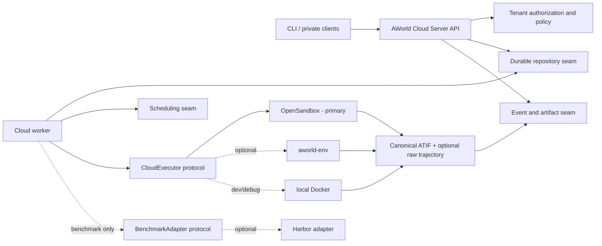

## Context

AWorld already has a durable cloud foundation under `aworld/cloud/`, versioned gateway routes under `/api/v1/cloud`, SQLite persistence, a worker, event and file APIs, and a deterministic fake executor. The original design framed that foundation as a Codex container service for one host. The product direction is broader: AWorld Cloud is a private-cloud execution service with one Server API and CLI for ordinary agent queries and benchmark runs.

The control plane owns lifecycle, durability, authorization, scheduling, and manifests. It does not synthesize an execution trajectory. The selected executor/provider owns execution and trajectory production. OpenSandbox is the primary remote provider, `aworld-env` is an optional compatibility/reuse provider, and Local Docker is restricted to development and debugging. AWorld Cloud has no Kubernetes layer or API contract; any OpenSandbox implementation detail remains outside this boundary. Benchmark preparation and verification are optional adapter concerns and must not leak into query execution or Cloud core.



## Goals / Non-Goals

**Goals:**

- Expose one versioned Server API and CLI lifecycle for `query` and `benchmark` runs.
- Persist accepted state changes before acknowledging them and recover deterministically after restart.
- Require exactly one final canonical ATIF manifest entry before a nominal executor result becomes `SUCCEEDED`.
- Permit raw provider-native trajectory retention without making it the external canonical contract.
- Keep provider, benchmark adapter, repository, scheduling, artifact, authentication, and policy boundaries explicit.
- Support rolling private deployments and old clients that omit new fields.
- Keep local development practical with SQLite and a fake executor.
- Deliver one Docker Compose entrypoint for the complete private-cloud stack.

**Non-Goals:**

- Implement OpenSandbox connectivity in this slice.
- Import or require Harbor in Cloud core, or require any benchmark adapter for query mode.
- Implement PostgreSQL, Redis, MinIO, or production identity providers in this slice.
- Let callers provide arbitrary host mounts, raw infrastructure credentials, or unrestricted network settings.
- Make the control plane fabricate ATIF content when an executor fails to produce it.
- Automatically commit, push, or open pull requests from a run.
- Add a Kubernetes product layer, Kubernetes manifests, or Kubernetes API objects.

## Decisions

### 1. Keep a focused control-plane bounded context

`aworld.cloud` owns immutable domain records, repository protocols, lifecycle services, the worker, provider protocols, and policy-safe paths. `aworld_gateway.http` owns transport models and `/api/v1/cloud/*` routes. The CLI remains an HTTP client and never reads the repository or invokes a provider directly.

The control-plane topology is:

```text
Server API -> durable repository -> worker -> executor provider
     |                |               |
     +-> events/files +-> scheduler   +-> trajectory/artifact manifests
```

API and worker may initially share a process, but the contracts must permit separate replicas. Durable state, not an in-memory queue, is authoritative.

### 2. Use one run lifecycle with a typed mode

Every request uses schema `aworld.cloud.run-request.v1` and a typed mode:

- `query`: ordinary agent/query execution. This is the default when older clients omit `mode` and `request_schema_version`.
- `benchmark`: the same lifecycle plus required structured benchmark metadata.

Benchmark metadata contains `dataset`, `task_id`, and optional `harness` and `verifier` identifiers. Query requests containing benchmark metadata are rejected as invalid rather than silently changing meaning. Benchmark requests without metadata are also rejected. A terminal benchmark may carry a finite numeric reward and JSON-compatible verifier result produced by its executor or adapter; clients cannot submit this trusted outcome. Retry copies the original request version, mode, and benchmark metadata but not the prior terminal outcome.

Both modes use `QUEUED -> STARTING -> RUNNING -> SUCCEEDED|FAILED` and the existing cancellation/retry/recovery rules. There is no parallel benchmark job state machine.

### 3. Make ATIF the canonical external trajectory

Executors return file manifest entries. A trajectory entry declares:

```text
kind: trajectory
trajectory.format: atif | provider_native
trajectory.schema_version: producer-declared schema identifier
trajectory.role: canonical | provider_raw
```

A canonical entry must use ATIF. A nominally successful executor result must contain exactly one canonical ATIF entry; otherwise the worker records `trajectory_missing` and fails the run. The file bytes remain executor/provider-owned and are retrieved through the existing run-file API. The control plane validates and persists metadata but never constructs production trajectory content.

An executor may additionally register one or more `provider_raw` trajectory files. These aid debugging and future conversions but are not the portable API contract. Run responses expose the canonical trajectory file ID as a convenience; file responses carry the full typed manifest.

The development fake executor owns and writes a deterministic ATIF fixture so end-to-end tests exercise the same contract.

### 4. Keep execution provider-neutral

The worker depends only on `ExecutorProvider.start`, `wait`, `inspect`, and `cancel`, using provider-neutral request, handle, inspection, event, and result records. `CloudExecutor` remains a compatibility alias. The protocol is the seam for the primary OpenSandbox implementation, optional `aworld-env` compatibility, and Local Docker development/debugging support.

Provider selection is administrator policy, not arbitrary client input. Provider credentials are secret references resolved at the provider boundary. This slice does not add a fake OpenSandbox client or an OpenSandbox SDK dependency.

### 5. Isolate optional benchmark adapters

`BenchmarkAdapter` prepares harness inputs and verifies executor outputs for benchmark runs. Cloud core persists neutral benchmark identity and lifecycle state. A deployment may register no benchmark adapters and still fully support query mode.

Harbor may later implement this protocol in an optional integration package. No Cloud-core module imports Harbor, assumes its schemas, or requires it at startup. Adapter failure is a benchmark-run concern and does not alter the shared lifecycle model.

### 6. Preserve durable storage seams

The current repository protocol and SQLite implementation remain the development baseline. SQLite schema v2 adds request schema, mode, benchmark identity JSON, benchmark reward/result, and trajectory manifest columns with defaults that map all v1 rows to query mode. Initialization applies migrations transactionally and rejects databases newer than the binary.

Private deployments require these replaceable seams:

- repository: PostgreSQL capable, including compare-and-set transitions, leases, tenant predicates, and opaque pagination;
- scheduling: Redis-capable claim/wakeup coordination while the durable repository remains authoritative;
- artifacts: S3-compatible MinIO object storage with immutable checksums, bounded reads, and tenant-scoped signed access.

Storage implementation details must not change Server API resource identities or lifecycle semantics. Mixed-version rollout uses additive nullable/defaulted columns, backward-readable responses, and normal forward migrations; destructive or down migrations are not part of request handling.

### 7. Enforce private-cloud identity and policy at boundaries

Before shared deployment, every workspace, run, event, file, and idempotency scope must carry a tenant identity. Authentication maps the caller to a principal and tenant; authorization checks both action and resource ownership in service and repository paths. Cross-tenant existence must not be disclosed.

Secrets are stored as references to an administrator-controlled secret backend. APIs, events, diagnostics, and manifests never return secret values. Workers receive only the least-privilege material needed for one execution, and configured redaction runs before ordinary event publication.

Network policy is selected from an administrator-defined profile. Clients cannot request privileged mode, Docker socket access, arbitrary mounts, public ingress, unrestricted egress, or provider credentials. Provider callbacks and artifact URLs must be authenticated, tenant-bound, time-limited where applicable, and auditable.

### 8. Keep events and files as common observability primitives

Both modes publish monotonic run events and immutable manifest-listed files. SSE resumes after `Last-Event-ID`. File reads remain contained beneath the run output root, support bounded/range reads, verify manifest identity, and may later redirect to signed object-storage URLs without changing file resources.

Core file kinds include stdout, stderr, events, result, artifact, and trajectory. Artifact counts exclude trajectory files; the canonical trajectory has its own response identity. Terminal benchmark responses also expose persisted `benchmark_outcome`; query responses always expose it as null.

### 9. Evolve the API additively

The existing endpoints remain unchanged. Omitted request version and mode default to the current v1 query contract. Unknown versions are rejected. New response fields are additive. Idempotency fingerprints include version, mode, and benchmark metadata so a key cannot be replayed with different semantics.

### 10. Ship one Compose topology

The final private-cloud delivery SHALL have one Docker Compose entrypoint and no Kubernetes deployment layer. Its default topology is:

```text
on-demand aworld-cloud-cli -> aworld-cloud-server -> PostgreSQL
                                      |             -> MinIO / S3-compatible artifacts
aworld-cloud-worker ------------------+             -> Redis wakeups/coordination
          |
          +-> OpenSandbox (primary direct ExecutorProvider)
```

The default Compose project contains `aworld-cloud-server`, `aworld-cloud-worker`, OpenSandbox, PostgreSQL, Redis, and MinIO, plus an on-demand `aworld-cloud-cli` service that uses the same HTTP path as external clients. Server and worker use real, independently runnable process entrypoints and the same pinned AWorld runtime image. Health checks and dependency readiness must reflect application readiness rather than container creation order.

OpenSandbox is consumed only through its documented deployment and client interfaces. Its internal orchestration is opaque to AWorld Cloud and cannot introduce Kubernetes resources or concepts into the Cloud API. No image name, SDK, endpoint shape, or health path is selected until verified from the OpenSandbox source or published deployment contract.

Harbor, `aworld-env`, and other compatibility adapters are outside the default dependency graph. If shipped, they use disabled-by-default Compose profiles. Local Docker remains a developer/debug provider and is not the private-cloud production executor.

## Risks / Trade-offs

- **A provider reports success without ATIF** -> fail with `trajectory_missing`; retain any raw files for diagnosis and require provider correction or explicit retry.
- **Provider-native traces drift** -> retain them as raw files while keeping ATIF as the stable external representation.
- **Benchmark coupling leaks into query mode** -> enforce mode/metadata validation and keep concrete adapters outside Cloud core.
- **SQLite limits horizontal scale** -> keep it for development and implement the PostgreSQL repository before multi-replica production.
- **Scheduler state diverges from durable state** -> treat Redis as a wakeup/coordination seam, never as lifecycle truth.
- **Object URLs leak across tenants** -> authorize manifest access first and mint short-lived tenant-scoped URLs.
- **Mixed-version rollout loses fields** -> use additive migration defaults, schema-versioned requests, and compatibility tests from schema v1.
- **Secrets leak through provider output** -> redact published events and restrict raw-file access by tenant and operator policy.
- **A placeholder Compose file appears runnable** -> add services only after their real process entrypoints, images, configuration, and health checks exist; document blockers instead of inventing integration details.

## Migration Plan

1. Land the additive contract/domain/API slice: mode, benchmark metadata, trajectory manifest, fake-executor ATIF, schema v2, and compatibility tests.
2. Add tenant-aware repository and authorization contracts before enabling shared private-cloud access.
3. Add the PostgreSQL repository, Redis scheduling, and S3-compatible MinIO artifact implementation behind existing seams.
4. Implement the OpenSandbox executor and provider conformance tests; keep aworld-env/local Docker optional.
5. Add the HTTP-only CLI user path for both modes and trajectory retrieval.
6. Add optional benchmark adapters and conformance tests; package any Harbor adapter separately.
7. Add real server and worker process entrypoints, then assemble the single Docker Compose topology using only verified OpenSandbox deployment interfaces and pinned images.
8. Run CLI-to-Server-to-worker-to-OpenSandbox private-cloud E2E, mixed-version rollout, failure recovery, tenant isolation, secret redaction, and network-policy verification before production enablement.

## Open Questions

- Which private identity provider and token format should the first deployment use?
- Which Redis deployment and lease-notification strategy is operationally preferred?
- Which OpenSandbox endpoint, image policy, network profile, and secret backend are approved for the first environment?
- Which ATIF versions must be accepted during provider rollout, and where will conformance fixtures live?
