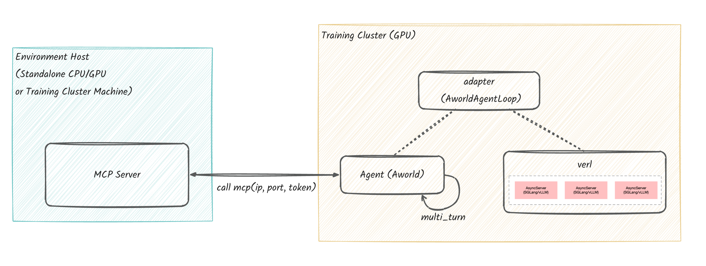

<div align="center">

# AWorld Train

*Provide more user-friendly and efficient evolutionary capabilities for AWorld agents*

[![License: MIT][license-image]][license-url]

</div>

---

AWorld Training aims to simplify the workflow and complexity of Agent training, making it easy not only
to build agents using AWorld, but also to train or integrate with excellent RL/training frameworks.


To implement agent evolution in AWorld train, five modules need to be considered:

1. **Agent construction (` agent `):** Build the core logic, strategies, and decision-making capabilities of the agent.
2. **Tool Environment Settings (` env `):** Build (optional) and configure the tool environment used by the agent,
   define the state/action space and interaction mechanism with the agent.
3. **Prepare dataset (`dataset`):** The dataset required for Agent training.
4. **Reward function (`reward`):** Evaluate the performance of the agent and return a reward.
5. **Training Execution (`trainer`): ** Training related configurations and training frameworks used.

3, 4, 5 belongs to the adaptation integration module, which is related to the compatibility with specific training
frameworks such as Verl. AWorld train has provided support for VeRL and AReaL, making it more convenient for users to
use.

## Installation (Example with Verl)

Follow these steps to set up your training environment.

1. **Install System-level Prerequisites**:
    - Install a compatible **NVIDIA Driver**.
    - Install the **CUDA Toolkit**.
2. **Manually Install PyTorch**:
    - Install a PyTorch version that matches your CUDA version. You can find the command on the [PyTorch website](https://pytorch.org/get-started/locally/).
3. **Install Verl and Dependencies**:
    - When you install Verl (e.g., via `pip install -e .`), other Python packages like `transformers`, `deepspeed`, and
      `vllm` will be installed automatically.
    - **Important**: This step requires the prerequisites from steps 1 and 2 to succeed, as some packages need to be
      compiled against CUDA. See `setup.py` for a full dependency list.

## Setting Up the Remote Environment

Follow these steps to prepare your remote server and launch the environment.

### System Requirements

#### Operating System

- The setup is compatible with Windows, macOS, and Linux.
- For best performance, a **Linux** system is highly recommended.
- **Note**: Using a server located in regions such as Singapore or North America is also advised to minimize latency.

#### Hardware

- **Minimum**: 4 CPU Cores and 8GB of RAM.

#### Software

- **Docker**: Docker must be installed on your machine.
    - **Important for Mac Users**: If you are using a Mac with Apple Silicon (M-series), you must enable Rosetta for
      x86/64 emulation. Please follow the official instructions
      at: [Docker for Mac Installation](https://docs.docker.com/desktop/setup/install/mac-install/).

### Login and Install the Environment

Log into your server and follow these steps.

**a. Clone the AWorld code to a server directory.**

```bash
git clone https://github.com/inclusionAI/AWorld ~/AWorld
```

**b. Configure environment parameters and download the Gaia dataset.**

- **Configure parameters**: Edit the `~/AWorld/env/gaia-mcp-server/mcp_servers/.env` file and enter your specific
  configuration values.

  ```bash
  cd ~/AWorld/env/gaia-mcp-server/mcp_servers
  cp .env_template .env
  ```

- **Download dataset**: Download the [gaia_dataset](https://huggingface.co/datasets/gaia-benchmark/GAIA) from Hugging
  Face and place it in `~/AWorld/env/gaia-mcp-server/docker/gaia_dataset`.

**c. Launch the Gaia Environment.**

Run the command below to start the Gaia Environment instance in Docker. The instance will provide:

- An MCP service on port `8000` (endpoint: `http://localhost:8000/mcp`).
- A VNC service on port `5901`. You can view the live interface at `http://localhost:5901/vnc.html?autoconnect=true`.

```bash
cd ~/AWorld/env
# Build the Docker image and start the container instance. This process will take approximately 5 minutes.
# Upon success, the following log message will be displayed: Start mcp server success.
sh run-local.sh
```


**d. Connecting and Testing the Gaia Environment**

The URL for the Gaia Environment's MCP service is automatically configured as an environment variable, so no manual
endpoint setup is required.

```bash
export MCP_SERVER_URL=http://localhost:8080/mcp
```

When building an Agent, you use the `get_agent_tool_env_and_servers` function to configure parameters for making MCP
requests and to provide the list of MCP Servers. If this function is called without any arguments, it will automatically
use default values.

<details>
<summary>Click to view the code</summary>

```python
gaia_env_config, gaia_env_servers = get_agent_tool_env_and_servers()
print(f"gaia_env_config: {gaia_env_config}\ngaia_env_servers: {gaia_env_servers}")

# output
# gaia_env_config: {
#   "mcpServers": {
#     "aworld-mcp": {
#       "type": "streamable-http",
#       "url": "http://localhost:8080/mcp",
#       "headers": {
#         "MCP_SERVERS": "readweb-server,browseruse-server,documents-csv-server,documents-docx-server,documents-pptx-server,documents-pdf-server,documents-txt-server,download-server,intelligence-code-server,intelligence-think-server,intelligence-guard-server,media-audio-server,media-image-server,media-video-server,parxiv-server,terminal-server,wayback-server,wiki-server,googlesearch-server",
#       },
#       "timeout": 600,
#       "sse_read_timeout": 600,
#       "client_session_timeout_seconds": 600,
#     }
#   }
# }
# gaia_env_servers: ['readweb-server', 'browser-server', ...]
```
</details>

## Building a Custom Agent

Use AWorld's agent building capabilities to create agents.

<details>
<summary>Click to view the code</summary>

```python
import os
from aworld.agents.llm_agent import Agent
from aworld.config import AgentConfig

mcp_config = {
    "mcpServers": {
        "gaia_server": {
            "type": "streamable-http",
            "url": "https://playground.aworldagents.com/environments/mcp",
            "timeout": 600,
            "sse_read_timeout": 600,
            "headers": {
                "ENV_CODE": "gaia",
                "Authorization": f'Bearer {os.environ.get("INVITATION_CODE", "")}',
            }
        }
    }
}

agent_config = AgentConfig(
    llm_provider="verl",
    top_k=80
)
agent = Agent(
    name="gaia_agent",
    desc="gaia_agent",
    system_prompt="Gaia agent system prompt",
    mcp_config=mcp_config,
    mcp_servers=["gaia_server"],
    conf=agent_config
)
```

</details>

- **Agent Construction**: For details on building single-agent or multi-agent systems, please refer to the [_Building
  and Running an Agent_](https://inclusionai.github.io/AWorld/Quickstart/agent_construction/#) and [_Building and
  Running a Multi-Agent System_](https://inclusionai.github.io/AWorld/Quickstart/multi-agent_system_construction/)
  guides.
- **MCP Tools**: If your agent requires MCP tools, you must configure the corresponding `mcp_config` file. Instructions
  can be found in the [_Building and Running an Agent_]() guide.

## Start-up Training

AWorld train is a one-click coding pattern that generally requires four items:
**agent**, **dataset**, **reward function**, and **custom training configuration**.

Note: Environment variables are independently configured and it is recommended to write them in the `.env` file.

[Gaia Training Startup Code](https://github.com/inclusionAI/AWorld/blob/main/train/examples/train_gaia_with_aworld_verl/main.py)

Simple example：

```python
from train.trainer.agent_trainer import AgentTrainer

# 定义数据集
train_dataset, test_dataset = "None or string or code reference"
# 定义agent
agent = ...
# 定义训练配置
custom_train_config = "string or json"
# 定义reward
reward_func = "None or string or code reference"
# 构建trainer实例并启动训练
trainer = AgentTrainer(agent=agent,
                       config=custom_train_config,
                       reward_func=reward_func,
                       train_dataset=train_dataset,
                       test_dataset=test_dataset)
trainer.train()
```

### Dataset

A dataset used for training intelligent agents.
It can be used as a file path or a Huggingface Dateset instance (generally secondary processing is required)
as a parameter and provided to the trainer.

### Reward Function

Define or adjust reward functions for evaluating agent behavior based on specific task objectives.
Taking training gaia as an example, the following code implements the `reward function` logic required by gaia,
code: [gaia_reward_function.py](https://github.com/inclusionAI/AWorld/blob/main/train/examples/train_gaia_with_aworld_verl/reward/gaia_reward_function.py )

Note: The Reward function is recommended as a separate file.

### Custom Training Configuration

YAML format configuration file, used to configure training related parameters based on actual situations, for defining
training parameters such as iteration times, learning rate, batch size, etc.
Configuration
example: [rpo_trainer.yaml](https://github.com/inclusionAI/AWorld/blob/main/train/examples/train_gaia_with_aworld_verl/grpo_trainer.yaml )

### Supplementary

Please pay special attention to the following core configuration items. When values are empty,
AWorld will **automatically** set them based on the user's trainer:

+ `train_files`, `val_files`: Specify the file paths for the training dataset and validation dataset, in `data`.
+ `agent_loop_config_path`: Specify the configuration file for the custom Agentloop, in `actor_rollout_def.rollout.agent`.
+ `reward_fn_file_path`: Defines the file path where the reward function is located, in `custom_deward_function`.
+ `reward_fn_name`: Specifies the name of the reward function to be used, in `custom_deward_function`.

Refer to the [VeRL documentation](https://verl.readthedocs.io/en/latest/examples/config.html) for detailed parameters.

---

<div align="center">

**AWorld Train** — Enable more efficient and user-friendly evolution for AWorld agents.

</div>

[license-image]: https://img.shields.io/badge/License-MIT-yellow.svg
[license-url]: https://opensource.org/licenses/MIT
