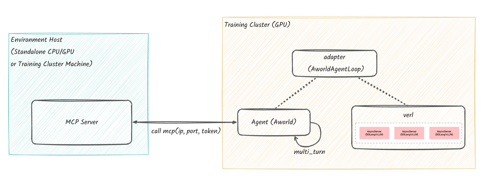
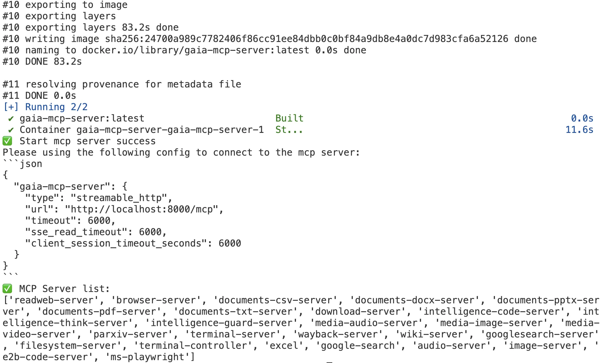

<div align="center">

# AWorld Train

*为 AWorld 智能体提供更易用高效进化能力*

[![License: MIT][license-image]][license-url]

</div>

---

AWorld Training 目标是简化Agent训练的工作流程和复杂度，不仅能够轻松地使用 AWorld 构建智能体，也能轻松地训练或使用三方 RL/训练框架。

在接口层，使用框架无关的设计，可以将 Agent 集成到您熟悉的 RL 训练框架中。


AWorld train实现Agent进化需要考虑5个模块：

1. **Agent 构建 (`agent`):** 构建 Agent 的核心逻辑、策略和决策能力。
2. **工具环境设置 (`env`):** 搭建(可选)和配置 Agent 使用的工具环境，定义状态/动作空间以及与agent的交互机制。
3. **准备数据集 (`dataset`):** Agent 训练需要的数据集。
4. **奖励函数 (`reward`):** 评估 Agent 的性能并返回奖励。
5. **训练执行 (`trainer`)** 训练的相关配置

其中345属于适配模块，与具体的训练框架（如 Verl）的兼容性有关，AWorld train 已经提供了VeRL，AReaL的支持，使用户更方便的使用。

## 安装训练所需依赖 (结合VeRL使用GAIA数据集为例)
**前置条件：** 在安装 Verl 之前，请确保系统中已正确安装了与硬件兼容的 **NVIDIA 驱动**和 **CUDA 工具包**。此外，需要根据 CUDA 版本**手动安装 PyTorch**。

**自动安装：** Verl 的其他依赖项（如 `transformers`、`deepspeed`、`vllm` 等）将通过 `pip` 在安装 Verl 时自动处理。请注意，
`deepspeed` 和 `vllm` 等库的安装过程会依赖于您已装好的 CUDA 和 PyTorch 环境，具体请参考 Verl 的 `setup.py` 文件。

```bash
# recommend Python>=3.10

# install AWorld
pip install aworld

# install train framework (VeRL example)
# Note: verl version 0.5.0.dev0 is required for agent training support.
git clone https://github.com/volcengine/verl.git
cd verl && pip install -e.
```

## 准备远程环境

请遵循以下步骤准备您的远程服务器并启动环境。

### 系统要求

#### 操作系统

- 兼容 Windows、macOS 和 Linux。
- 为获得最佳性能，强烈推荐使用 **Linux** 系统。
- **注意**：建议使用新加坡或北美等地区的服务器以减少延迟。

#### 硬件要求

- **最低配置**：4 CPU 核心 和 8GB 内存。

#### 软件要求

- **Docker**：您的机器上必须安装 Docker。
    - **Mac 用户注意**：如果您使用的是配备 Apple Silicon（M系列）的 Mac，必须启用 Rosetta 以进行 x86/64
      仿真。请遵循官方指南：[Docker for Mac 安装](https://docs.docker.com/desktop/setup/install/mac-install/)。

### 登录并安装环境

登录到您的服务器并按以下步骤操作。

**a. Clone AWorld 代码到服务器目录。**

```bash
git clone https://github.com/inclusionAI/AWorld ~/AWorld
```

**b. 配置环境参数并下载 Gaia 数据集。**

- **配置参数**：编辑 `~/AWorld/env/gaia-mcp-server/mcp_servers/.env` 文件并填入您的具体配置值。

  ```bash
  cd ~/AWorld/env/gaia-mcp-server/mcp_servers
  cp .env_template .env
  ```

- **下载数据集**：从 Hugging Face 下载 [gaia_dataset](https://huggingface.co/datasets/gaia-benchmark/GAIA) 并放置到
  `~/AWorld/env/gaia-mcp-server/docker/gaia_dataset`。

**c. 启动 Gaia Environment。**

运行下面的命令，在 Docker 环境中启动 Gaia Environment 实例。实例将提供：
- 一个位于 `8000` 端口的 MCP 服务（端点：`http://localhost:8000/mcp`）。
- 一个位于 `5901` 端口的 VNC 服务。您可以通过 `http://localhost:5901/vnc.html?autoconnect=true` 查看实时界面。

```bash
cd ~/AWorld/env
# 构建 Docker 镜像并启动容器实例。此过程大约需要 5 分钟。
# 成功后，将显示以下日志消息：Start mcp server success。
sh run-local.sh
```



**d. 连接并测试 Gaia Environment。**

Gaia Environment 的 MCP 服务 URL 已自动配置为环境变量，无需手动设置端点。

```bash
export MCP_SERVER_URL=http://localhost:8080/mcp
```

在构建 Agent 时，您可以使用 `get_agent_tool_env_and_servers` 函数来配置 MCP 请求参数并提供 MCP
服务器列表。如果无参数调用此函数，它将自动使用默认值。
<details>
<summary>Click to view the code</summary>

```python
gaia_env_config, gaia_env_servers = get_agent_tool_env_and_servers()
print(f"gaia_env_config: {gaia_env_config}\ngaia_env_servers: {gaia_env_servers}")

# output
# gaia_env_config: {
#   "mcpServers": {
#     "aworld-mcp": {
#       "type": "streamable-http",
#       "url": "http://localhost:8080/mcp",
#       "headers": {
#         "MCP_SERVERS": "readweb-server,browseruse-server,documents-csv-server,documents-docx-server,documents-pptx-server,documents-pdf-server,documents-txt-server,download-server,intelligence-code-server,intelligence-think-server,intelligence-guard-server,media-audio-server,media-image-server,media-video-server,parxiv-server,terminal-server,wayback-server,wiki-server,googlesearch-server",
#       },
#       "timeout": 600,
#       "sse_read_timeout": 600,
#       "client_session_timeout_seconds": 600,
#     }
#   }
# }
# gaia_env_servers: ['readweb-server', 'browser-server', ...]
```
</details>

## 定义 Agent

使用AWorld的Agent构建能力，创建Agent。

<details>
<summary>Click to view the code</summary>

```python
import os
from aworld.agents.llm_agent import Agent
from aworld.config import AgentConfig

mcp_config = {
    "mcpServers": {
        "gaia_server": {
            "type": "streamable-http",
            "url": "https://playground.aworldagents.com/environments/mcp",
            "timeout": 600,
            "sse_read_timeout": 600,
            "headers": {
                "ENV_CODE": "gaia",
                "Authorization": f'Bearer {os.environ.get("INVITATION_CODE", "")}',
            }
        }
    }
}

agent_config = AgentConfig(
    llm_provider="verl",
    top_k=80
)
agent = Agent(
    name="gaia_agent",
    desc="gaia_agent",
    system_prompt="Gaia agent system prompt",
    mcp_config=mcp_config,
    mcp_servers=["gaia_server"],
    conf=agent_config
)
```
</details>

+ Agent构建：关于如何构建单智能体和多智能体，请分别参考 [构建与运行Agent](https://inclusionai.github.io/AWorld/Quickstart/agent_construction/#)，[构建与运行Multi-agent](https://inclusionai.github.io/AWorld/Quickstart/multi-agent_system_construction/)。
+ MCP 工具配置：若 Agent 需要使用 MCP 工具，则必须配置相应的 `mcp_config`
  文件。具体方法请参考 [构建与运行Agent](https://inclusionai.github.io/AWorld/Quickstart/agent_construction/#configuring-tools)。

## 启动训练
AWorld trainer是代码模式一键运行，一般需要**agent**，**数据集**，**奖励函数**，**自定义训练配置**4项内容。

注：环境设置是独立配置，建议写到.env文件中。

[gaia训练启动代码](https://github.com/inclusionAI/AWorld/blob/main/train/examples/train_gaia_with_aworld_verl/main.py)

示例：
```python
from train.trainer.agent_trainer import AgentTrainer

# 定义数据集
train_dataset, test_dataset = "None or string or code reference"
# 定义agent
agent = ...
# 定义训练配置
custom_train_config = "string or json"
# 定义reward
reward_func = "None or string or code reference"
# 构建trainer实例并启动训练
trainer = AgentTrainer(agent=agent,
                       config=custom_train_config,
                       reward_func=reward_func,
                       train_dataset=train_dataset,
                       test_dataset=test_dataset)
trainer.train()
```

### 数据集 (Dataset)
用于训练智能体的数据集。
可以作为文件路径，或者Huggingface Dateset实例(需要二次加工的情况)作为参数，提供给trainer。

### 奖励函数 (Reward Function)
根据具体的任务目标，定义或调整用于评估智能体行为的奖励函数。
以训练 gaia 为例，以下代码实现了 gaia 所需要的 reward function 逻辑，代码：[gaia_reward_function.py](https://github.com/inclusionAI/AWorld/blob/main/train/examples/train_gaia_with_aworld_verl/reward/gaia_reward_function.py)

注：Reward function建议作为独立的代码文件。

### 自定义训练配置 (Training Config)
yaml格式配置文件，基于实际情况配置训练相关参数，用于定义训练参数，如迭代次数、学习率、批次大小等。
配置示例: [grpo_trainer.yaml](https://github.com/inclusionAI/AWorld/blob/main/train/examples/train_gaia_with_aworld_verl/grpo_trainer.yaml)

### 补充说明
请特别关注以下核心配置项，其值为空时AWorld会基于用户的 trainer **自动设置**：

+ `train_files`, `val_files`: 指定训练数据集和验证数据集的文件路径，位于data。
+ `agent_loop_config_path`: 指定自定义 AgentLoop 的配置文件，位于actor_rollout_ref.rollout.agent。
+ `reward_fn_file_path`: 定义了奖励函数所在的文件路径，位于custom_reward_function。
+ `reward_fn_name`: 指定了要使用的奖励函数名称，位于custom_reward_function。

详细参数请在 [VeRL 官方文档](https://verl.readthedocs.io/en/latest/examples/config.html)中查阅。

---

<div align="center">

**AWorld Train** — 让你的 AWorld 智能体更易用高效进化

[license-image]: https://img.shields.io/badge/License-MIT-yellow.svg
[license-url]: https://opensource.org/licenses/MIT

</div>
